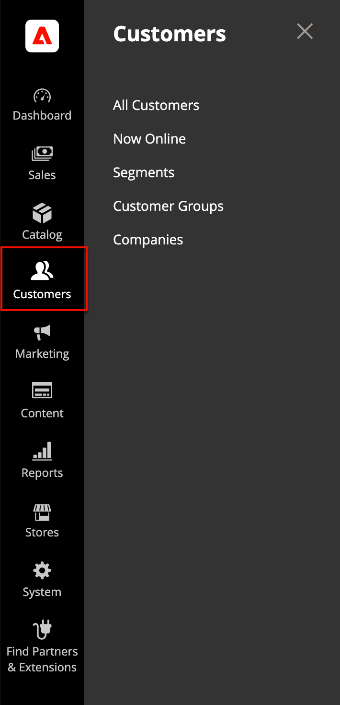

# 客户管理简介

_[!UICONTROL Customers]_菜单提供对客户帐户管理工具的访问，并让您能够查看商店中的在线人员。

{width="300" zoomable="yes"}

## 显示[!UICONTROL Customers]菜单

在&#x200B;_管理员_&#x200B;侧边栏中，单击[!UICONTROL Customers]以显示菜单选项：

| 字段 | 描述 |
|---|---|
| [!UICONTROL All Customers] | 列出已在您的商店中注册帐户或由管理员添加的所有[客户](../customers/customers-all.md)。 |
| [!UICONTROL Now Online] | 列出您商店中当前[在线](../customers/now-online.md)的所有客户和访客。 |
| [!UICONTROL Segments] | 列出用于根据各种属性向特定客户动态显示内容和促销的[客户区段](../customers/customer-segments.md)。 |
| [!UICONTROL Customer Groups] | [客户组](../customers/customer-groups.md)确定购物者可获得哪些折扣以及购买的税种。 |
| [!UICONTROL Companies] | (需要Adobe Commerce B2B)列出所有活动的[公司帐户](../b2b/account-companies.md)和挂起的请求，无论状态设置如何，并提供用于创建和[管理](../b2b/account-company-manage.md)公司帐户的工具。 |

{style="table-layout:auto"}
