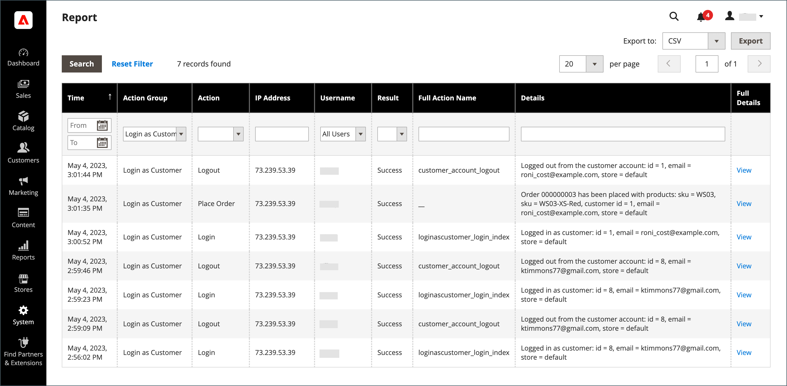

# 为购物者提供帮助

有时，客户需要帮助来安排订单。 存储管理员可以使用&#x200B;_以客户身份登录_，这样他们就可以查看客户看到的内容，并进行更新以帮助他们。

以客户身份登录时执行的任何操作将应用于实际客户的帐户。

为&#x200B;_管理员_&#x200B;用户启用&#x200B;_[!UICONTROL Login as Customer]_&#x200B;按钮后，该按钮会显示在多个页面中：

* [客户编辑页面](../customers/update-account.md)
* [订单查看页面](../stores-purchase/order-processing.md)
* [发票查看页](../stores-purchase/invoices.md)
* [装运视图页](../stores-purchase/shipments.md)
* [贷项通知单视图页](../stores-purchase/credit-memo-create.md)

{width="600" zoomable="yes"}

## 启用客户登录

启用&#x200B;_以客户身份登录_&#x200B;要求您在Commerce实例中启用该功能，然后在用户角色权限中为管理员用户启用访问权限。

### 启用该功能

1. 在管理员侧边栏上，转到&#x200B;**[!UICONTROL Stores]** > _[!UICONTROL Settings]_>**[!UICONTROL Configuration]**。

1. 在左侧面板中，展开&#x200B;**[!UICONTROL Customers]**&#x200B;并选择&#x200B;**[!UICONTROL Login as Customer]**。

   {width="600" zoomable="yes"}

1. 将&#x200B;**[!UICONTROL Enable Login as Customer]**&#x200B;设置为`Yes`。

1. _（可选）_&#x200B;将&#x200B;**[!UICONTROL Disable Page Cache for Admin User]**&#x200B;设置为`No`以在管理员用户以客户身份登录时启用页面缓存。

   >[!WARNING]
   >
   > 禁用页面缓存（`Yes` — 默认）可确保客户登录时获得最新未缓存的数据。

1. _（可选）_&#x200B;如果您具有多站点和/或多商店设置，并且希望管理员用户在以客户身份登录时选择商店视图，请将&#x200B;**[!UICONTROL Store View to Log in]**&#x200B;设置为`Manual Selection`。

1. 完成后，单击&#x200B;**[!UICONTROL Save Config]**。

### 为管理员用户启用访问权限

1. 在&#x200B;_管理员_&#x200B;侧边栏上，转到&#x200B;**[!UICONTROL System]** > _权限_ > **[!UICONTROL User Roles]**。

1. 单击列表中的角色。

1. 在&#x200B;[!UICONTROL _角色信息_]&#x200B;左侧面板中，单击&#x200B;**[!UICONTROL Role Resources]**。

1. 将页面上的&#x200B;**[!UICONTROL Role Resources]**&#x200B;更改为`Custom`。

   >[!INFO]
   >
   > 选中此选项后，资源层次结构将显示在页面中。

1. 滚动到&#x200B;**[!UICONTROL Customers]**&#x200B;父项和下面的&#x200B;**[!UICONTROL Login as Customer]**&#x200B;项。 然后，选择要为角色启用的资源：

   * **[!UICONTROL Allow Login as Customer]** — 允许管理员用户使用&#x200B;_以客户身份登录_&#x200B;功能。
   * **[!UICONTROL View Login as Customer Log]** — 允许管理员用户查看&#x200B;_以客户身份登录_&#x200B;日志。

   {width="400" zoomable="yes"}

1. 单击&#x200B;**[!UICONTROL Save Role]**。

## 以客户身份从管理员登录

1. 在&#x200B;_管理员_&#x200B;侧边栏上，转到&#x200B;**[!UICONTROL Customers]** > [!UICONTROL _所有客户_]。

1. 在编辑模式下打开用户。

1. 在&#x200B;**[!UICONTROL Customer Information]**&#x200B;面板中，选择&#x200B;**[!UICONTROL Account Information]**&#x200B;部分。

1. 将&#x200B;**[!UICONTROL Allow remote shopping assistance]**&#x200B;设置为`Yes`。

   >[!INFO]
   >
   >管理员现在可以用户身份登录，而无需从店面获得权限。

## 用于远程购物协助的客户帐户权限

要从管理员为商店支持人员启用帐户访问权限，客户必须为其帐户启用该功能：

1. 客户转到&#x200B;**[!UICONTROL Account Information]**&#x200B;页面。

1. 选中&#x200B;**[!UICONTROL Allow remote shopping assistance]**&#x200B;复选框。

1. 客户单击&#x200B;**[!UICONTROL Save]**。

{width="700" zoomable="yes"}

>[!WARNING]
>
>如果没有此权限，管理员用户将无法以此客户身份登录。

## 使用客户身份登录

>[!INFO]
>
>若要使用&#x200B;_Login作为客户_，请确保按照前面所述配置您的管理员。

_以客户身份登录_&#x200B;允许您查看站点（与客户一样），并允许您为客户排除故障和执行其他操作。 如果您分配了具有所需权限的用户角色：

1. 您可以在上一部分中列出的页面上单击&#x200B;**[!UICONTROL Login as Customer]**。
1. “作为客户登录”操作在“操作报表”中可用。

>[!WARNING]
>
>以客户&#x200B;_身份登录_&#x200B;时执行的任何操作（如添加/删除产品）均应用于实际客户的订单。 在店面，当您`logged in as customer_name`时会显示一个横幅以提供特殊状态提醒。

## 以客户日志记录身份登录

{{ee-feature}}

Adobe Commerce为&#x200B;_作为客户登录_&#x200B;操作提供日志记录。 它列出了管理员用户访问功能的所有会话。 要访问记录的操作，请转到[管理员操作报表](../systems/action-log-report.md)。

您可以过滤页面顶部的报表设置&#x200B;**[!UICONTROL Action Group]**&#x200B;至`Login As Customer`，然后单击&#x200B;**[!UICONTROL Search]**。

{width="700" zoomable="yes"}
