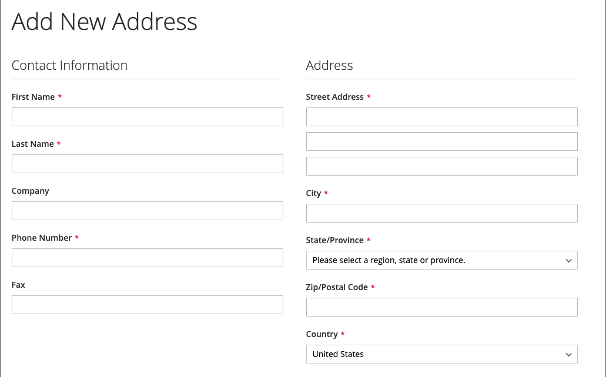
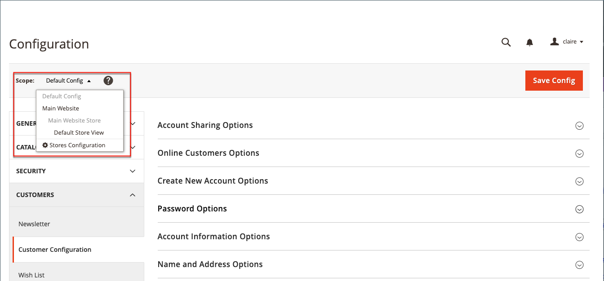

# 客户名称和地址选项

当客户使用您的商店创建[帐户](../customers/account-create.md)时，_名称和地址选项_&#x200B;将确定名称和地址表单中包含哪些字段。

{width="500" zoomable="yes"}

对于Adobe Commerce和Magento Open Source，配置名称和地址选项的步骤有所不同。

## 为Adobe Commerce配置名称和地址选项

您可以配置在店面为客户创建帐户时向其显示的名称和地址选项。

### 步骤1：设置配置的范围

1. 在&#x200B;_管理员_&#x200B;侧边栏上，转到&#x200B;**[!UICONTROL Stores]** > _[!UICONTROL Settings]_>**[!UICONTROL Configuration]**。

1. 在左侧面板中，展开&#x200B;**[!UICONTROL Customers]**&#x200B;并选择&#x200B;**[!UICONTROL Customer Configuration]**。

1. 展开&#x200B;**[!UICONTROL Name and Address Options]**&#x200B;部分。

   >[!INFO]
   >
   >请注意，名称和地址选项的范围适用于`website`级别。

1. 向上滚动到页面顶部，并将配置的范围设置为以下项之一：

   - `Default Config`
   - `Main Website` （或用于多站点安装的特定站点）

   >[!INFO]
   >
   >当范围设置为`Default Store View`时，_[!UICONTROL Name and Address Options]_&#x200B;部分未出现。

   {width="700" zoomable="yes"}

### 步骤2：配置名称和地址选项

1. 返回客户配置页面的&#x200B;[!UICONTROL _名称和地址选项_]&#x200B;部分。

   >[!INFO]
   >
   > 如果您未使用`Default config`范围设置，则在更改值之前必须清除每个字段的`Use Default`复选框。

   {width="600" zoomable="yes"}

1. 对于&#x200B;**[!UICONTROL Prefix Dropdown Options]**，输入要显示在列表中的每个前缀，用分号分隔。

   >[!IMPORTANT]
   >
   >在第一个值前放置分号，以在列表顶部显示空白值。

1. 对于&#x200B;**[!UICONTROL Suffix Dropdown Options]**，输入要在列表中显示的每个后缀，用分号分隔。

1. 要在客户表单中包含以下字段，请根据需要将每个字段的值设置为`Optional`或`Required`。

   - **[!UICONTROL Show Telephone]**
   - **[!UICONTROL Show Company]**
   - **[!UICONTROL Show Fax]**

### 步骤3：保存并刷新

1. 完成后，单击&#x200B;**[!UICONTROL Save Config]**。

1. 在页面顶部的消息中，单击每个无效缓存的&#x200B;**[!UICONTROL Cache Management]**&#x200B;和[刷新](../systems/cache-management.md)。

## 配置用于Magento Open Source的名称和地址选项

配置在店面客户创建帐户时向其显示的名称和地址选项。

{width="500" zoomable="yes"}

### 步骤1：设置配置的范围

1. 在&#x200B;_管理员_&#x200B;侧边栏上，转到&#x200B;**[!UICONTROL Stores]** > _[!UICONTROL Settings]_>**[!UICONTROL Configuration]**。

1. 在左侧面板中，展开&#x200B;**[!UICONTROL Customers]**&#x200B;并选择&#x200B;**[!UICONTROL Customer Configuration]**。

1. 展开&#x200B;**[!UICONTROL Name and Address Options]**&#x200B;部分。

   >[!IMPORTANT]
   >
   > 请注意，名称和地址选项的范围适用于`website`级别。

   {width="600" zoomable="yes"}

1. 向上滚动到页面顶部，并将配置的范围设置为以下项之一：

   - `Default Config`
   - `Main Website` （或用于多站点安装的特定站点）

   >[!NOTE]
   >
   >范围设置为`Default Store View`时，_名称和地址选项_&#x200B;部分未出现。

   {width="600" zoomable="yes"}

### 步骤2：配置名称和地址选项

1. 返回客户配置页面的&#x200B;[!UICONTROL _名称和地址选项_]&#x200B;部分。

   >[!INFO]
   >
   >如果您未使用`Default config`范围设置，则在更改值之前必须清除每个字段的`Use Default`复选框。

1. 对于&#x200B;**街道地址**&#x200B;中的行数，请输入从1到4的数字。

   >[!WARNING]
   >
   >默认情况下，街道地址为三行。

1. 若要在名称中包含前缀（如Mr或Ms.），请将&#x200B;**显示前缀**&#x200B;设置为`Yes`。

   {width="600" zoomable="yes"}

   >[!INFO]
   >
   >对于&#x200B;**前缀下拉列表选项**，输入要显示在列表中的每个前缀，以分号分隔。 您可以在第一个值之前放置分号，以在列表顶部显示空白值。

1. 要为客户的中间名或初始名称包含一个可选字段，请将&#x200B;**[!UICONTROL Show Middle Name (initial)]**&#x200B;设置为`Yes`。

1. 添加后缀(如Jr. 或Sr.)在客户名称后，将&#x200B;**[!UICONTROL Show Suffix]**&#x200B;设置为以下任一项：

   - `Optional`
   - `Required`

   >[!INFO]
   >
   >对于&#x200B;**后缀下拉列表选项**，请输入要在列表中显示的每个后缀，并用分号分隔。 您可以在第一个值之前放置分号，以在列表顶部显示空白值。

1. 要包括出生日期，请将&#x200B;**[!UICONTROL Show Date of Birth]**&#x200B;设置为以下项之一：

   - `Optional`
   - `Required`

   >[!INFO]
   >
   >按照最新的安全和隐私最佳实践，了解将客户的完整出生日期（月、日、年）与其他个人标识符一起存储可能会带来的任何法律和安全风险。 建议限制存储客户的完整出生日期，并建议使用客户出生年份作为替代方法。

   客户可以在字段后使用日历图标从弹出日历中选择出生日期。

   {width="600" zoomable="yes"}

1. 若要允许客户输入其税务或[VAT](../stores-purchase/vat.md)编号，请将&#x200B;**[!UICONTROL Show Tax/VAT Number]**&#x200B;设置为以下项之一：

   - `Optional`
   - `Required`

1. 要在客户表单中包含性别字段，请将&#x200B;**[!UICONTROL Show Gender]**&#x200B;设置为以下项之一：

   - `Optional`
   - `Required`

   {width="600" zoomable="yes"}

1. 要在客户表单中包含以下字段，请根据需要将每个字段的值设置为`Optional`或`Required`。

   - **[!UICONTROL Show Telephone]**
   - **[!UICONTROL Show Company]**
   - **[!UICONTROL Show Fax]**

### 步骤3：保存并刷新

1. 完成后，单击&#x200B;**[!UICONTROL Save Config]**。

1. 在页面顶部的消息中，单击每个无效缓存的&#x200B;**[!UICONTROL Cache Management]**&#x200B;和[刷新](../systems/cache-management.md)。
