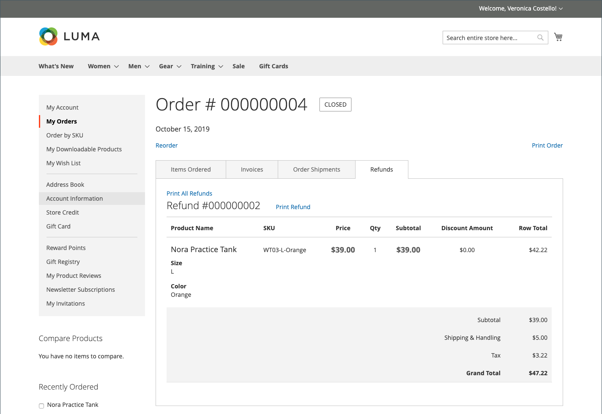

# 客户帐户仪表板中的退款

{{ee-feature}}

如果已为订单发出退款，则客户可以在帐户信息板中查看与订单关联的退款信息。 如果您已启用 [!UICONTROL _向客户显示商店信用历史记录_] 选项 [存储信用配置](../customers/credit-configure.md)，客户还可以访问其 [商店点数](../customers/store-credit.md) 历史。

## 在店面查看退款

1. 客户从店面登录到他们的帐户。

1. 使用以下方法之一查找其顺序：

   * 在列表中查找订单 **最新订单** 并单击 **[!UICONTROL View]**.
   * 在左侧面板中，选择 **[!UICONTROL My Orders]**. 然后，在列表中查找顺序并单击 **[!UICONTROL View]**.

1. 客户单击 **[!UICONTROL Refunds]** 选项卡以查看退款的详细信息。

   {width="700" zoomable="yes"}

## 在店面查看商店贷方余额和历史记录

方法1： **从客户帐户信息板**

1. 客户从店面登录帐户。

1. 如果退款应用于存储贷项，请选择 **[!UICONTROL Store Credit]** 在左侧面板中。

1. 退款至商店贷项的金额会显示在包含活动日期和时间的列表中。

   {width="700" zoomable="yes"}

   >[!INFO]
   >
   >“商店贷项”页还为客户提供了一个兑换的链接。 [礼品卡](../stores-purchase/product-gift-card-workflow.md#check-status-and-balance-of-the-gift-card).

方法2： **从 _审核与支付_ 页面**

1. 客户将产品添加到购物车。

2. 所得款项以 _结帐_ 页面。

3. 传递 **[!UICONTROL Shipping]** 步骤。

4. 如果商店积分可用，则客户单击 **[!UICONTROL Use Store Credit]**.

   {width="700" zoomable="yes"}

5. 如果客户改变了对使用商店信贷的想法，请单击 **[!UICONTROL Remove]** 在 _订单摘要_ 部分。

## 管理员中的付款操作

您可以为特定客户配置付款活动 [付款方式](../configuration-reference/sales/payment-methods.md). 每种付款方法都有一组不同的付款操作。

| 付款操作 | 描述 |
|--- |---|
| [!UICONTROL Capture Online] | 在提交发票时，系统从第三方付款网关捕获付款。 然后，管理员用户可以创建贷项通知单并撤消发票。 |
| [!UICONTROL Capture Offline] | 提交发票时，系统不会捕获付款。 假定通过网关直接获取付款，且无法通过Adobe Commerce获取付款。 然后，管理员用户可以创建贷项通知单，但不能撤消发票。 （即使订单使用在线付款，但发票本质上还是离线发票。） |
| [!UICONTROL Not Capture] | 提交发票时，系统不会捕获付款。 假定付款稍后通过Adobe Commerce捕获。 有一个 [!UICONTROL _Capture_] 已完成的发票中的按钮。 在捕获之前，您可以取消发票。 捕获后，您可以创建贷项通知单并撤消发票。 |

{style="table-layout:auto"}

>[!WARNING]
>
>选择 [!UICONTROL _未捕获_] 选项，除非您确定稍后将通过Adobe Commerce获取付款。 在使用获取付款之前，您无法创建贷项通知单 [!UICONTROL _Capture_] 按钮。
