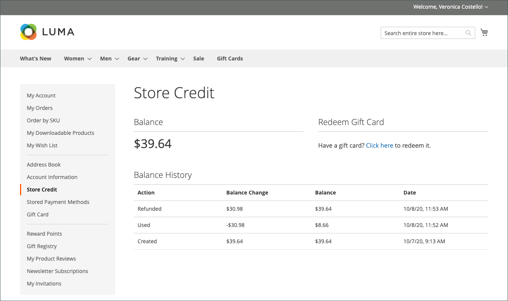

# 客户帐户仪表板中的退款

{{ee-feature}}

如果已为订单发出退款，则客户可以在帐户信息板中查看与订单关联的退款信息。 如果已为[商店信用配置](../customers/credit-configure.md)启用&#x200B;[!UICONTROL _向客户显示商店信用历史记录_]&#x200B;选项，则客户还可以访问其[商店信用历史记录](../customers/store-credit.md)。

## 在店面查看退款

1. 客户从店面登录到他们的帐户。

1. 使用以下方法之一查找其顺序：

   * 在&#x200B;**最近订单**&#x200B;的列表中查找订单，然后单击&#x200B;**[!UICONTROL View]**。
   * 在左侧面板中选择&#x200B;**[!UICONTROL My Orders]**。 然后，在列表中查找订单并单击&#x200B;**[!UICONTROL View]**。

1. 客户单击&#x200B;**[!UICONTROL Refunds]**&#x200B;标签以查看退款的详细信息。

   店面上的{width="700" zoomable="yes"}

## 在店面查看商店贷方余额和历史记录

方法1：从客户帐户仪表板&#x200B;**中**

1. 客户从店面登录帐户。

1. 如果退款用于存储积分，请在左侧面板中选择&#x200B;**[!UICONTROL Store Credit]**。

1. 退款至商店贷项的金额会显示在包含活动日期和时间的列表中。

   {width="700" zoomable="yes"}

   >[!INFO]
   >
   >商店信用卡页面还为客户提供兑换[礼品卡](../stores-purchase/product-gift-card-workflow.md#check-status-and-balance-of-the-gift-card)的链接。

方法2：从&#x200B;_复查和付款_&#x200B;页面&#x200B;**中的**

1. 客户将产品添加到购物车。

2. 进入&#x200B;_签出_&#x200B;页面。

3. 通过&#x200B;**[!UICONTROL Shipping]**&#x200B;步骤。

4. 如果商店积分可用，则客户单击&#x200B;**[!UICONTROL Use Store Credit]**。

   {width="700" zoomable="yes"}

5. 如果客户改变了对使用商店点数的想法，请单击&#x200B;_订单摘要_&#x200B;部分中的&#x200B;**[!UICONTROL Remove]**。

## 管理员中的付款操作

您可以为特定的[付款方式](../configuration-reference/sales/payment-methods.md)配置付款操作。 每种付款方法都有一组不同的付款操作。

| 付款操作 | 描述 |
|--- |---|
| [!UICONTROL Capture Online] | 在提交发票时，系统从第三方付款网关捕获付款。 然后，管理员用户可以创建贷项通知单并撤消发票。 |
| [!UICONTROL Capture Offline] | 提交发票时，系统不会捕获付款。 假定通过网关直接获取付款，且无法通过Adobe Commerce获取付款。 然后，管理员用户可以创建贷项通知单，但不能撤消发票。 （即使订单使用在线付款，但发票本质上还是离线发票。） |
| [!UICONTROL Not Capture] | 提交发票时，系统不会捕获付款。 假定付款稍后通过Adobe Commerce捕获。 完成的发票中有一个&#x200B;[!UICONTROL _Capture_]&#x200B;按钮。 在捕获之前，您可以取消发票。 捕获后，您可以创建贷项通知单并撤消发票。 |

{style="table-layout:auto"}

>[!WARNING]
>
>选择&#x200B;[!UICONTROL _不捕获_]&#x200B;选项，除非您确定稍后将通过Adobe Commerce捕获付款。 在使用&#x200B;[!UICONTROL _Capture_]&#x200B;按钮捕获付款之前，无法创建贷项通知单。
