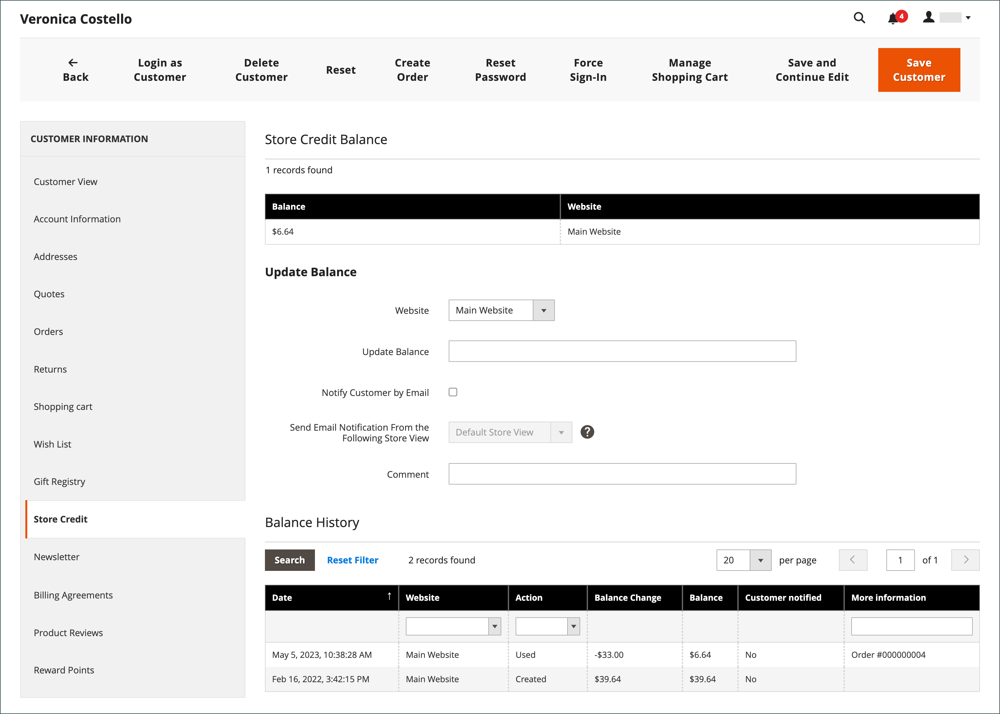
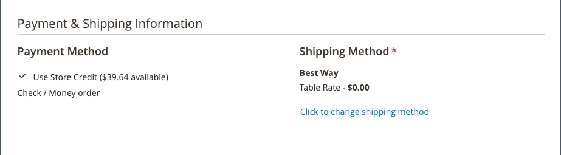

# 应用商店积分

{{ee-feature}}

商店管理员可以查看客户帐户的信用余额和历史记录，还可以将商店信用应用于购买。

{width="600" zoomable="yes"}

## 查看贷方余额

1. 在&#x200B;_管理员_&#x200B;侧边栏上，转到&#x200B;**[!UICONTROL Customers]** > **[!UICONTROL All Customers]**。

1. 在网格中查找客户。

1. 在&#x200B;_操作_&#x200B;列中，单击&#x200B;**[!UICONTROL Edit]**。

1. 滚动&#x200B;_[!UICONTROL Customer View]_&#x200B;页面并在底部查看&#x200B;**[!UICONTROL Store Credit Balance]**。

{width="600" zoomable="yes"}

## 更新商店贷方余额

1. 在&#x200B;_管理员_&#x200B;侧边栏上，转到&#x200B;**[!UICONTROL Customers]** > _操作_ > **[!UICONTROL All Customers]**。

1. 在网格中查找客户。

1. 在&#x200B;_操作_&#x200B;列中，单击&#x200B;**[!UICONTROL Edit]**。

1. 在左侧面板中，选择&#x200B;**[!UICONTROL Store Credit]**。

1. 选择要与余额关联的网站（店面）。

1. 对于&#x200B;**[!UICONTROL Update Balance]**，输入新值。

1. 要通知客户余额更新，请选中&#x200B;**[!UICONTROL Notify Customer by Email]**&#x200B;复选框，然后从&#x200B;**[!UICONTROL Send Email Notification From the Following Store View]**&#x200B;中选择商店视图。

1. 输入有关更改的&#x200B;**[!UICONTROL Comment]**。

1. 更新完成后，单击&#x200B;**[!UICONTROL Save and Continue Edit]**&#x200B;或&#x200B;**[!UICONTROL Save Customer]**。

更新的余额应显示在&#x200B;**[!UICONTROL Balance History]**&#x200B;中。

## 以商店管理员身份将贷方余额应用于订单

作为商店管理员，您可以代表客户执行各种操作，包括提交订单。 当您[创建订单](../stores-purchase/customer-account-create-order.md)时，您可以应用应付给客户的商店贷方余额。 可用余额显示在&#x200B;_付款和送货信息_&#x200B;部分。 选中&#x200B;**[!UICONTROL Use Store Credit]**&#x200B;复选框以应用余额，如果订单合计少于此值，则选择余额的一部分。

{width="500" zoomable="yes"}

## 在结账期间应用商店积分

如果地点有贷方余额，客户可以在将订单放在店面之前将商店贷方应用于订单余额。

1. 客户查看可用商店贷项的金额。

   在&#x200B;_审核和付款_&#x200B;步骤中，可用金额显示在&#x200B;_[!UICONTROL Store Credit]_&#x200B;下。

1. 要将金额应用于订单，请单击&#x200B;**[!UICONTROL Use Store Credit]**。

   >[!INFO]
   >
   >重新计算订单总计，应用的商店积分金额显示在&#x200B;_[!UICONTROL Order Summary]_&#x200B;中。

   {width="700" zoomable="yes"}

1. 准备就绪后，单击&#x200B;**[!UICONTROL Place Order]**。
