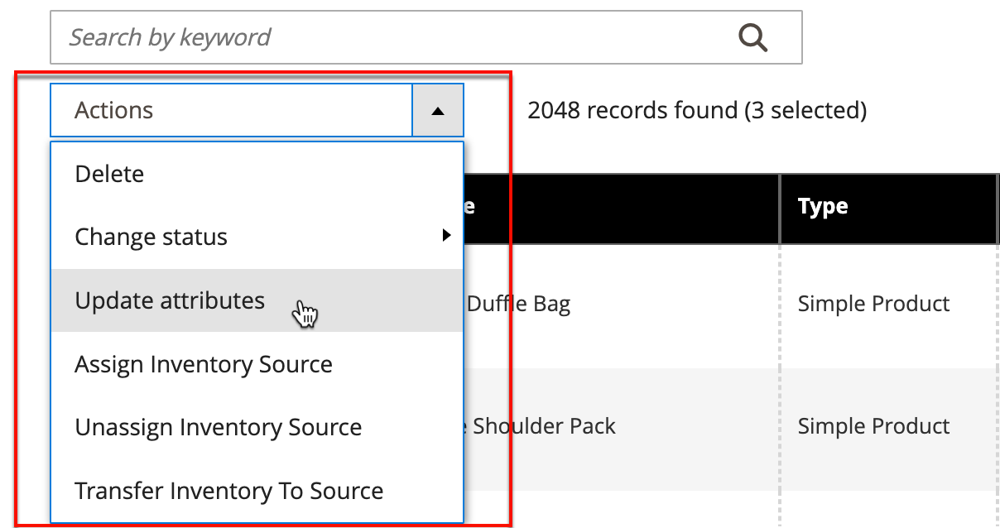

# 操作控制

在网格中处理记录集合时，可以使用“操作”控件将操作应用到一个或多个记录。 Actions控件列出了可用于特定类型数据的每个操作。 例如，您可以使用Actions控件更新所选产品的属性，将状态从`Disabled`更改为`Enabled`，或者从数据库中删除记录。

您可以进行所需数量的更改，然后在单一步骤中更新记录。 它比单独更改每个产品的设置要高效得多。 将编辑应用到记录批次是一项异步操作，它将在后台执行，这样您就可以继续在Admin中工作，而无需等待操作完成。 任务完成后，系统将显示一条消息。

可用操作的选择因列表而异，并且可能会显示其他选项，具体取决于所选的操作。 例如，更改一组记录的状态时，Actions控件旁边会显示一个包含其他选项的&#x200B;_[!UICONTROL Status]_&#x200B;框。

## 第1步：选择记录

列表第一列中的复选框标识作为操作目标的每个记录。 [筛选器控件](admin-grid-controls.md)可用于将列表缩小到要针对该操作定位的记录。

1. 如果需要，请在每列的顶部设置过滤器，以仅显示要包含的记录。

1. 选中作为操作目标的每个记录的复选框，或使用列选择器来选择批量选择。

{width="500"}上的全部或全部

## 第2步：将操作应用于选定记录

1. 将&#x200B;**[!UICONTROL Actions]**&#x200B;控件设置为要应用的操作。

   **_示例：_**&#x200B;更新属性

   - 在列表中，选中要更新的每个记录的复选框。

   - 将&#x200B;**[!UICONTROL Actions]**&#x200B;控件设置为`Update Attributes`。

     {width="450"}

   - 单击&#x200B;**[!UICONTROL Submit]**。

     “更新属性”页面列出了所有可用的属性，按左侧面板中的组进行整理。

     {width="700" zoomable="yes"}

   - 选中每个属性旁边的&#x200B;**[!UICONTROL Change]**&#x200B;复选框并进行必要的更改。

   - 单击&#x200B;**[!UICONTROL Save]**&#x200B;以更新选定记录组的属性。

1. 完成后，单击&#x200B;**[!UICONTROL Submit]**。

## 复选框操作

| 操作 | 描述 |
|--- |--- |
| [!UICONTROL Select All] | 选中列表中所有记录的复选框。 |
| [!UICONTROL Unselect All] | 清除列表中所有记录的复选框。 |
| [!UICONTROL Select All on This Page] | 选中当前页面上显示的记录复选框。 |
| [!UICONTROL Deselect All on This Page] | 清除当前页面上显示的记录复选框。 |

{style="table-layout:auto"}
