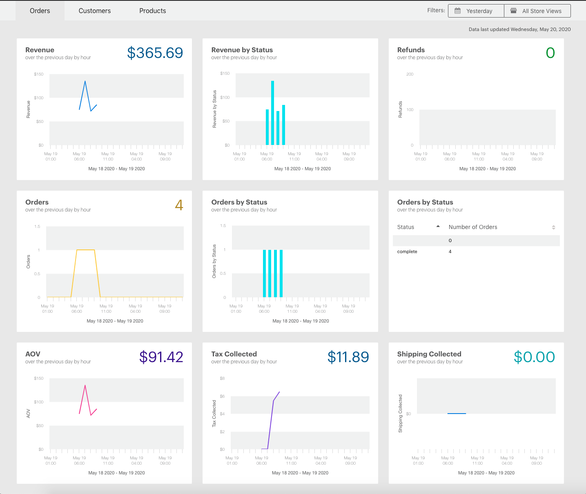
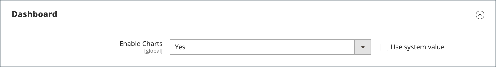
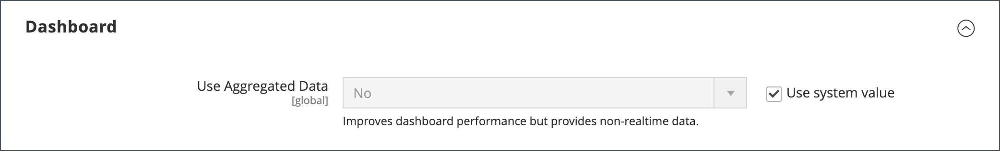

# 管理员信息板

仪表板通常是您登录&#x200B;_管理员_&#x200B;时显示的第一个页面，它可以实时提供销售和客户活动的概览。 仪表板数据提供生命周期销售额、平均订单金额、最近订单和搜索项的快照。 此图表显示选定日期范围内的已完成订单和金额，并且可从动态、实时数据或历史汇总数据生成。 底部的选项卡可快速报告您最畅销的产品、查看次数最多的产品、新客户和购买次数最多的客户。

如果要处理的数据量很大，可以关闭图表以提高性能。 以下示例中的仪表板配置为使用实时数据，并按小时显示过去24小时内的已完成订单。 图表会针对每个完成的订单进行更新。

{zoomable="yes"}

[高级报告](business-intelligence.md#advanced-reporting)根据您的产品、订单和客户数据显示个性化仪表板。

{zoomable="yes"}

## 配置仪表板

1. 在&#x200B;_管理员_&#x200B;侧边栏中，转到&#x200B;**[!UICONTROL Stores]** > _[!UICONTROL Settings]_>**[!UICONTROL Configuration]**&#x200B;并完成以下任何设置。

1. 配置完成后，单击&#x200B;**[!UICONTROL Save Config]**。

1. 保存更改后，单击&#x200B;**[!UICONTROL Cache Management]**&#x200B;并刷新每个无效缓存。

### 启用图表

如果要处理的数据量很大，可以关闭图表显示以提高性能。 如果未启用，则将显示消息“未找到数据”来代替图表，尽管仍会生成下面的汇总总数。

1. 在左侧导航面板中的&#x200B;**[!UICONTROL Advanced]**&#x200B;下，选择&#x200B;**[!UICONTROL Admin]**。

1. 如有必要，请展开&#x200B;**[!UICONTROL Dashboard]**&#x200B;部分。

   {width="600"}

1. 要更改默认值，请清除&#x200B;**[!UICONTROL Use system value]**&#x200B;复选框。

1. 将&#x200B;**启用图表**&#x200B;设置为`Yes`。

有关管理员配置选项的详细信息，请参阅[配置参考指南](../configuration-reference/advanced/admin.md)。

### 更改启动页面

仪表板是管理员的默认[启动页面](../configuration-reference/advanced/admin.md)，但您可以配置其他启动页面。

1. 如果尚未打开管理员配置选项，请在左侧导航面板的&#x200B;_[!UICONTROL Advanced]_&#x200B;下选择&#x200B;**[!UICONTROL Admin]**。

1. 单击以展开&#x200B;**启动页面**&#x200B;部分。

   {width="600"}

1. 清除&#x200B;**[!UICONTROL Use system value]**&#x200B;复选框，然后选择您登录管理员时要显示的&#x200B;**启动页面**。

### 选择开始日期

1. 在左侧导航面板中的&#x200B;**[!UICONTROL General]**&#x200B;下，选择&#x200B;**报表**。

1. 在页面上，展开&#x200B;**[!UICONTROL Dashboard]**&#x200B;部分。

1. 清除日期设置的&#x200B;**[!UICONTROL Use system value]**&#x200B;复选框，并执行以下操作：

   - 将&#x200B;**年初至今开始时间**&#x200B;设置为&#x200B;**月**&#x200B;和&#x200B;**天**。

   - 将&#x200B;**当前月份开始**&#x200B;设置为&#x200B;**天**。

   {width="600"}

有关[!UICONTROL Reports]配置选项的详细信息，请参阅&#x200B;[_配置参考指南_](../configuration-reference/general/reports.md)。

### 配置数据源

仪表板图表可以实时生成，也可以使用历史汇总数据生成。 如果性能有问题，则可以使用聚合数据加快处理速度。

1. 在左侧导航面板中，单击展开&#x200B;**Sales**，然后在下面选择&#x200B;**Sales**。

1. 在页面上，展开&#x200B;**[!UICONTROL Dashboard]**&#x200B;部分。

   {width="600"}

1. 清除&#x200B;**[!UICONTROL Use system value]**&#x200B;复选框，并将&#x200B;**[!UICONTROL Use Aggregated Data]**&#x200B;设置为以下任一项：

   - 对于历史聚合数据，请选择`Yes`。
   - 对于实时数据，请选择`No`。

## 图表节

| 部分 | 描述 |
|--- |--- |
| [!UICONTROL Orders] | 此选项卡显示当前商店视图和指定时间段内所有已完成订单的实时图表。 |
| [!UICONTROL Amounts] | 此选项卡显示当前商店视图和指定时间段内所有已完成订单金额的实时图表。 |
| [!UICONTROL Time Range] | 确定下图中所显示的数据以及下面的汇总总数。 选项： `Last 7 Days` / `Current Month` / `YTD` / `2YTD` |
| [!UICONTROL Summary Totals] | 图表下方的收入、税、运费和数量合计基于图表数据和当前时间范围设置。 |

{style="table-layout:auto"}

## 快照数据

| 部分 | 描述 |
|--- |--- |
| [!UICONTROL Lifetime Sales] | 商店存留期内的总销售额。 |
| [!UICONTROL Average Order] | 存储生命周期内的平均订单量。 |
| [!UICONTROL Last Orders] | 最近五份订购的摘要。 |
| [!UICONTROL Last Search Terms] | 最后五个搜索词。 |
| [!UICONTROL Top Search Terms] | 最常用的五个搜索词。 |

{style="table-layout:auto"}

## 报告选项卡

| 部分 | 描述 |
|--- |--- |
| [!UICONTROL Bestsellers] | 于指定期间内之五个最畅销产品。 |
| [!UICONTROL Most Viewed Products] | 在指定的时间段内，5项产品的查看次数最多。 |
| [!UICONTROL New Customers] | 在指定时间段内注册了帐户的最近五个客户。 |
| [!UICONTROL Customers] | 订单在指定时间段内完成处理的最近五个客户。 |

{style="table-layout:auto"}

## 仪表板按钮

| 按钮 | 描述 |
|--- |--- |
| [!UICONTROL Reload Data] | 刷新仪表板数据。 |
| [!UICONTROL Go to Advanced Reporting] | 根据您的产品、订单和客户数据显示动态图表和报告的个性化仪表板。 有关更全面的分析，请参阅[高级报告](business-intelligence.md#advanced-reporting)。 |

{style="table-layout:auto"}
