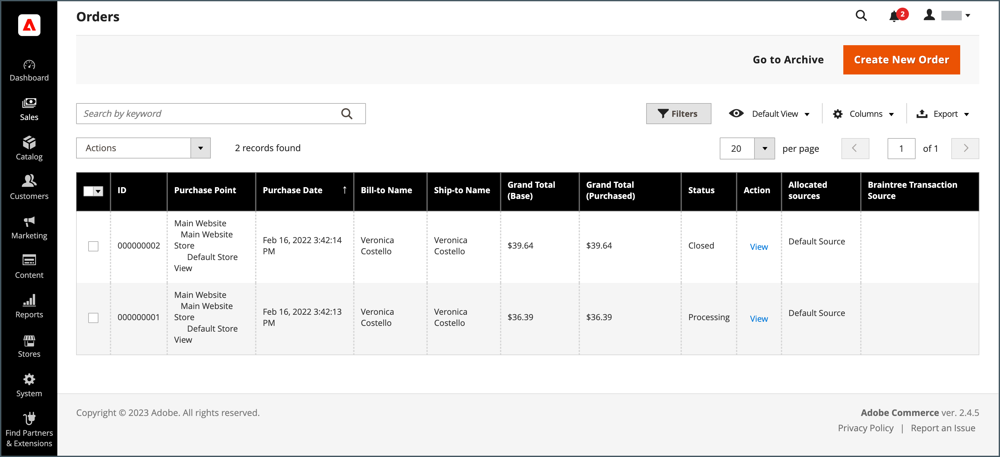
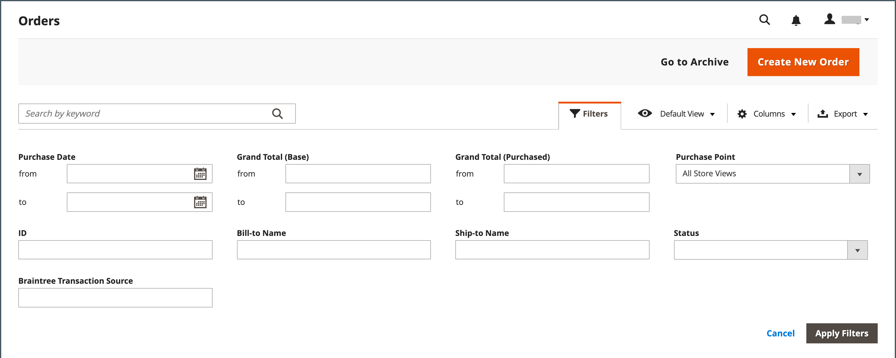

# 管理网格控件

管理数据的管理页面在网格中显示记录集合。 每列顶部的控件可用于对数据排序。 当前排序顺序由列标题中的升序或降序箭头指示。 您可以指定哪些列显示在网格中，并将它们拖到不同的位置。 您还可以将不同的列排列保存为以后可以使用的视图。 **[!UICONTROL Action]**&#x200B;列列出了可应用于单个记录的操作。 此外，大多数网格的当前视图中的日期可以导出为[CSV](../systems/data-csv.md)或XML文件。

{width="700" zoomable="yes"}

## 对列表排序

1. 单击任意列标题。

   箭头指示当前顺序为升序或降序。

1. 使用分页控件查看收藏集中的其他页面。

   {width="300"}

## 将列表分页

1. 将&#x200B;**[!UICONTROL Pagination]**&#x200B;控件设置为每页要查看的记录数。

1. 单击&#x200B;**[!UICONTROL Next]**&#x200B;和&#x200B;**[!UICONTROL Previous]**&#x200B;以翻阅列表，或输入特定的&#x200B;**[!UICONTROL Page Number]**。

## 筛选列表

1. 单击&#x200B;**[!UICONTROL Filters]**。

1. 填写所需数量的筛选器以描述要查找的记录。

1. 单击&#x200B;**[!UICONTROL Apply Filters]**。

   {width="700" zoomable="yes"}

## 导出数据

1. 选择要导出的记录。

   >[!NOTE]
   >
   >无法从网格导出产品数据。 若要了解详细信息，请参阅[导出](../systems/data-export.md)。

1. 在右上角的&#x200B;_导出_ （）菜单中，选择以下文件格式之一：

   - `CSV`
   - `Excel XML`

   {width="700" zoomable="yes"}

1. 单击&#x200B;**[!UICONTROL Export]**。

1. 在您的浏览器用于下载的位置查找导出的数据的下载文件。

## 网格布局

列在网格中的选择及其顺序可以根据您的喜好进行更改，并保存为&#x200B;_视图_。 您可以在单个属性配置下控制哪些属性显示在网格中。 产品网格中显示许多属性可能会影响管理员加载时间和性能。

{width="700" zoomable="yes"}

### 更改列的选择

1. 单击右上角的&#x200B;_列_ （）控件。

1. 更改列选择：

   - 选中要添加到网格的任何列的复选框。
   - 清除要从网格中删除的任何列的复选框。
   - 要返回默认网格视图，请单击&#x200B;**[!UICONTROL Reset]**。

确保向下滚动以查看所有可用列。

### 移动列

1. 单击列的标题并按住。

1. 将列拖到新位置并释放。

### 保存网格视图

1. 单击&#x200B;_视图_ （）控件。

1. 单击&#x200B;**[!UICONTROL Save Current View]**。

1. 输入视图的&#x200B;**[!UICONTROL name]**。

1. 若要保存所有更改，请单击&#x200B;_箭头_ （）。

   视图名称现在显示为当前视图。

### 更改网格视图

1. 单击&#x200B;_视图_ （）控件。

1. 执行以下操作之一：

   - 要使用其他视图，请单击视图的名称。
   - 要更改视图的名称，请单击&#x200B;_编辑_ （）图标并更新名称。
   - 要删除视图，请单击&#x200B;_编辑_ （）图标，然后单击&#x200B;_删除_ （）图标。
