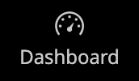
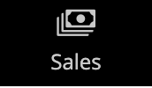
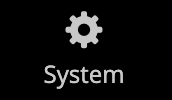

# 管理员侧栏

左侧的侧栏是商店的主菜单 _管理员_ 专为台式机和移动设备而设计。 通过弹出菜单，可访问您用于每天管理商店的所有工具。

| 菜单图标 | 链接 | 描述 |
| --------- | ---- | ----------- |
|  | **[管理启动页面](../configuration-reference/advanced/admin.md)** | 显示管理员启动页面，默认情况下是功能板。 |
|  | **[[!UICONTROL Dashboard]](admin-dashboard.md)** | 功能板提供您商店中销售和客户活动的快速概览，通常是登录到管理员时显示的第一个页面。 |
|  | **[[!UICONTROL Sales]](../stores-purchase/sales-menu.md)** | 此 [!UICONTROL Sales] 菜单是您可在其中查找与处理订单、发票、发运、贷项通知单和事务处理等操作相关的所有内容。 |
|  | **[[!UICONTROL Catalog]](../catalog/catalog-menu.md)** | 此 [!UICONTROL Catalog] 菜单用于创建产品和定义类别。 |
|  | **[[!UICONTROL Customers]](../customers/customers-introduction.md)** | 此 [!UICONTROL Customers] 菜单是管理客户帐户，以及查看哪些客户当前在线的地方。 |
|  | **[[!UICONTROL Marketing]](../merchandising-promotions/marketing-menu.md)** | 此 [!UICONTROL Marketing] 菜单是设置目录和购物车价格规则和优惠券的位置。 价格规则会在满足一组特定条件时触发操作。 |
|  | **[[!UICONTROL Content]](../content-design/content-menu.md)** | 此 [!UICONTROL Content] 菜单是您管理存储的内容元素和设计的位置。 了解如何创建页面、块和前端应用程序，以及管理应用商店的展示方式。 |
|  | **[[!UICONTROL Reports]](reports-menu.md)** | 此 [!UICONTROL Reports] 菜单提供了大量精选报表，可让您深入了解商店的各个方面，包括销售、购物车、产品、客户、标记、评论和搜索词。 |
|  | **[[!UICONTROL Stores]](../stores-purchase/stores-menu.md)** | 此 [!UICONTROL Stores] 菜单包括用于配置和维护商店的各个方面的工具，包括多站点安装设置、税费、货币、产品属性和客户组。 |
|  | **[[!UICONTROL System]](../systems/system-menu.md)** | 此 [!UICONTROL System] 菜单包括用于管理系统操作、安装扩展以及管理Web服务以便与其他应用程序集成的工具。 |
|  | **[[!UICONTROL Find Partners & Extensions]](commerce-marketplace.md)** | 此 [!DNL Commerce Marketplace] 您可以在此处找到商店的Adobe Commerce和Magento Open Source解决方案。 |

{style="table-layout:auto"}
