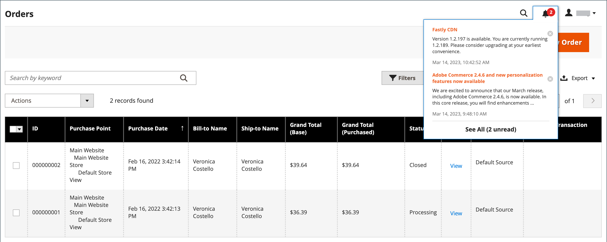
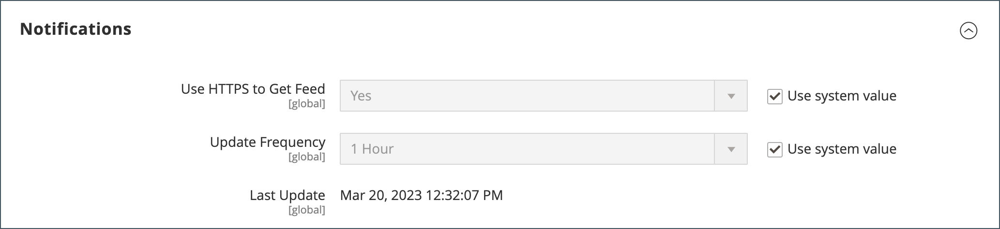

# 管理员消息收件箱

您的商店会定期接收来自Adobe的消息。 这些消息按重要性评级，可能涉及系统更新、修补程序、新版本、定期维护或即将发生的事件。 标题中的铃铛图标表示收件箱中未读邮件的数量。

{width="700" zoomable="yes"}

此 _[!UICONTROL Notifications]_页面列出了按日期排名的所有消息。 此_[!UICONTROL Action]_ 命令可用于将单个邮件标记为已读、查看更多详细信息或从收件箱中删除邮件。

该配置决定收件箱更新的频率以及邮件的投放方式。 如果您的商店管理员具有安全URL，则必须通过HTTPS传送通知。

## 查看新传入消息

1. 单击 **[!UICONTROL Notification]** 图标并读取摘要。

1. 执行以下操作之一：

   - 如有必要，单击消息以显示全文。
   - 要删除消息，请单击消息右侧的删除图标。
   - 要显示完整的通知列表，请单击 **[!UICONTROL See All]**.

## 处理关键消息

对于关键重要消息，请执行下列操作之一：

- 单击 **[!UICONTROL Read Details]**.
- 要关闭警报框但使消息保持活动状态，请单击 **[!UICONTROL Close]**.

## 管理您的通知

1. 执行以下操作之一以打开“通知”页面：

   - 单击 **[!UICONTROL Notification]** 图标。 如果显示一条或多条新消息，请单击 **[!UICONTROL See All]**.

   - 在 _管理员_ 侧栏，转到 **[!UICONTROL System]** > _[!UICONTROL Other Settings]_>**[!UICONTROL Notifications]**.

1. 在 **[!UICONTROL Action]** 列，执行以下任一操作：

   - 有关详细信息，请单击 **[!UICONTROL Read Details]** 在新窗口中打开链接的页面。

   - 要将邮件保留在收件箱中，请单击 **[!UICONTROL Mark As Read]**.

     {width="700" zoomable="yes"}

   - 要删除消息，请单击 **[!UICONTROL Remove]**.

1. 要将操作应用于多条消息，请执行以下操作之一：

   - 选中要管理的每个消息第一列中的复选框。
   - 要选择多条消息，请设置 **[!UICONTROL Mass Actions]** 根据需要进行控制。

1. 设置 **[!UICONTROL Actions]** 控制以下任一项：

   - `Mark as Read`
   - `Remove`

1. 单击 **[!UICONTROL Submit]** 以完成该过程。

## 配置通知

1. 在 _管理员_ 侧栏，转到 **[!UICONTROL Stores]** > _[!UICONTROL Settings]_>**[!UICONTROL Configuration]**.

1. 在左侧导航面板中，展开 **[!UICONTROL Advanced]** 并选择 **[!UICONTROL System]**.

1. 展开 该 **[!UICONTROL Notifications]** 部分。

   {width="600"}

1. 如果您的商店管理员在 [安全URL](../stores-purchase/store-urls.md)，设置 **[!UICONTROL Use HTTPS to Get Feed]** 到 `Yes`.

1. 设置 **[!UICONTROL Update Frequency]** 用于确定收件箱更新的频率。

   间隔可以是1到24小时。

1. 完成后，单击 **[!UICONTROL Save Config]**.

欲知关于 [!UICONTROL System] 配置选项，请参见 [_配置参考指南_](../configuration-reference/advanced/system.md).
