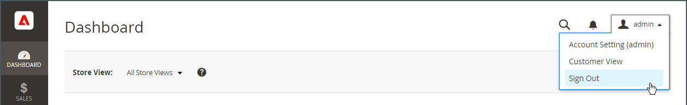

# 您的管理员帐户

主管理员帐户最初是在安装期间设置的，可能包含初始占位符信息或示例数据信息。 此帐户的指定所有者可以个性化用户名和密码，并随时更新名字、姓氏和电子邮件地址。 此帐户，默认情况下是具有所有权限的&#x200B;_超级用户_，通常会创建业务所需的管理员用户帐户。

- 有关添加或编辑用户的信息，请参阅[创建用户](../systems/permissions-users-all.md#create-a-user)。

- 有关管理员和用户角色的信息，请参阅[权限](../systems/permissions.md)和[用户角色](../systems/permissions-user-roles.md)。

{{ims-admin-note}}

## 管理员登录

[!DNL Commerce] _管理员_&#x200B;受多层安全措施的保护，以防止对您的商店、订单和客户数据的未经授权访问。 首次登录&#x200B;_管理员_&#x200B;时，需要输入用户名和密码并设置[双重身份验证](../systems/security-two-factor-authentication.md) (2FA)。

根据您商店的配置，可能有[验证码](../systems/security-google-recaptcha.md)难题需要解决，例如输入一系列键盘字符、解决难题或单击一系列具有通用主题的图像。 这些测试旨在将您识别为人类，而不是自动机器人。

为了提高安全性，您可以确定每个用户在&#x200B;_管理员_&#x200B;中拥有[权限](../systems/permissions.md)的访问权限，还可以限制[次登录尝试](../configuration-reference/advanced/admin.md)的次数。 默认情况下，在六次尝试后，帐户将被锁定，用户必须等待几分钟再重试。 也可以从&#x200B;_管理员_&#x200B;重置[锁定的帐户](../systems/permissions-users-all.md#locked-users)。

>[!NOTE]
>
>首次登录&#x200B;_管理员_&#x200B;时，系统会提示您&#x200B;_允许收集管理员使用情况数据_。 有关详细信息，请参阅[使用情况数据收集](admin.md#usage-data-collection)。

{width="400"}

### 步骤1：设置双重身份验证

在登录到应用商店的&#x200B;_管理员_&#x200B;之前，您必须设置双重身份验证解决方案并准备使用。 要了解有关每个解决方案使用的身份验证过程的详细信息，请参阅[使用双重身份验证](../systems/security-two-factor-authentication-use.md)。 默认情况下，[!DNL Commerce]支持[Google Authenticator][1]。

请咨询您的[!DNL Commerce]系统管理员，了解存储支持哪些2FA解决方案。 然后，根据提供商的说明完成首选2FA解决方案的设置。

### 第2步：登录到管理员

1. 输入在[!DNL Commerce]安装期间指定的&#x200B;_管理员_ URL。

   默认&#x200B;_管理员_ URL类似于`https://www.yourdomain.com/your-custom-admin-domain`。

   >[!NOTE]
   >
   >尽管本文档在大多数示例中都使用`admin`作为基本URL，但建议您为商店的&#x200B;_管理员_&#x200B;选择一个唯一且难以猜测的[自定义URL](../stores-purchase/store-urls.md)。

   您可以为页面添加书签或在桌面上保存快捷方式以便轻松访问。

1. 输入您的&#x200B;_管理员_ **[!UICONTROL Username]**&#x200B;和&#x200B;**[!UICONTROL Password]**。

1. （可选）如果您的商店启用了验证码，请按照屏幕上的说明解决挑战。

   要了解更多信息，请参阅[CAPTCHA](../systems/security-captcha.md)和[reCAPTCHA](../systems/security-google-recaptcha.md)。

1. 单击&#x200B;**[!UICONTROL Sign in]**。

   如果这是您第一次从该帐户登录&#x200B;_管理员_，则您应会收到一封电子邮件，其中包含指向配置说明的链接。

### 步骤3：完成2FA配置

以下示例显示如何将您的&#x200B;_Admin_&#x200B;帐户与Google Authenticator配对。

1. 出现二维码时，请使用以下方法之一捕获该代码，并将Google Authenticator与您的&#x200B;_管理员_&#x200B;帐户配对。

   {width="400"}

   - 使用智能手机捕获二维码

     在智能手机上，启动Google Authenticator。 点按应用程序右上角的&#x200B;_加号_ (+)。 然后在屏幕底部，点按&#x200B;**[!UICONTROL Scan Barcode]**&#x200B;并拍摄二维码的照片。

   - 从浏览器中捕获二维码

     如果Google Authenticator作为扩展安装在浏览器中，请单击工具栏中的&#x200B;**Authenticator**&#x200B;图标并捕获页面。

   - 手动输入二维码

     复制二维码下方的文本字符串。 使用智能手机或浏览器启动Google Authenticator，然后单击加号(+)。 然后选择&#x200B;**[!UICONTROL Manual Entry]**。 在&#x200B;**[!UICONTROL Account]**&#x200B;下，输入与您的&#x200B;_管理员_&#x200B;帐户关联的电子邮件地址，并将二维码字符串粘贴到&#x200B;**[!UICONTROL Key]**&#x200B;字段中。

1. 若要使用双重身份验证登录到&#x200B;_管理员_，请在&#x200B;**[!UICONTROL Authenticator code]**&#x200B;字段中输入Google身份验证器生成的六位数代码，然后单击&#x200B;**[!UICONTROL Confirm]**。

   {width="400"}

## 重置密码

不允许重复使用分配给帐户的最后4个密码。

1. 输入与&#x200B;_管理员_&#x200B;帐户关联的&#x200B;**[!UICONTROL Email Address]**。

   {width="400"}

1. 单击&#x200B;**[!UICONTROL Retrieve Password]**。

   如果某个帐户与电子邮件地址关联，则会发送一封电子邮件以重置密码。

   >[!NOTE]
   >
   >_管理员_&#x200B;密码长度必须为7个或更多字符，并且包含字母和数字。 有关密码选项的信息，请参阅[配置&#x200B;_管理员_&#x200B;安全性](../systems/security-admin.md)。

## 注销管理员

1. 单击右上角的&#x200B;_帐户_ （）图标。

1. 单击&#x200B;**[!UICONTROL Sign Out]**。

   {width="700" zoomable="yes"}

_[!UICONTROL Sign In]_&#x200B;页面显示您已注销的消息。 无论何时让计算机处于无人值守状态，请注销_&#x200B;管理员&#x200B;_。

## 编辑帐户信息

1. 单击&#x200B;_帐户_ （）图标。

1. 单击&#x200B;**[!UICONTROL Account Setting]**。

   {width="700" zoomable="yes"}

1. 对您的帐户信息进行必要的更改。

   如果更改登录凭据，请确保将它们存储在安全位置。

1. 输入您的当前帐户密码。

1. 单击&#x200B;**[!UICONTROL Save Account]**。

## 允许多个管理员登录

管理员提供管理订单、客户、产品、运输和支付功能的权限。 作为安全最佳实践，默认配置设置为不允许管理员用户帐户多次登录。 但是，您可以更改此设置，以允许管理员用户从多个设备登录以适应您的业务工作流。

1. 在&#x200B;_管理员_&#x200B;侧边栏上，转到&#x200B;**[!UICONTROL Stores]** > _[!UICONTROL Settings]_>**[!UICONTROL Configuration]**。

1. 在左侧导航面板中，展开&#x200B;**[!UICONTROL Advanced]**&#x200B;并选择&#x200B;**[!UICONTROL Admin]**。

1. 展开&#x200B;**[!UICONTROL Security]**&#x200B;部分的。

1. 对于&#x200B;**管理员帐户共享**，请选择`Yes`。

   {width="700" zoomable="yes"}

1. 单击&#x200B;**[!UICONTROL Save Config]**。

## 将管理员用户登录名设置为区分大小写

1. 在&#x200B;_管理员_&#x200B;侧边栏上，转到&#x200B;**[!UICONTROL Stores]** > _[!UICONTROL Settings]_>**[!UICONTROL Configuration]**。

1. 在左侧导航面板中，展开&#x200B;**[!UICONTROL Advanced]**&#x200B;并选择&#x200B;**[!UICONTROL Admin]**。

1. 展开&#x200B;**[!UICONTROL Security]**&#x200B;部分的。

1. 将&#x200B;**[!UICONTROL Login is Case Sensitive]**&#x200B;字段设置为`Yes`。

1. 单击&#x200B;**[!UICONTROL Save Config]**。

[1]: https://play.google.com/store/apps/details?id=com.google.android.apps.authenticator2&amp;hl=en_US

## 维护对管理员的安全访问

为确保管理员的安全，请定期对具有管理员访问权限的用户和角色进行审核。

此外，考虑[更新Admin Base URL配置](https://experienceleague.adobe.com/en/docs/commerce-admin/config/advanced/admin#admin-base-url)以将默认`/admin`端点更改为自定义路径。 配置自定义路径具有以下安全优势：

**增强的安全性**：默认“管理员”路径广为人知，且经常被恶意行为者以暴力攻击为目标。 通过将其更改为唯一的自定义值，您可以显着降低未经授权访问尝试的风险。

**漏洞减少**：自动机器人经常扫描常见路径（如“管理员”）以利用漏洞。 自定义路径使这些机器人更难找到您的管理员登录页面，从而降低受到攻击的可能性。

**已改进隐私**：自定义管理员路径添加了一个额外的遮蔽层，使潜在攻击者更难识别和定位您的管理员登录页面。

**遵循最佳实践**：遵循安全最佳实践（如自定义管理员路径）可展示一种主动保护电子商务网站和客户数据的方法。

>[!NOTE]
>
>如果怀疑存在入侵，请确保删除所有未知的管理员用户，并重置所有管理员密码，然后查看[安全行动计划](https://experienceleague.adobe.com/en/docs/commerce-admin/systems/security/security)以了解后续步骤。
