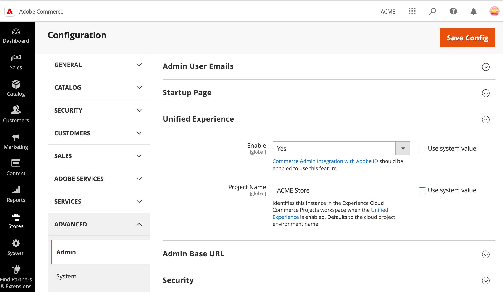

# 管理Experience Cloud集成

初始启用后，通过启用或禁用Experience Cloud Admin Unified Experience扩展来管理Commerce集成的状态。

- 如果启用了Commerce Admin Unified Experience扩展，并且[已正确设置管理员帐户](#manage-admin-user-accounts)，则Commerce管理员可以从Adobe Experience Cloud查看和访问可用的Commerce项目。 管理员仍然可以使用Commerce项目环境的管理员URL访问各个项目。

- 如果禁用了Commerce Admin Unified Experience扩展，则将禁用通过Experience Cloud进行访问。 管理员必须使用Commerce项目环境的管理员URL登录到各个项目。

>[!WARNING]
>
>如果禁用了Adobe Identity Management Service (IMS)集成，则会自动禁用Experience Cloud集成。

## 从管理员管理集成

1. 从Commerce管理员中，通过从左侧导航菜单中选择&#x200B;**[!UICONTROL Stores]**&#x200B;打开商店配置菜单，然后选择&#x200B;**[!UICONTROL Configuration]**。

1. 从“配置”菜单中选择&#x200B;**[!UICONTROL Advanced > Admin]**，然后展开&#x200B;**[!UICONTROL Unified Experience option]**。

   用于Experience Cloud集成的{width="600" zoomable="yes"}

1. 通过选择&#x200B;**[!UICONTROL Enable]**&#x200B;值启用或禁用集成。

1. 通过添加或更新&#x200B;**[!UICONTROL Project Name]**&#x200B;值来更改Commerce项目工作区中显示的项目名称。

1. 保存配置。

1. 清除缓存。

## 使用Adobe Commerce CLI管理集成

对Commerce云项目具有管理员访问权限的Commerce系统管理员可以使用Adobe Commerce CLI命令管理Experience Cloud集成。

1. 从您的本地开发环境中，登录到云项目。

   ```bash
   magento-cloud login
   ```

1. 从云项目环境的根目录中，连接到Commerce应用程序服务器。

   ```bash
   ssh magento-cloud
   ```

1. 检查Admin Unified Experience扩展的状态：

   ```bash
   bin/magento admin:uex:status
   ```

1. 更改扩展的状态以禁用集成

   - **启用**—`bin/magento config:set admin/unified_experience/enabled 1`

   - **禁用**—`bin/magento config:set admin/unified_experience/enabled 0`

## 管理管理员用户帐户

所有Commerce管理员用户都必须具有Commerce实例上的管理员帐户和Adobe用户帐户(Adobe ID)，才能访问Adobe产品和服务。 两个帐户必须关联到相同的电子邮件地址。

- **Commerce管理员帐户**—[从Commerce实例的管理员那里管理Commerce管理员用户](../systems/permissions-users-all.md)。 必须为Commerce管理员的用户帐户分配管理员角色。

  Commerce项目上的系统管理员可以使用[SSH连接到远程环境](https://experienceleague.adobe.com/docs/commerce-cloud-service/user-guide/develop/secure-connections.html?lang=zh-Hans#connect-to-a-remote-environment)，并使用Commerce CLI `admin:user:create`和`admin:user:unlock`命令添加或解锁管理员用户帐户。

- **Adobe用户帐户** — 与Commerce实例关联的Adobe组织的管理员必须登录到Adobe Admin Console，并将每个Commerce管理员的Adobe ID添加到该组织。 然后，他们必须分配产品权利和权限才能访问Commerce应用程序。 请参阅[在Adobe Admin Console中配置Adobe Commerce用户](adobe-ims-config.md#step-4-configure-adobe-commerce-users-in-the-adobe-admin-console)。

从Adobe Developer Console管理Experience Cloud集成配置的管理员必须拥有具有系统管理员或开发人员访问权限的Adobe用户帐户。

>[!NOTE]
>
>Adobe ID是通过Adobe创建的帐户，需要该帐户才能通过Experience Cloud访问产品和服务。 没有Adobe ID的Commerce管理员可以使用登录Commerce管理员所用的电子邮件地址[创建免费帐户](https://helpx.adobe.com/cn/manage-account/using/create-update-adobe-id.html)。
