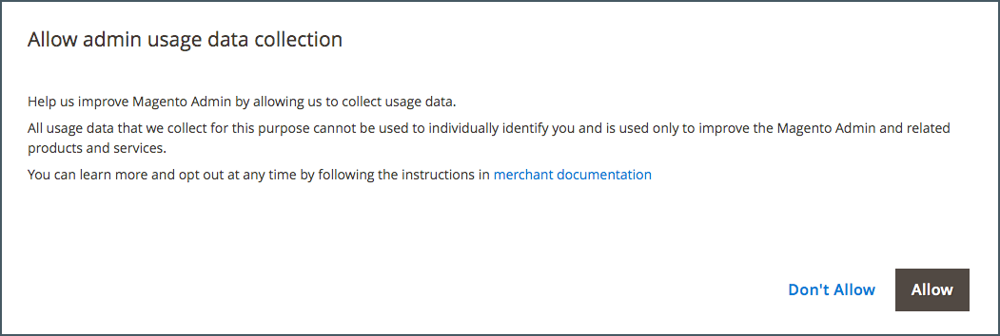

# 管理员是什么？

您的商店&#x200B;_管理员_&#x200B;是受密码保护的后台，您作为商家可以在这里设置产品和促销活动、管理订单以及执行其他管理任务。 从&#x200B;_管理员_&#x200B;执行所有基本配置任务和存储管理操作。

为了提高安全性，_管理员_&#x200B;登录受[双重身份验证](../systems/security-two-factor-authentication.md)保护，并且可以配置为需要[验证码](../systems/security-captcha.md)。 若要了解详细信息，请转到[配置管理员安全](../systems/security-admin.md)。

{width="700" zoomable="yes"}

您的[初始登录](admin-signin.md)凭据是在Adobe Commerce或Magento Open Source安装期间设置的。 如果您忘记了密码，则会将临时密码发送到与帐户关联的电子邮件地址。 为了提高安全性，请将存储配置为需要区分大小写的用户名和强密码。

除了默认的Admin用户帐户外，您的企业还可以创建管理商店和支持客户帐户所需的最多[个其他帐户](../systems/permissions-users-all.md)。 每个帐户都可以与特定的[角色](../systems/permissions-user-roles.md)和访问级别相关联，具体取决于业务&#x200B;_需要知道_。 与每个管理员用户帐户关联的电子邮件地址必须是唯一的。

{{ims-admin-note}}

## 使用情况数据收集

首次登录&#x200B;_管理员_&#x200B;时，系统会要求您授予Adobe权限，以收集所有管理员用户的使用情况数据。 通过允许收集管理员使用情况数据，您可以帮助Adobe改善使用Adobe Commerce管理员以及相关产品和服务的体验。

{width="600"}

在使用数据中未标识个别用户。 您的数据收集设置可以随时从[管理员使用情况](../configuration-reference/advanced/admin.md#admin-usage)配置中进行更改。

对于Adobe Commerce，允许数据收集还支持&#x200B;_产品内指南_，该指南旨在将交互式内容带给&#x200B;_管理员_。 它提供了帮助、工具提示、演练指南、入门信息、功能公告等。
