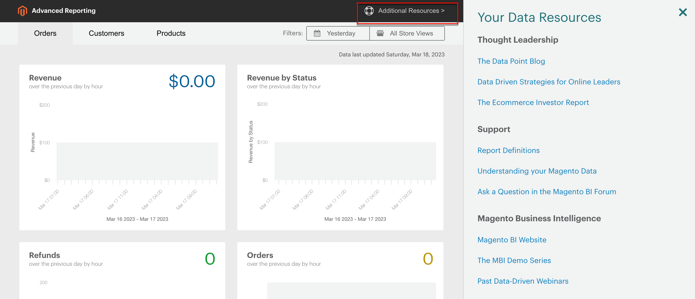

# [!DNL Commerce Intelligence]工具

使用Commerce Intelligence工具获得用于制定明智业务决策的insight。

## [!DNL Commerce Intelligence]帐户

当您通过Adobe激活[!DNL Commerce Intelligence]帐户时，您将有权访问五个包含约70个报表的仪表板。 这些报表旨在提供有关数据的洞察，并回答诸如“我的订单环比增长如何？”、“谁是我的最忠实客户？”和“我的优惠券策略有效吗？”等之类的问题。 有关此工具集的详细信息，请参阅[Commerce Intelligence用户指南](https://experienceleague.adobe.com/docs/commerce-business-intelligence/mbi/guide-overview.html?lang=zh-Hans)。

## [!DNL Advanced Reporting]

[!DNL Advanced Reporting]包含在Adobe Commerce和Magento Open Source中。 通过此功能，您可以访问基于您的产品、订单和客户数据的一组动态报表，并根据您的业务需求定制个性化仪表板。 当[!DNL Advanced Reporting]使用[!DNL Commerce Intelligence]进行Analytics时，您无需拥有Commerce Intelligence帐户即可使用[!DNL Advanced Reporting]。

有关技术信息，请参阅开发人员文档中的[[!DNL Advanced Reporting]](https://developer.adobe.com/commerce/php/development/advanced-reporting/){:target="_blank"}主题。

>[!NOTE]
>
>由于与[!DNL Adobe Commerce Intelligence]的兼容性问题，Commerce暂时无法支持使用AWS S3存储段作为[!DNL Commerce Intelligence]中源数据文件的介质的高级报表。

{width="700"}

### 要求

* 网站必须在公共Web服务器上运行。

* 域必须具有有效的安全(SSL)证书。

* [!DNL Commerce]必须安装或升级成功，并且没有错误。

* 在[!DNL Commerce]存储URL[的](../stores-purchase/store-urls.md)配置中，存储视图的&#x200B;**[!UICONTROL Base URL (Secure)]**&#x200B;设置必须指向安全URL。 例如： `https://yourdomain.com`。

* 在存储URL的[!DNL Commerce]配置中，**[!UICONTROL Use Secure URLs on Storefront]**&#x200B;和&#x200B;**[!UICONTROL Use Secure URLs in Admin]**&#x200B;必须设置为`Yes`。

* 已创建[[!DNL Commerce] crontab](https://experienceleague.adobe.com/docs/commerce-operations/configuration-guide/cli/configure-cron-jobs.html?lang=zh-Hans)，且已安装的服务器上正在运行cron作业。

>[!NOTE]
>
>[!DNL Advanced Reporting]只能与已连续使用单个[!DNL Commerce]基础货币[的](../stores-purchase/currency-configuration.md)安装一起使用。


### 步骤1：启用[!DNL Advanced Reporting]

在[!DNL Commerce]配置中，[[!DNL Advanced Reporting]](../configuration-reference/general/advanced-reporting.md)默认启用，如果cron为[已配置](../configuration-reference/advanced/system.md)且正在运行，则会自动启动。 在接下来的24小时内，每小时开始时都会开始尝试建立订阅，直到成功。 在成功建立订阅之前，订阅状态为“挂起”。

1. 在&#x200B;_管理员_&#x200B;侧边栏上，转到&#x200B;**[!UICONTROL Stores]** > _[!UICONTROL Settings]_>**[!UICONTROL Configuration]**。

1. 在展开&#x200B;**[!UICONTROL General]**&#x200B;的左侧导航面板中，选择&#x200B;**[!UICONTROL Advanced Reporting]**&#x200B;并执行以下操作：

   * 验证&#x200B;**[!UICONTROL Advanced Reporting Service]**&#x200B;是否设置为`Enable` （默认设置）。

   * 根据24小时制将&#x200B;**[!UICONTROL Time of day to send data]**&#x200B;设置为希望服务从您的存储接收更新数据的小时、分钟和秒。 默认情况下，数据在凌晨2:00发送。

   * 在&#x200B;**[!UICONTROL Industry Data]**&#x200B;下，选择最能描述您的业务的&#x200B;**[!UICONTROL Industry]**。

   {width="400"}

1. 完成后，单击&#x200B;**[!UICONTROL Save Config]**。

1. 出现提示时，单击页面顶部消息中的&#x200B;**[[!UICONTROL Cache Management]](../systems/cache-management.md)**&#x200B;并刷新任何无效缓存。

1. 整夜等待，或等到下次计划更新时再更新。 然后，检查您的订阅的状态。 如果状态仍为&#x200B;_挂起_，请确保您的安装满足所有要求。

### 步骤2：访问[!DNL Advanced Reporting]

1. 执行以下操作之一：

   * 在&#x200B;_管理员_&#x200B;侧边栏上，选择&#x200B;**[!UICONTROL Dashboard]**。 然后，单击&#x200B;**[!UICONTROL Go to Advanced Reporting]**。
   * 在&#x200B;_管理员_&#x200B;侧边栏上，转到&#x200B;**[!UICONTROL Reports]** > _[!UICONTROL Business Intelligence]_>**[!UICONTROL Advanced Reporting]**。

   [!DNL Advanced Reporting]仪表板可快速汇总您的订单、客户和产品。 确保向下滚动以查看完整的功能板。

1. 要更好地查看数据，请将右上角的&#x200B;**[!UICONTROL Filters]**&#x200B;设置为时段并存储要包含在报告中的视图。 然后，执行以下操作：

   * 将鼠标悬停在任意数据点上以了解更多信息。
   * 要查看所有功能板报表，请单击每个选项卡。

   {width="600" zoomable="yes"}

## 访问[!DNL Advanced Reporting]数据资源

在高级报告仪表板的右上角，单击&#x200B;**[!UICONTROL Additional Resources]**。

{width="600" zoomable="yes"}

## 故障排除

如果您收到404“页面未找到”消息，请验证您的商店是否符合[!DNL Advanced Reporting]的要求。 然后，按照说明验证集成是否已安装。

### 验证集成是否处于活动状态

1. 在&#x200B;_管理员_&#x200B;侧边栏上，转到&#x200B;**[!UICONTROL System]** > _[!UICONTROL Extensions]_>**[!UICONTROL Integration]**。

1. 验证&#x200B;**[!UICONTROL Magento Analytics user]**&#x200B;集成是否显示在列表中，**[!UICONTROL Status]**&#x200B;是否为`Active`。

1. 要重新建立用户，请单击&#x200B;**[!UICONTROL Reauthorize]**&#x200B;并执行以下操作：

   {width="600"}

   * 出现提示时，单击&#x200B;**[!UICONTROL Reauthorize]**&#x200B;批准对API资源的访问。

     {width="600"}

   * 验证扩展的集成令牌列表是否完整。 然后，单击&#x200B;**完成**。

     {width="600"}

1. 查找指示集成`Magento Analytics user`已重新授权的消息。

1. 整夜等待或等到下次计划更新时再进行。

### 验证单一基础货币

[!DNL Advanced Reporting]只能与自安装以来仅使用单个[!DNL Commerce]基础货币[的](../stores-purchase/currency-configuration.md)安装一起使用。 结果是，在历史记录中，所有订单都使用相同的基准货币。 如果您在任何时候更改了您的基础货币，并且历史记录中有使用不同基础货币处理的订单，则[!DNL Advanced Reporting]不起作用。

要确定存储是否具有多个基本货币，可以使用以下MySQL示例从命令行查询[!DNL Commerce]数据库。 您可能需要更改表名以匹配数据结构：

```sql
select distinct base_currency_code from sales_order;
```

### 数据差异

如果您注意到`Data last updated...`标题显示的是昨天的日期，而不是今天的日期，则高级报告更新中的延迟时间可能最多为一天。 此延迟是由于队列大小大于预期所致。

## 信息板报表

**[!UICONTROL Orders]**

| 字段 | 描述 |
|--- |--- |
| [!UICONTROL Revenue] | 显示商店视图在定义的时间段内收到的所有收入。 |
| [!UICONTROL Orders] | 显示在定义的时间段内通过商店视图下达的所有订单。 |
| [!UICONTROL AOV] | 显示在定义的时间段内通过商店视图下达的平均订单值。 |
| [!UICONTROL Refunds] | 显示在定义的时间段内通过商店视图处理的所有退款。 |
| [!UICONTROL Tax Collected] | 显示在定义的时间段内通过商店视图征收的所有税。 |
| [!UICONTROL Shipping Collected] | 显示在定义的时间段内通过商店视图收集的所有运输费用。 |
| [!UICONTROL Orders by Status] | 显示在定义的时间段内商店视图的按状态显示的订单数。 |
| [!UICONTROL Orders by Status] | 按状态列出订单数量的汇总。 |
| [!UICONTROL Coupon Usage] | 列出在定义的时间段内通过商店视图兑换的所有优惠券代码和每个优惠券的用户数。 |
| [!UICONTROL Orders and Revenue by Billing Region] | 列出在定义的时间段内商店视图的订单数和按区域列出的收入。 |
| [!UICONTROL Tax Collected by Billing Region] | 列出在定义的时间期内，按区域为商店视图征收的税额。 |
| [!UICONTROL Shipping Fees Collected by Shipping Region] | 列出在定义的时间段内按区域为商店视图收集的运输费用。 |

{style="table-layout:auto"}

**[!UICONTROL Customers]**

| 字段 | 描述 |
|--- |--- |
| [!UICONTROL Unique Customers] | 显示在定义的时间段内与商店视图关联的独特客户帐户数。 |
| [!UICONTROL New Registered Accounts] | 显示在定义的时间段内向商店视图注册的新客户帐户数。 |
| [!UICONTROL Top Coupon Users] | 按客户ID列出排名最前的优惠券用户，以及在定义的时间段内为商店视图下含优惠券的订单数。 |
| [!UICONTROL Customer KPI Table] | 列出在定义的时间段内商店视图的订单数、收入和平均订单值（按客户ID）。 |

{style="table-layout:auto"}

**[!UICONTROL Products]**

| 字段 | 描述 |
|--- |--- |
| [!UICONTROL Quantity of Products Sold] | 显示在定义的时间段内通过商店视图销售的产品数。 |
| [!UICONTROL Products Added to Wishlists] | 列出在定义的时间段内通过商店视图添加到愿望清单的所有产品。 |
| [!UICONTROL Best Selling Products by Quantity] | 列出在定义的时间段内通过商店视图销售的最畅销产品和数量。 |
| [!UICONTROL Best Selling Products by Revenue] | 列出在定义的时间段内通过商店视图销售产品时产生的畅销产品和收入。 |

{style="table-layout:auto"}
