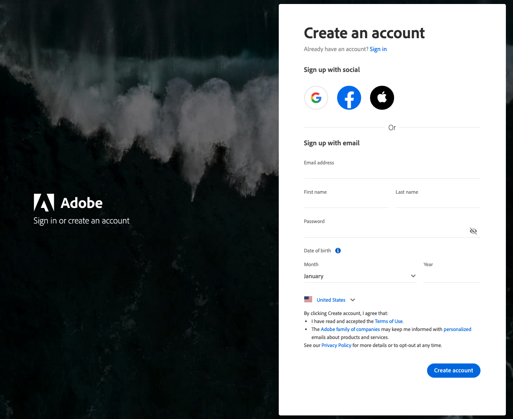

# 访问您的[!DNL Commerce]帐户

您可以从[!DNL Commerce]网站访问您的[!DNL Commerce]帐户。 从您[!DNL Commerce]帐户的信息板中，您可以找到与您购买的产品和服务相关的信息，以及您的联系人和账单信息。 某些信息仅对许可证所有者可见。

![您的[!DNL Commerce]帐户](./assets/home-acct.png){width="700"}

您的[!DNL Commerce]帐户登录名不同于商店管理员登录名。 您通常会对每个系统使用不同的凭据，并且每个系统的访问权限都受独立管理。

但是，想要简化Adobe Commerce和Adobe商业产品登录流程的用户可以将其Adobe ID配置为登录到应用商店管理员：[Commerce的IMS Integration Guide](https://experienceleague.adobe.com/en/docs/commerce-admin/start/admin/ims/adobe-ims-config)中的&#x200B;*Configure the Commerce Admin Integration with Adobe ID*。

>[!NOTE]
>
>创建帐户后，建议您使用双重身份验证(TFA)来[保护帐户的安全](commerce-account-secure.md)。

## 登录到您的[!DNL Commerce]帐户

要访问Commerce帐户，需要Adobe ID。 如果您已有[!DNL Commerce]帐户，但自2022年8月起未登录该帐户，则需要在登录过程中创建Adobe ID。

>[!WARNING]
>
>使用与现有Commerce帐户MAGEID关联的电子邮件地址来创建Adobe ID。 使用其他全新的电子邮件地址可创建新的MAGEID。

1. 转到[[!DNL Commerce] 站点](https://account.magento.com/customer/account/login/)。

1. 单击&#x200B;**[!UICONTROL Sign in with Adobe ID]**。

   {width="700"}

1. 输入您的电子邮件地址并单击&#x200B;**[!UICONTROL Continue]**。

   >[!TIP]
   >
   >如果您使用的电子邮件地址与现有Commerce帐户MAGEID关联，则登录过程会自动将其链接到您的Adobe ID。

## 创建[!DNL Commerce]帐户

任何人都可以创建免费的[!DNL Commerce]帐户。 您使用的电子邮件地址只能与一个Commerce帐户关联。

>[!NOTE]
>
>使用Adobe ID创建和访问Commerce帐户。
>- 如果您没有Commerce帐户，则可以在注册过程中创建一个。
>- 如果您已经拥有Commerce帐户，但是没有Adobe ID，请参阅[登录到Commerce帐户](#log-in-to-your-dnl-commerce-account)。

1. 转到[[!DNL Commerce] 站点](https://account.magento.com/customer/account/login/)。

1. 单击&#x200B;**[!UICONTROL Sign in with Adobe ID]**。

1. 如果您没有Adobe ID，请单击&#x200B;**[!UICONTROL Create an account]**。 否则，请跳至步骤7。

   {width="700"}

1. 完成注册表单。

   {width="700"}

1. 单击&#x200B;**[!UICONTROL Create account]**。

1. 输入发送到您电子邮件地址的验证码。

   {width="700"}

1. 创建并验证Adobe ID后，请返回https://account.magento.com/。 这将生成一个图像ID，并将其自动链接到您的Adobe ID。

## 重置密码

1. 转到[[!DNL Commerce] 站点](https://account.magento.com/customer/account/login/)。

1. 单击&#x200B;**[!UICONTROL Sign in with Adobe ID]**。

1. 单击&#x200B;**[!UICONTROL Get help signing in]**。

   {width="700"}

1. 单击&#x200B;**[!UICONTROL Reset your password]**。

   {width="700"}

1. 输入您的电子邮件地址。

1. 单击&#x200B;**[!UICONTROL Continue]**。
