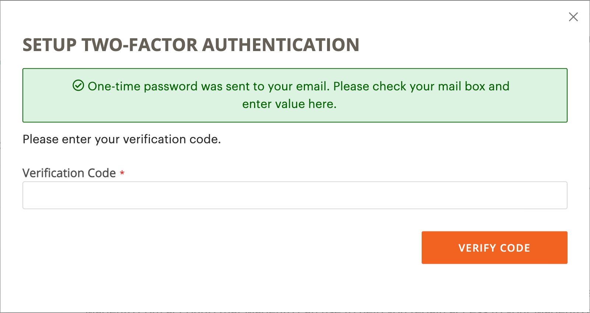
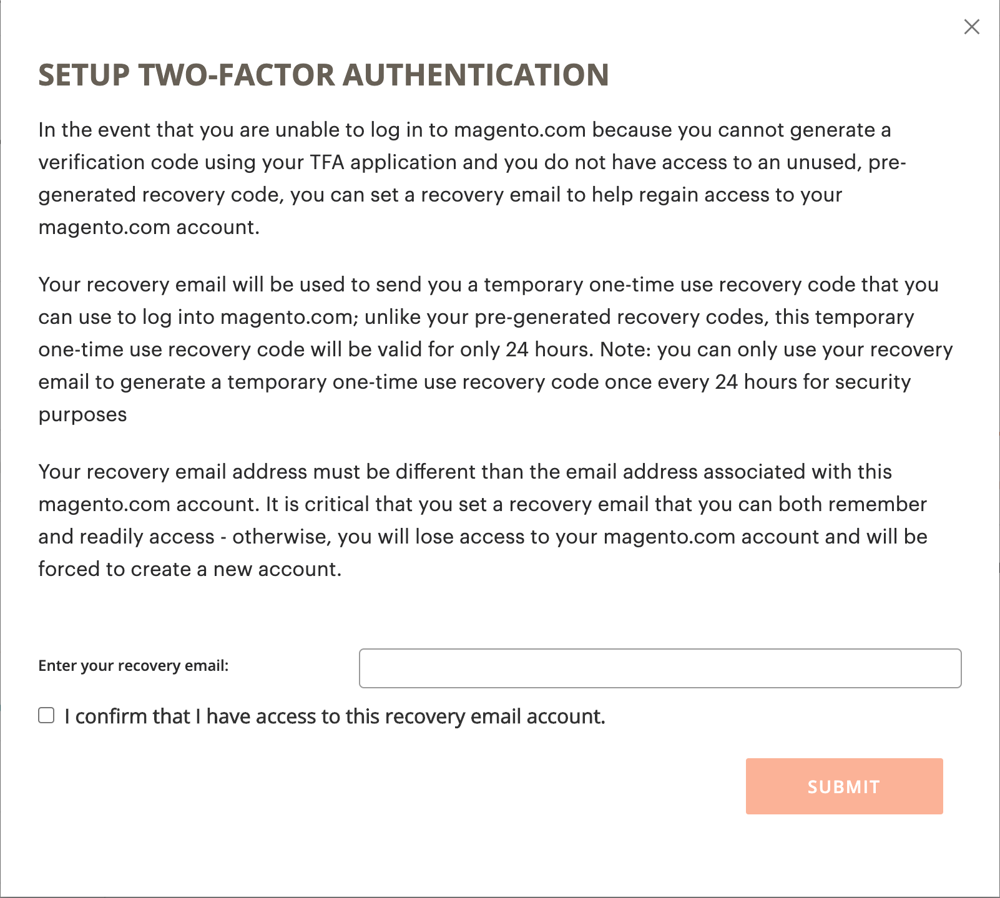
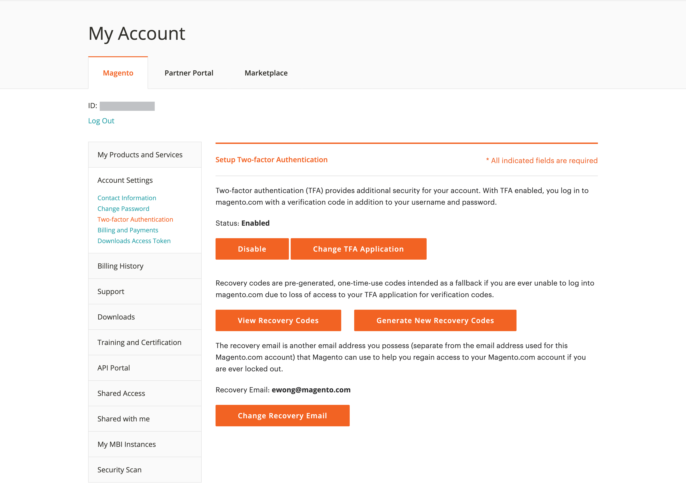
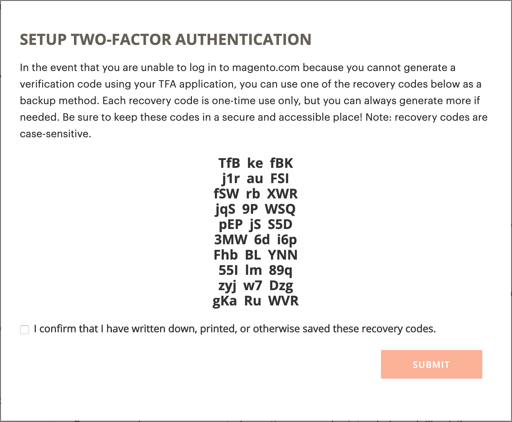

# 保护您的 [!DNL Commerce] 帐户

双重身份验证（TFA或2FA）是增加的安全层，可更好地保护您的 [!DNL Commerce] 帐户免遭未经授权的访问。 要完成登录过程，TFA需要一个 _次要因素_ 除了标准用户名和密码凭据之外。 第二个因素采用临时验证代码的形式，这些代码由安装在您的移动设备上并与之配对的TFA应用程序持续生成。 [!DNL Commerce] 帐户。

启用TFA后，您的帐户将更加安全。 未经授权的用户无法登录，除非他们同时拥有您的用户名和密码凭据（第一个因素）以及您个人设备上的TFA应用程序的有效验证代码（第二个因素）。

>[!NOTE]
>
>双重身份验证可保护 _管理员_ 的网站具有单独的设置。 要了解更多信息，请参阅 [双重身份验证](../systems/security-two-factor-authentication.md).

## 开始之前

要使用TFA，您必须在个人设备（如智能手机、平板电脑、计算机）上安装TFA应用程序。 这里有很多种可供选择的方式，但也有一些颇受欢迎且免费的选项，包括：

- Google Authenticator (iOS、Android™、BlackBerry®)

- Authy (iOS、Android™)

- Microsoft® Authenticator (iOS、Android™、Windows Phone)

## 启用双重身份验证

1. 登录 [[!DNL Commerce] 帐户][1]{：target=&quot;_blank&quot;}.

1. 在左侧导航窗格中，选择 **[!UICONTROL Account Settings]**，然后选择 **[!UICONTROL Two-factor Authentication]**.

   {width="600" zoomable="yes"}

1. 选择 **[!UICONTROL Enable]** 开始双重身份验证设置过程。

1. 输入 **[!UICONTROL Verification Code]** 已发送到您的电子邮件并选择 **[!UICONTROL Verify Code]** 以继续。

   {width="400"}

1. 打开您下载并安装在个人设备上的双重身份验证应用程序。

1. 在 [!UICONTROL SETUP TWO-FACTOR AUTHENTICATION] 表单，使用 **[!UICONTROL Setup Code]** 以将Adobe Commerce添加到您的TFA应用程序。

   {width="400"}

   您可以通过使用TFA应用程序扫描二维码或手动输入来添加代码。 此代码会将您的TFA应用程序与您的 [!DNL Commerce] 帐户，并启用生成TFA应用程序的权限以生成验证码以便安全访问帐户。

1. 完成设置。

   - 在 [!UICONTROL SETUP TWO FACTOR-AUTHENTICATION] 表单中，输入双重身份验证申请中的验证码。

   - 选择 **[!UICONTROL Verify Code]**.

   >[!NOTE]
   >
   >为安全起见，TFA应用程序中的验证代码会不断过期并重新生成。 **_始终_** 使用当前显示的代码。

1. 保存 **[!UICONTROL Recovery Codes]** 在一个安全无虞的地方出现。

   {width="400"}

   如果您在登录时无法提供验证码， [!DNL Commerce] 帐户，您必须使用恢复代码来重新获得帐户访问权限。

   每个恢复代码只能使用一次，但您可以 [生成](#generate-new-recovery-codes) 新版。 恢复代码区分大小写。

1. 选中确认复选框并选择 **[!UICONTROL Submit]** 以继续。

1. 要确保您可以恢复对帐户的访问，请输入 **[!UICONTROL Recovery Email]**.

   如果您无法从双重身份验证应用程序生成验证码，并且您无权访问未使用的预生成恢复码，则需要此电子邮件地址。

   每24小时生成一次临时恢复代码并将其发送到指定的恢复电子邮件地址。 使用此代码可重新获得帐户访问权限。

   >[!IMPORTANT]
   >
   >保持对恢复电子邮件帐户的访问权限。 否则，无法使用发送到该帐户的临时恢复代码。

   {width="400"}

1. 选中确认复选框并选择 **[!UICONTROL Submit]** 完成双重身份验证设置过程。

   - 将向与您的关联的电子邮件地址发送通知 [!DNL Commerce] 帐户，以确认您已成功启用双重身份验证。

   - 系统会向您的恢复电子邮件帐户发送通知，以确认配置。

>[!TIP]
>
>如果您丢失了个人设备或获取了新设备，您可以 [更改您的双重身份验证应用程序](#change-your-two-factor-authentication-application) 并生成新的恢复代码。

## 使用验证码登录

1. 转到 [!DNL Commerce] [帐户登录][1]{：target=&quot;_blank&quot;}.

1. 输入用户名和密码凭据，然后选择 **[!UICONTROL Login]**.

1. 输入 **[!UICONTROL Verification Code]** 在出现提示时显示在双重身份验证应用程序中。

   {width="600"}

1. 选择 **[!UICONTROL Submit]** 以完成登录过程。

## 使用恢复代码登录

1. 转到 [!DNL Commerce] [帐户登录][1]{：target=&quot;_blank&quot;}.

1. 输入用户名和密码凭据，然后选择 **[!UICONTROL Login]**.

1. 选择 **[!UICONTROL Use recovery code]** 以绕过验证码提示。

1. 输入一个未使用的 **[!UICONTROL Recovery Code]** 出现提示时。

   {width="600"}

1. 选择 **[!UICONTROL Submit]** 以完成登录过程。

## 使用恢复电子邮件登录

1. 登录 [[!DNL Commerce] 帐户][1]{：target=&quot;_blank&quot;}.

1. 输入用户名和密码凭据，然后选择 **[!UICONTROL Login]**.

1. 选择 **[!UICONTROL Use recovery code]** 以绕过验证码提示。

1. 要通过电子邮件获取临时恢复代码，请选择 **[!UICONTROL recovery email]** 链接。

   {width="600"}

1. 打开恢复电子邮件帐户以获取临时代码，然后在指定字段中输入该代码。

1. 选择 **[!UICONTROL Submit]** 以完成登录过程。

使用临时恢复代码访问帐户后， [生成新的恢复代码](#generate-new-recovery-codes) 并保存它们，以防止进一步的帐户访问问题。

## 查看您的恢复代码

1. 转到 [!DNL Commerce] [帐户登录][1]{：target=&quot;_blank&quot;}.

1. 输入用户名和密码凭据，然后选择 **[!UICONTROL Login]**.

1. 使用前面介绍的双重身份验证方法之一完成登录过程。

1. 在左侧导航窗格中，选择 **[!UICONTROL Account Settings]**，然后选择 **[!UICONTROL Two-factor Authentication]**.

   {width="600" zoomable="yes"}

1. 要查看预生成的恢复代码，请选择 **查看恢复代码**.

1. 输入 **[!UICONTROL Verification Code]** 已发送到您的电子邮件并选择 **[!UICONTROL Verify Code]** 以继续。

   {width="400"}

1. 保存 **恢复代码** 在一个安全无虞的地方出现。

   如果您无法提供验证码以登录 [!DNL Commerce] 帐户，使用恢复代码是重新获得帐户访问权限的唯一方法。

   每个恢复代码仅供一次性使用，但您可以随时使用 [生成](#generate-new-recovery-codes) 新版。 恢复代码区分大小写。

   {width="400"}

1. 选中确认复选框并选择 **[!UICONTROL Submit]** 以关闭对话框。

## 生成新的恢复代码

1. 转到 [!DNL Commerce] [帐户登录][1]{：target=&quot;_blank&quot;}.

1. 输入用户名和密码凭据，然后选择 **[!UICONTROL Login]**.

1. 使用前面介绍的双重身份验证方法之一完成登录过程。

1. 在左侧导航窗格中，选择 **[!UICONTROL Account Settings]**，然后选择 **[!UICONTROL Two-factor Authentication]**.

1. 要生成新的预生成的恢复代码，请选择 **生成新的恢复代码**.

1. 输入 **[!UICONTROL Verification Code]** 已发送到您的电子邮件并选择 **[!UICONTROL Verify Code]** 以继续。

1. 保存 **恢复代码** 在一个安全无虞的地方出现。

   如果您在登录时无法提供验证码， [!DNL Commerce] 帐户，使用恢复代码是重新获得帐户访问权限的唯一方法。

   现在，所有以前生成的恢复代码都将变为无效，应将其丢弃（只有当前生成的恢复代码集才能正常工作）。 恢复代码区分大小写。

1. 选中确认复选框并选择 **[!UICONTROL Submit]** 以关闭对话框。

## 更改恢复电子邮件

1. 转到 [!DNL Commerce] [帐户登录][1]{：target=&quot;_blank&quot;}.

1. 输入用户名和密码凭据，然后选择 **[!UICONTROL Login]**.

1. 使用前面介绍的双重身份验证方法之一完成登录过程。

1. 在左侧导航窗格中，选择 **[!UICONTROL Account Settings]**，然后选择 **[!UICONTROL Two-factor Authentication]**.

1. 选择 **更改恢复电子邮件** 以更改您帐户的recovery email on file。

1. 输入 **[!UICONTROL Verification Code]** 已发送到您的电子邮件并选择 **[!UICONTROL Verify Code]** 以继续。

1. 要确保您可以恢复对帐户的访问，请输入 **恢复电子邮件**.

   如果您无法从双重身份验证应用程序生成验证码，并且您无权访问未使用的预生成恢复码，则需要此电子邮件地址。

   每24小时生成一次临时恢复代码并将其发送到指定的恢复电子邮件地址。 您可以使用此代码重新获得帐户访问权限。

   >[!IMPORTANT]
   >
   >保持对恢复电子邮件帐户的访问权限。 否则，无法使用发送到该帐户的临时恢复代码。

1. 选中确认复选框并选择 **[!UICONTROL Submit]** 以关闭对话框。

   系统会向您指定的恢复电子邮件发送电子邮件通知，以确认特定电子邮件地址已归档为接收临时恢复代码的恢复电子邮件。

## 更改您的双重身份验证应用程序

1. 转到 [!DNL Commerce] [帐户登录][1]{：target=&quot;_blank&quot;}.

1. 输入用户名和密码凭据，然后选择 **[!UICONTROL Login]**.

1. 使用前面介绍的双重身份验证方法之一完成登录过程。

1. 在左侧导航窗格中，选择 **[!UICONTROL Account Settings]**，然后选择 **[!UICONTROL Two-factor Authentication]**.

1. 选择 **更改TFA应用程序** 以使用其他TFA应用程序与您的magento.com帐户。

1. 输入 **[!UICONTROL Verification Code]** 已发送到您的电子邮件并选择 **[!UICONTROL Verify Code]** 以继续。

1. 在个人设备上打开双重身份验证应用程序。

1. 输入 **设置代码** 加入您的双重身份验证应用程序中。

   您可以使用TFA应用程序扫描二维码或手动输入来添加代码。 此代码会将您的TFA应用程序与您的 [!DNL Commerce] 帐户，并启用TFA应用程序的权限以生成验证码来保护帐户访问。

   >[!NOTE]
   >
   >为安全起见，TFA应用程序中的验证代码会不断过期并重新生成。 **_始终_** 使用当前显示的代码。

1. 您的TFA应用程序现已与您的 [!DNL Commerce] 帐户，请输入 **[!UICONTROL Verification Code]** 显示在TFA应用程序中，并选择 **[!UICONTROL Verify Code]** 以继续。

1. 保存 **恢复代码** 在一个安全无虞的地方出现。

   如果您在登录时无法提供验证码， [!DNL Commerce] 帐户，重新获得帐户访问权限的唯一方法是使用恢复代码。

   每个恢复代码仅供一次性使用，但您可以随时使用 [生成](#generate-new-recovery-codes) 新版。 恢复代码区分大小写。 恢复代码区分大小写。

1. 选中复选框以确认并选择 **[!UICONTROL Submit]** 以继续。

1. 要确保您可以恢复对帐户的访问，请输入 **恢复电子邮件**.

   如果您无法从双重身份验证应用程序生成验证码，并且您无权访问未使用的预生成恢复码，则需要此电子邮件地址。

   每24小时生成一次临时恢复代码并将其发送到指定的恢复电子邮件地址。 使用此代码可重新获得帐户访问权限。

   >[!IMPORTANT]
   >
   >保持对恢复电子邮件帐户的访问权限。 否则，无法使用发送到该帐户的临时恢复代码。

1. 选中确认复选框并选择 **[!UICONTROL Submit]** 完成双重身份验证设置过程。

   系统会向您指定的恢复电子邮件发送电子邮件通知，以确认特定电子邮件地址已归档为恢复电子邮件，用于接收临时恢复代码。

## 禁用双重身份验证

>[!IMPORTANT]
>
>如果您的组织安全策略要求对Adobe Commerce帐户进行多重身份验证，则无法禁用双重身份验证。

1. 转到 [!DNL Commerce] [帐户登录][1]{：target=&quot;_blank&quot;}.

1. 输入用户名和密码凭据，然后选择 **[!UICONTROL Login]**.

1. 使用前面介绍的双重身份验证方法之一完成登录过程。

1. 在左侧导航窗格中，选择 **[!UICONTROL Account Settings]** 并选择 **[!UICONTROL Two-factor Authentication]** 下方。

1. 选择 **[!UICONTROL Disable]** 以开始TFA停用过程。

1. 输入 **[!UICONTROL Verification Code]** 已发送到您的电子邮件并选择 **[!UICONTROL Verify Code]** 以继续。

1. 选中确认复选框并选择 **[!UICONTROL Submit]** 以完成双重身份验证的停用。

   系统会发送电子邮件确认，指示已在您的计算机上禁用TFA [!DNL Commerce] 帐户。

   {width="400"}

[1]: https://account.magento.com/customer/account/login
