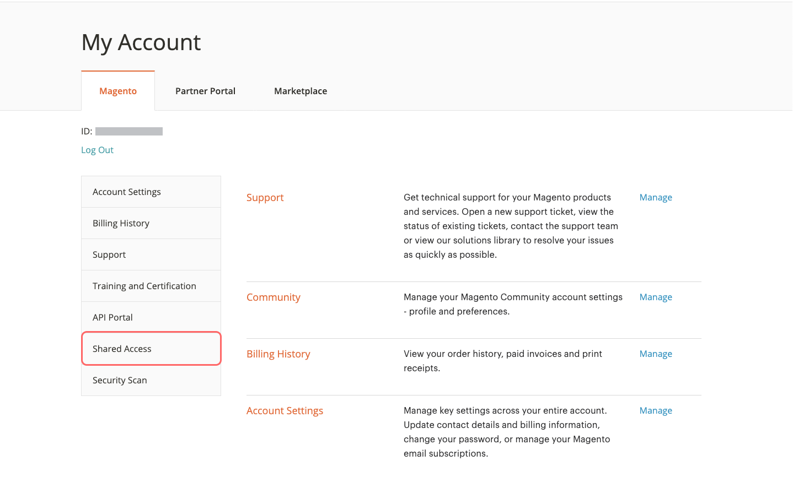

# 共享[!DNL Commerce]帐户

您的[!DNL Commerce]帐户包含的信息可供受信任的员工和帮助管理您网站的服务提供商使用。 作为主要帐户持有人，您有权授予其他[!DNL Commerce]帐户持有人的有限访问权限。 共享访问权限可以撤销，但无法从一个用户转移到另一个用户。

[!DNL Commerce]支持团队没有访问帐户的权限，无法为您设置共享访问权限。 只有具有适当权限的主要帐户持有人才能设置共享访问权限。 当您共享帐户访问权限时，所有敏感信息（如账单历史记录或信用卡信息）都会受到保护，其他用户将永远无法访问。

>[!NOTE]
>
>具有共享访问权限的用户执行的所有操作由主要帐户持有人全权负责。 对于已共享您的帐户访问权限的用户执行的任何操作，Adobe概不负责。

{width="600" zoomable="yes"}

## 设置共享帐户

1. 在开始之前，请从&#x200B;**新共享访问被授权者**&#x200B;的[!DNL Commerce]帐户获取以下信息：

   - 用户必须在account.adobe.com上注册帐户，并通过account.magento.com登录。
   - `MAGE ID/Account ID (MAG00XXXXXXX)`显示在&#x200B;_[!UICONTROL Magento]_选项卡的左上角，**注销**链接正上方。
   - 与帐户关联的`Email`地址。

1. 登录到您的[[!DNL Commerce] 帐户](commerce-account-create.md)。

1. 在左侧导航面板中，单击&#x200B;**[!UICONTROL Shared Access]**。

1. 单击&#x200B;**[!UICONTROL Add New User]**。

   {width="600" zoomable="yes"}

1. 在[!UICONTROL _New User Information]_下，执行以下操作：

   - 输入新用户的[!DNL Commerce]帐户中的&#x200B;**[!UICONTROL Account ID]**。
   - 输入与新用户的[!DNL Commerce]帐户关联的&#x200B;**[!UICONTROL Email]**&#x200B;地址。

   {width="600"}

1. 在&#x200B;_[!UICONTROL Shared Information]_下，执行以下操作：

   - 要识别共享帐户，请输入&#x200B;**[!UICONTROL Share Name]**。 此名称供内部参考，仅对您以及与您共享帐户的人可见。

     最佳做法是将您的组织名称用作[!UICONTROL Share Name]。 不要使用以`CLOUD SHARED ACCESS FROM MAG XYX`开头的名称。
   - 如果要与新用户共享您的个人联系信息，请输入&#x200B;**[!UICONTROL Your Email]**&#x200B;和&#x200B;**[!UICONTROL Your Phone]**。

1. 在&#x200B;_[!UICONTROL Grant Account Permissions]_下，选中要共享的每个[!DNL Commerce]产品和服务的复选框。

   {width="600"}

1. 单击&#x200B;**[!UICONTROL Create Shared Access]**。

   新用户信息显示在“共享访问”页面的&#x200B;_[!UICONTROL Manage Permissions]_部分中，并且会向新用户发送一封电子邮件邀请，其中包含访问共享帐户的说明。

   {width="600" zoomable="yes"}

>[!NOTE]
>
>无需共享对&#x200B;_[!UICONTROL Security Tool]_的访问权限 — 任何具有MAGE ID的用户都可以使用自己的帐户设置安全扫描工具。 他们只需要必要的权限即可更改网站并使用[所需方法](https://experienceleague.adobe.com/en/docs/commerce-admin/systems/security/security-scan)之一验证域的所有权。

## 访问共享帐户

以下说明是从收到共享帐户邀请的共享用户的角度编写的。

1. 当您收到共享帐户的邀请时，请按照电子邮件中的说明登录到您自己的[!DNL Commerce]帐户。

   您帐户的左侧导航面板具有新的&#x200B;_[!UICONTROL Shared with me]_选项卡。 右上角的_[!UICONTROL Switch Accounts]_&#x200B;控件具有`My Account`的选项和共享帐户的名称。

   {width="600" zoomable="yes"}

1. 若要获得对共享帐户的访问权限，请将&#x200B;**[!UICONTROL Switch Accounts]**&#x200B;设置为共享帐户的名称。

   {width="600" zoomable="yes"}

   共享帐户显示欢迎消息和联系信息。 左侧导航面板仅包含您有权使用的项目。

1. 要将共享帐户连接到帮助中心，请单击共享帐户左侧导航面板中的&#x200B;**[!UICONTROL Support]**。

   {width="600" zoomable="yes"}

   您可以使用共享帐户中的[Adobe Commerce帮助中心](https://experienceleague.adobe.com/en/docs/commerce-knowledge-base/kb/overview.html)来搜索文章和疑难解答信息、查找已知问题的修补程序以及创建支持工单。

   >[!NOTE]
   >
   >收到共享访问权限后，用户必须登录到其[[!DNL Commerce] 帐户](https://account.magento.com/customer/account/login)，导航到&#x200B;_共享访问权限_，然后单击&#x200B;**[!UICONTROL Support]**&#x200B;选项卡。 第一次需要执行此操作只是为了确保通过`SSO`调用正确配置了[Adobe Commerce支持知识库](https://experienceleague.adobe.com/en/docs/commerce-knowledge-base/kb/overview.html)。

1. 若要返回您自己的帐户，请在浏览器控件中单击&#x200B;**返回**，并将&#x200B;**[!UICONTROL Switch Accounts]**&#x200B;设置为`My Account`。

## 撤销共享访问权限

1. 登录到您的Commerce帐户。

1. 在左侧导航面板中，单击&#x200B;**[!UICONTROL Shared Access]**。

1. 查找要在&#x200B;_[!UICONTROL Managing Users & Permissions]_下撤消的帐户，然后单击&#x200B;**[!UICONTROL Delete]**。

   >[!NOTE]
   >
   > 如果未显示&#x200B;**[!UICONTROL Delete]**，请检查&#x200B;**[!UICONTROL Share Name]**&#x200B;是否以`Cloud Shared Access from MAG XYZ`开头。 不能删除具有该[命名模式](https://experienceleague.adobe.com/en/docs/commerce-knowledge-base/kb/help-center-guide/magento-help-center-user-guide#remove-cloud-shared-access-users)的帐户。
   > 
   > 如果是这样，请要求帐户所有者修改共享访问帐户以清除帐户权限。 在该更新之后，用户无法访问任何帐户资源。
   >
   > 此外，确保从项目中删除用户，以便他们不再收到电子邮件通知： [前团队成员将收到Adobe Commerce云通知电子邮件](https://experienceleague.adobe.com/en/docs/commerce-knowledge-base/kb/troubleshooting/miscellaneous/former-teammembers-receive-cloud-notification-emails.html)

1. 提示确认时，单击&#x200B;**[!UICONTROL Delete User]**。

>[!NOTE]
>
>您无法在此界面中从MAG[XYZ ]_删除共享名称为_&#x200B;云共享访问的用户。 请参阅[如何删除通过云项目被授予共享访问权限的用户？](https://experienceleague.adobe.com/en/docs/commerce-knowledge-base/kb/help-center-guide/magento-help-center-user-guide.html?lang=en#remove-cloud-shared-access-users)。
