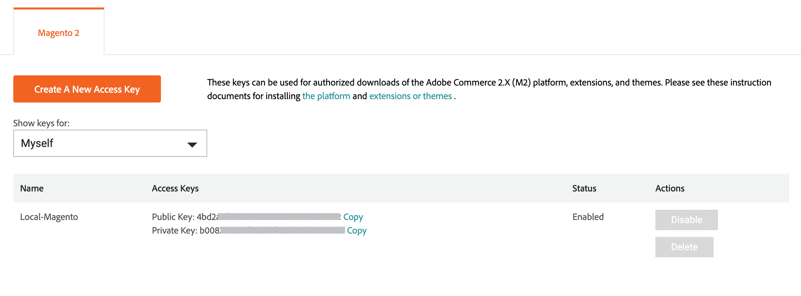

# Adobe Commerce市场

[Adobe Commerce Marketplace][1]是一个应用商店，为商家提供精选的解决方案，并为合格的开发人员提供工具、平台和最佳位置，以打造蓬勃发展的业务。 [!DNL Commerce Marketplace]提供一系列免费的扩展以及其他可供销售的扩展。 可以通过信用卡或[PayPal][2]支付购买费用。

[!DNL Commerce Marketplace]上可用的所有扩展均已通过广泛审查。 [扩展质量计划][3] (EQP)结合了[!DNL Commerce]专业知识、开发准则和验证工具，以确保Commerce Marketplace上的所有扩展都符合编码标准和最佳实践。 审核过程包括自动检查和手动QA审核。 在此过程中，会检查并测试每个扩展的结构和代码，以查找病毒/恶意软件感染的证据以及是否存在任何抄袭迹象。 审查包括由[!DNL Commerce]工程师进行的深入技术检查和健全性检查，重点是文档、编码结构、性能、可扩展性、安全性和与[!DNL Commerce]核心的兼容性。

尽管您可以从其他来源购买扩展，但只有在[!DNL Commerce Marketplace]上可用的扩展才通过扩展质量计划中的大量技术和营销审查得到验证。

## 应用程序资源

开发人员传统上使用PHP创建进程内扩展以向Adobe Commerce添加特性、功能、服务和集成。 通过创建具有进程外可扩展性的应用程序（而不是扩展），您可以避免出现兼容性问题。

以下资源为新采用者熟悉应用程序提供了起点：

### Commerce资源

- [为Adobe Commerce设置I/O事件](https://developer.adobe.com/commerce/extensibility/events/)
- [为Adobe Commerce配置事件](https://developer.adobe.com/commerce/extensibility/events/configure-commerce/)
- [设置管理员UI SDK](https://developer.adobe.com/commerce/extensibility/admin-ui-sdk/)
- [将扩展转换为应用程序](https://developer.adobe.com/commerce/extensibility/app-development/#how-do-i-port-an-extension-into-an-app)

### App Builder资源

- [Commerce App Builder概述](https://developer.adobe.com/commerce/extensibility/app-development/)
- [为Adobe Developer App Builder设置API网格](https://developer.adobe.com/graphql-mesh-gateway/gateway/getting-started/)
- [正在部署App Builder应用程序](https://developer.adobe.com/app-builder/docs/guides/deployment/)
- 适用于App Builder应用程序的[CI/CD](https://developer.adobe.com/app-builder/docs/guides/deployment/ci_cd_for_firefly_apps/)
- App Builder/Developer Console快速入门
   - [App Builder快速入门](https://developer.adobe.com/app-builder/docs/getting_started/)
   - [了解项目和工作区](https://developer.adobe.com/app-builder/docs/resources/videos/exploring/projects-and-workspaces/)

## [!DNL Marketplace]凭据

在您可以安装从[!DNL Commerce Marketplace]购买的扩展之前，请登录到您的[!DNL Commerce]帐户并验证您是否拥有有效的访问密钥。 您可以从[!DNL Commerce]或[[!DNL Marketplace]][1]Magento.com[的标题登录您的][6]帐户。

您的访问密钥是一组公钥和私钥，用于将[!DNL Commerce]安装与[!DNL Commerce]帐户同步并验证您的凭据。 帐户同步后，每次从Commerce Marketplace安装扩展或模块或升级[!DNL Commerce]安装时，都必须输入私钥。

您可以为不同目的创建多个访问密钥，并根据需要启用或禁用它们。 但是，您必须使用安装[!DNL Commerce]软件所用的同一访问密钥。 例如，您无法使用Magento Open Source访问密钥更新或升级Adobe Commerce，反之亦然。 您也无法使用属于其他用户或来自[共享帐户](commerce-account-share.md)的访问密钥。

### 创建访问密钥

1. 登录到您的[!DNL Commerce]帐户。

1. 在&#x200B;_[!UICONTROL My Account]_页面上，选择&#x200B;**[!UICONTROL Marketplace]**选项卡。

1. 在名称旁边的右上角，单击向下箭头并选择&#x200B;**[!UICONTROL My Profile]**。

   ![您的[!DNL Marketplace]配置文件](./assets/marketplace-profile.png){width="600"}

1. 在&#x200B;_[!UICONTROL Marketplace]_下的_[!UICONTROL My Products]_&#x200B;选项卡上，单击&#x200B;**[!UICONTROL Access Keys]**，然后执行以下任一操作：

   - 查看您是否已经拥有一组用于您的市场购买的访问密钥。 您可以为不同目的创建多组访问键。

   {width="600"}

   - 单击&#x200B;**[!UICONTROL Create a New Access Key]**。 输入新密钥对的名称，然后单击&#x200B;**[!UICONTROL OK]**。 有效字符包括大写和小写字符以及连字符而不是空格。

1. 完成后，单击&#x200B;**[!UICONTROL OK]**。

   您的新访问密钥已启用，并显示在列表中。

   请注意每个公钥和私钥后面的&#x200B;_复制_&#x200B;链接。 在下一步中，您将复制并粘贴这些值，以将存储与Commerce Marketplace同步。

## 安装过程

>[!IMPORTANT]
>
>从Adobe Commerce和Magento Open Source 2.4.0开始，将删除“Web安装向导”，您必须使用命令行来[安装](https://experienceleague.adobe.com/docs/commerce-operations/installation-guide/advanced.html)或[升级](https://experienceleague.adobe.com/docs/commerce-operations/upgrade-guide/implementation/perform-upgrade.html)您的实例。 此要求还包括[模块](https://experienceleague.adobe.com/docs/commerce-operations/upgrade-guide/modules/upgrade.html)和[扩展](https://experienceleague.adobe.com/docs/commerce-operations/installation-guide/tutorials/extensions.html)。

Commerce的[!DNL Marketplace]内部部署&#x200B;_安装的购买_&#x200B;的安装过程与托管在[Adobe Cloud Architecture][4]上的安装不同。

{width="600"}

## 支持

如果您在安装或使用扩展时需要帮助，请首先查看扩展随附的文档。 如果找不到问题的答案，请使用扩展列表中的联系信息直接联系开发人员。 如果您在Marketplace上购买的产品无法满足您的需求，则可以在购买日期起25天内[申请退款](#refund-requests)。 Adobe会审核所有退款请求，并（如果批准）发出相应的退款。 有关与Commerce Marketplace相关的问题：

方法1：从[Adobe Commerce Marketplace提交支持请求 — 联系我们](https://commercemarketplace.adobe.com/contact-us/)表单。

方法2：[电子邮件支持](mailto:commercemarketplacesupport@adobe.com)。

### 签出问题

必须在Marketplace购买系统中填写帐户配置文件中的地址字段以进行验证。

1. 在您的Marketplace帐户配置文件中添加地址字段。
1. 保存更新的配置文件。
1. 继续您的结帐。

### 登录问题

登录问题通常与帐户数据库中的MAGEID和电子邮件地址不匹配有关。 如需帮助，请联系市场支持。

>[!INFO]
>
>应用程序和扩展购买不能是[转移到](#purchase-transfers)新帐户。

### 开源问题

市场支持团队仅解决了与[commercemarketplace.adobe.com/](https://commercemarketplace.adobe.com/)和[commercedeveloper.adobe.com/](https://commercedeveloper.adobe.com/)网站相关的问题。 请将有关Magento Open Source的问题提交至[社区论坛](https://community.magento.com/)或[联系可以协助Magento Open Source的合作伙伴](https://business.adobe.com/products/magento/partners.html)。

### 退款申请

要申请购买Marketplace的退款，请登录您的帐户并执行以下步骤：

1. 单击&#x200B;[!UICONTROL **我的个人资料**] > [!UICONTROL **购买历史记录**]。
1. 找到购买并单击&#x200B;[!UICONTROL **请求退款**]。
1. 完成退款订单表。

Marketplace Support将在生成退款请求后请求信息。 退款选项可在购买日期后25天内使用。 请参阅[市场客户协议](https://www.adobe.com/legal/terms/enterprise-licensing/magento-legacy-terms.html)。

### 订单发票

您可以从Marketplace帐户中的&#x200B;[!UICONTROL **购买历史记录**]&#x200B;下载订单发票。 发票不提供VAT或卖方地址，因为此时它不是Marketplace要求。

要下载Marketplace购买的订单发票，请登录Marketplace帐户并执行以下步骤：

1. 单击&#x200B;[!UICONTROL **我的个人资料**] > [!UICONTROL **购买历史记录**]。
1. 找到购买。
1. 单击订单右上角的打印机图标。

### 采购转帐

Marketplace支持团队无法将购买转移到其他帐户。 您必须购买主Commerce帐户下的所有应用程序和扩展，以避免安装和部署问题。 Adobe Commerce有权使用一个唯一标识符。 由于使用Composer进行安装，因此只能使用绑定到主帐户的一组[访问密钥](#create-an-access-key)。 唯一可用的解决方案是[从Marketplace购买帐户](#refund-requests)申请退款(如果Adobe Commerce退款政策允许)。

您可通过主帐户[共享](commerce-account-share.md)Commerce实例。 共享访问权限授予主帐户的下属帐户的特殊权限。 共享接入点是从主帐户生成的。 主帐户可以是Commerce授权帐户、主商家帐户或在组织内共享的帐户。

这些特殊权限会授予用户与主要用户相同级别的Adobe Commerce访问权限，但不会转到Adobe Commerce Marketplace或开发人员门户。 这意味着从市场中的从属帐户购买扩展时不能与主帐户共享。 共享访问是单向访问（主帐户到从属帐户）。 当从属帐户尝试共享回主帐户时，此方法不起作用。

[1]: https://marketplace.magento.com/
[2]: https://www.paypal.com/us/home
[3]: https://developer.adobe.com/commerce/marketplace/guides/sellers/extension-quality-program/
[4]: https://www.adobe.com/commerce/magento/enterprise.html
[6]: https://business.adobe.com/products/magento/magento-commerce.html
