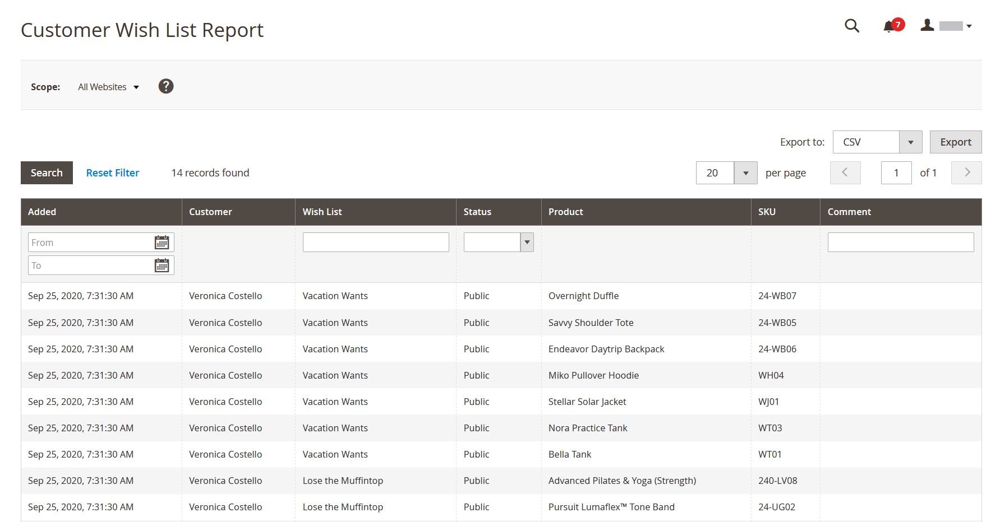

# 客户报表

客户报表在指定的时间段或日期范围内向客户活动提供insight。

## [!UICONTROL Order Total Report]

[!UICONTROL Order Total Report]显示指定时间间隔或日期范围内的客户订单。 此报表包括每位客户的订单数、平均订单金额和总额。

在&#x200B;_管理员_&#x200B;侧边栏上，转到&#x200B;**[!UICONTROL Reports]** > _[!UICONTROL Customers]_>**[!UICONTROL Order Total]**。

{width="600"}

### Workspace控件

| 控件 | 描述 |
|--- |--- |
| [!UICONTROL From / To] | 用于根据起始日期和终止日期定义订单搜索。 |
| [!UICONTROL Show By] | 定义订单记录拆分的粒度。 选项： `Month` / `Day` / `Year` |
| [!UICONTROL Refresh] | 将网格更新为指定的筛选器。 |
| [!UICONTROL Export] | 将选定的记录导出为CSV或Excel XML文件。 |
| [!UICONTROL Scope] | 用于设置生成报告的网站或商店。 |

{style="table-layout:auto"}

### 列描述

| 列 | 描述 |
|--- |--- |
| [!UICONTROL Interval] | 订单总计间隔，按`Month` / `Day` / `Year`。 |
| [!UICONTROL Customer] | 下订单的客户的名称。 |
| [!UICONTROL Orders] | 指定间隔内的订单数。 |
| [!UICONTROL Average] | 平均订单金额。 此金额始终针对产品价格&#x200B;**计算（不含税**），即使目录产品价格、订单小计和订单总计含税。 因此，如果订单总额含税，则报表中显示的金额与订单详细信息中显示的金额会有所不同。 |
| [!UICONTROL Total] | 该期间所有订单的总和。 此金额始终针对产品价格&#x200B;**计算（不含税**），即使目录产品价格、订单小计和订单总计含税。 因此，如果订单总额含税，则报表中显示的总金额与订单详细信息中显示的金额会有所不同。 |

{style="table-layout:auto"}

## [!UICONTROL Order Count Report]

[!UICONTROL Order Count Report]显示指定时间间隔或日期范围内每个客户的订单数。 此报表包括每位客户的订单数、平均订单金额和总额。

在&#x200B;_管理员_&#x200B;侧边栏上，转到&#x200B;**[!UICONTROL Reports]** > _[!UICONTROL Customers]_>**[!UICONTROL Order Count]**。

{width="600"}

### Workspace控件

| 控件 | 描述 |
|--- |--- |
| [!UICONTROL From / To] | 用于根据起始日期和终止日期定义订单搜索。 |
| [!UICONTROL Show By] | 定义订单记录拆分的粒度。 选项： `Month` / `Day` / `Year` |
| [!UICONTROL Refresh] | 将网格更新为指定的筛选器。 |
| [!UICONTROL Export] | 将选定的记录导出为CSV或Excel XML文件。 |
| [!UICONTROL Scope] | 用于设置生成报告的网站或商店。 |

{style="table-layout:auto"}

### 列描述

| 列 | 描述 |
|--- |--- |
| [!UICONTROL Interval] | 订单计数间隔，按`Month` / `Day` / `Year`。 |
| [!UICONTROL Customer] | 下订单的客户。 |
| [!UICONTROL Orders] | 指定间隔内的订单数。 |
| [!UICONTROL Average] | 平均订单金额。 此金额始终针对产品价格&#x200B;**计算（不含税**），即使目录产品价格、订单小计和订单总计含税。 因此，如果订单总额含税，则报表中显示的金额与订单详细信息中显示的金额会有所不同。 |
| [!UICONTROL Total] | 该期间所有订单的总和。 此金额始终针对产品价格&#x200B;**计算（不含税**），即使目录产品价格、订单小计和订单总计含税。 因此，如果订单总额包含该金额，则报表中显示的总金额与订单详细信息中显示的金额会有所不同。 |

{style="table-layout:auto"}

## [!UICONTROL New Accounts Report]

[!UICONTROL New Accounts Report]显示在指定的时间间隔或日期范围内打开的新客户帐户数。

在&#x200B;_管理员_&#x200B;侧边栏上，转到&#x200B;**[!UICONTROL Reports]** > _[!UICONTROL Customers]_>**[!UICONTROL New]**。

{width="600"}

### Workspace控件

| 控件 | 描述 |
|--- |--- |
| [!UICONTROL From / To] | 用于根据开始日期和结束日期定义新帐户的搜索。 |
| [!UICONTROL Show By] | 定义订单记录拆分的粒度。 选项：月/日/年 |
| [!UICONTROL Refresh] | 将网格更新为指定的筛选器。 |
| [!UICONTROL Export] | 将选定的记录导出为CSV或Excel XML文件。 |
| [!UICONTROL Scope] | 用于设置生成报告的网站或商店。 |

{style="table-layout:auto"}

### 列描述

| 列 | 描述 |
|--- |--- |
| [!UICONTROL Interval] | 新帐户创建间隔，按月/日/年。 |
| [!UICONTROL New Accounts] | 在特定间隔内创建的新帐户数。 |

{style="table-layout:auto"}

## [!UICONTROL Customer Wish List Report]

(仅限Adobe Commerce)

[!UICONTROL Customer Wish List Report]提供了有关客户愿望清单的信息。

在&#x200B;_管理员_&#x200B;侧边栏上，转到&#x200B;**[!UICONTROL Reports]** > _[!UICONTROL Customers]_>**[!UICONTROL Wish Lists]**。

{width="600"}

### Workspace控件

| 控件 | 描述 |
|--- |--- |
| [!UICONTROL Scope] | 用于设置生成报告的网站或商店。 |
| [!UICONTROL Search] | 按指定的参数启动搜索。 |
| [!UICONTROL Reset Filter] | 启动所有搜索参数的重置。 |
| [!UICONTROL Per Page] | 设置单个页面中显示的记录数。 |
| [!UICONTROL Export] | 将选定的记录导出为CSV或Excel XML文件。 |
| [!UICONTROL From / To] | 用于根据开始日期和结束日期定义愿望清单的搜索。 |
| [!UICONTROL Wishlist] | 按名称启动愿望清单搜索。 |
| [!UICONTROL Status] | 愿望清单的状态。 选项： `Private` / `Public` |
| [!UICONTROL Comment] | 在愿望清单注释中启动按文本搜索。 |

{style="table-layout:auto"}

### 列描述

| 列 | 描述 |
|--- |--- |
| [!UICONTROL Added] | 创建愿望清单的日期。 |
| [!UICONTROL Customer] | 创建愿望清单的客户的名字和姓氏。 |
| [!UICONTROL Wishlist] | 希望列表的名称。 |
| [!UICONTROL Status] | 愿望清单的状态。 选项： `Private` / `Public` |
| [!UICONTROL Product] | 添加到愿望清单的产品名称。 |
| [!UICONTROL SKU] | 已将产品的SKU添加到愿望清单。 |
| [!UICONTROL Comment] | 创建愿望清单时输入的备注文本。 |

{style="table-layout:auto"}

## [!UICONTROL Customer Segment Report]

(仅限Adobe Commerce)

[!UICONTROL Customer Segment Report]提供有关每个区段中的客户数的信息。

在&#x200B;_管理员_&#x200B;侧边栏上，转到&#x200B;**[!UICONTROL Reports]** > _[!UICONTROL Customers]_>**[!UICONTROL Segments]**。

{width="600"}

### Workspace控件

| 控件 | 描述 |
|--- |--- |
| [!UICONTROL Search] | 按指定的参数启动搜索。 |
| [!UICONTROL Reset Filter] | 启动所有搜索参数的重置。 |
| [!UICONTROL Action] | 按参数启动区段的显示。 选项： `Action` / `View Combined Report` |
| [!UICONTROL Per Page] | 设置单个页面中显示的记录数。 |

{style="table-layout:auto"}

### 列描述

| 列 | 描述 |
|--- |--- |
| [!UICONTROL ID] | 分配给每个区段的唯一数字标识符。 |
| [!UICONTROL Segment] | 区段名称。 |
| [!UICONTROL Status] | 区段状态。 选项： `Active` / `Inactive` |
| [!UICONTROL Website] | 区段分配到的网站。 |
| [!UICONTROL Customers] | 分配给区段的客户数。 |

{style="table-layout:auto"}
