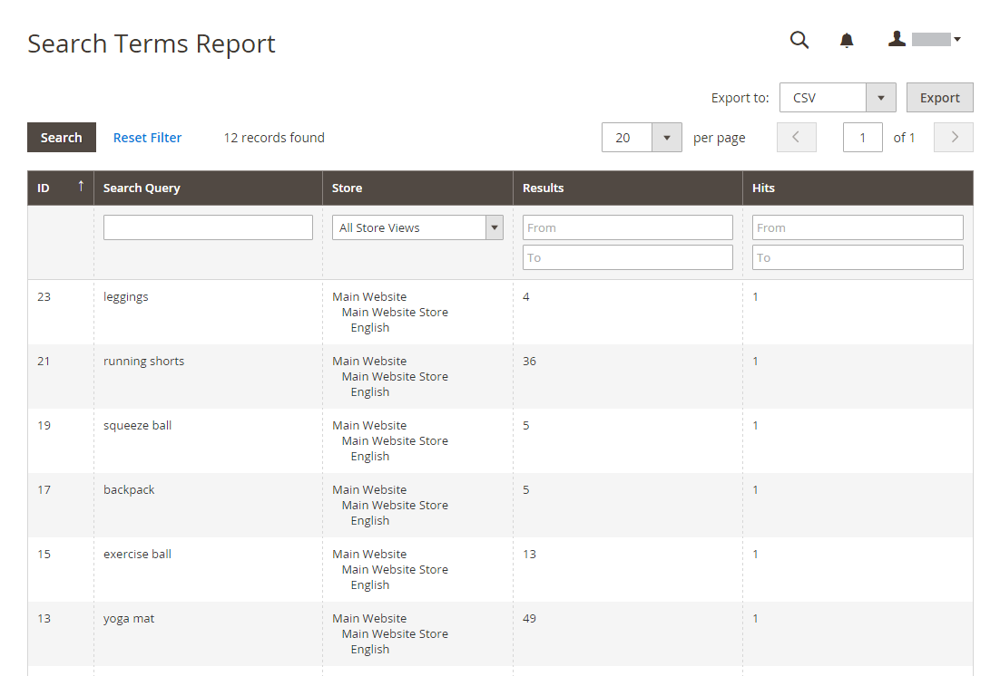
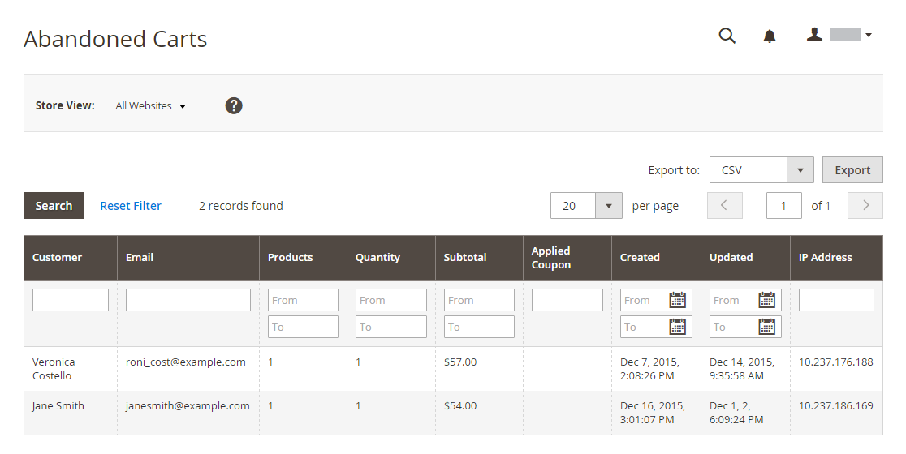
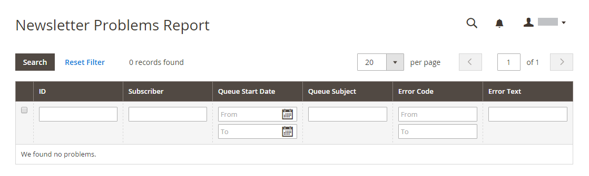

# 市场营销报告

市场营销报告提供有关购物车状态、搜索词的使用和新闻稿传输的信息。

## [!UICONTROL Products in Cart]

此 [!UICONTROL Products in Cart] 报表提供当前购物车中所有产品的列表。 它包括每个项目的名称和价格、随项目一起提供的购物车数量以及每个项目已订购的次数。

{width="600"}

## [!UICONTROL Search Terms Report]

此 [搜索词](../catalog/search-terms.md#search-terms-report) 报表会显示您的客户在每个商店视图中查找的内容。 报表包括在目录中找到匹配项目的数量以及使用搜索词的次数。

{width="600"}

## [!UICONTROL Abandoned Carts]

此 [!UICONTROL Abandoned Carts] 报告列出了所有已放弃购物车但尚未过期的注册客户。 此报表包括客户名称和电子邮件地址、购物车中的产品数量和小计、创建日期和上次更新日期。

{width="600"}

## [!UICONTROL Newsletter Problems Report]

此 [!UICONTROL Newsletter Problems Report] 包含有关任何未能成功传输的新闻稿队列的信息。 报告包含每个订阅者的名称、排队日期和主题以及有关错误的信息。

{width="600"}
