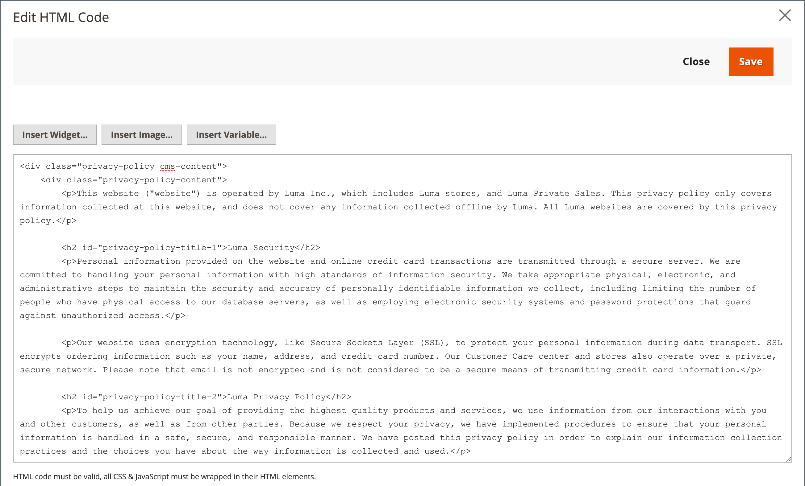

# 存储隐私策略

您的商店包含必须使用您自己的信息更新的示例隐私策略。 您的隐私政策应描述贵公司收集的信息类型以及信息的使用方式。 它还应列出以下的文件名： [Cookie](compliance-cookie-law.md#default-cookies) 放在访问您商店的用户的电脑上。 与第三方扩展和加载项关联的任何其他Cookie都应包含在列表中。

## 个人数据

个人数据有两种被广泛接受的分类，通常简称为PI和PII。 Luma示例数据中的隐私策略示例引用了个人身份信息(PII)。 此外，这些定义的许多变体与不同国家、地区和国家的法律规章相关联。 以下定义可用于此一般性讨论：

### 个人信息(PI)

合理识别或可用于直接或间接识别个人的任何信息。 个人信息可能与任何个人相关，例如客户、雇主、供应商或承包商。

### 个人身份信息(PII)

任何信息的表述，允许通过直接或间接手段合理推断信息所适用的个人的身份。 PII定义为直接识别个人的信息（例如姓名、地址、社会保险号码或其他识别号码）。 这也是机构打算用其他数据要素（间接识别）识别具体个人的信息。 这些数据元素可能包括性别、种族、出生日期、地理指标和其他描述符的组合。 此外，它还包括允许特定个人进行物理或在线联系与个人身份信息相同的信息。 该信息可以用纸张、电子或其它介质进行维护。

{width="600" zoomable="yes"}

## 编辑您的隐私策略

>[!TIP]
>
>Luma示例数据包含一个示例隐私策略，您可以修改该策略以供使用。

1. 在 _管理员_ 侧栏，转到 **[!UICONTROL Content]** > _[!UICONTROL Elements]_>**[!UICONTROL Pages]**.

1. 在网格中，查找 **[!UICONTROL Privacy Policy]**. 然后，在 _[!UICONTROL Action]_列，单击&#x200B;**[!UICONTROL Select]**并选择&#x200B;**[!UICONTROL Edit]**.

   >[!NOTE]
   >
   >如果更改隐私策略页面的URL密钥，则还必须创建 [自定义URL重写](../merchandising-promotions/url-rewrite-custom.md) 将流量重定向到新的URL密钥。 否则，页脚中的链接将返回 `404 Page Not Found`.

1. 展开 **[!UICONTROL Content]** 并对内容进行必要的更改。

   要了解有关使用页面内容工具的更多信息，请参阅 [完成内容](../content-design/page-add.md#step-2-complete-the-content) 在 _内容和设计指南_.

   {width="600" zoomable="yes"}

1. 完成后，单击 **[!UICONTROL Save Page]**.
