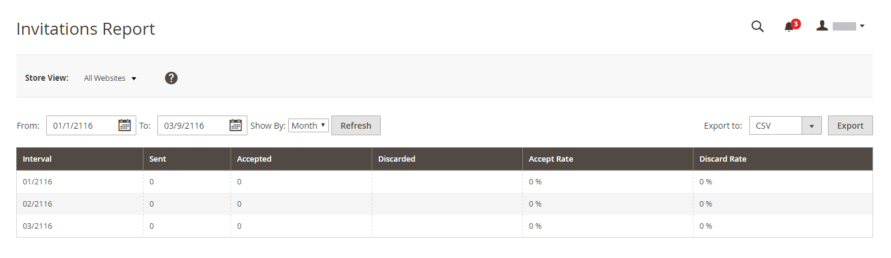
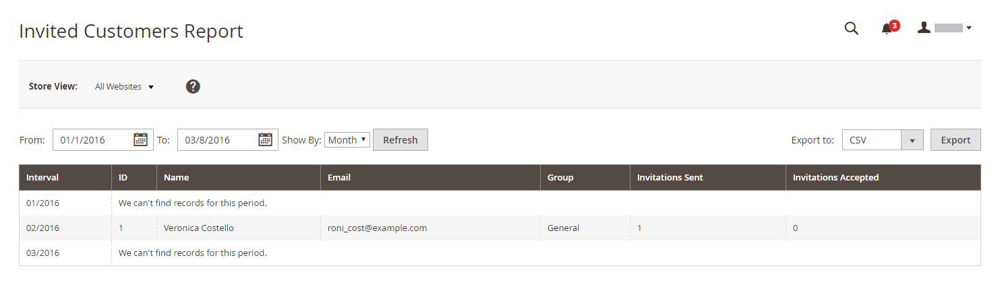
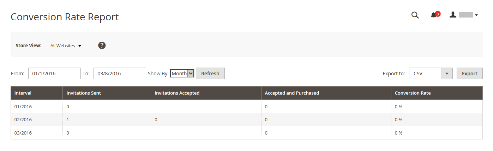

# 专用销售报表

{{ee-feature}}

专用销售报表提供以下信息 [活动和私人销售](../merchandising-promotions/events-private-sales.md).

## [!UICONTROL Invitations Report]

此 [!UICONTROL Invitations Report] 显示数量 [邀请](../merchandising-promotions/invitations.md) 在指定的时间段内发送，并且接受和丢弃的数量。

在 _管理员_ 侧栏，转到 **[!UICONTROL Reports]** > _[!UICONTROL Private Sales]_>**[!UICONTROL Invitations]**.

{width="600"}

## [!UICONTROL Invited Customers Report]

此 [!UICONTROL Invited Customers Report] 显示已向其发送私人销售或活动邀请的所有客户。 其中包括姓名和电子邮件地址、客户群以及发送的邀请数和接受的邀请数。

在 _管理员_ 侧栏，转到 **[!UICONTROL Reports]** > _[!UICONTROL Private Sales]_>**[!UICONTROL Invited Customers]**.

{width="600"}

## [!UICONTROL Conversion Rate Report]

此 [!UICONTROL Conversion Rate Report] 显示已发送和已接受的邀请数、导致购买的邀请数以及转化率（百分比）。

在 _管理员_ 侧栏，转到 **[!UICONTROL Reports]** > _[!UICONTROL Private Sales]_>**[!UICONTROL Conversions]**.

{width="600"}
