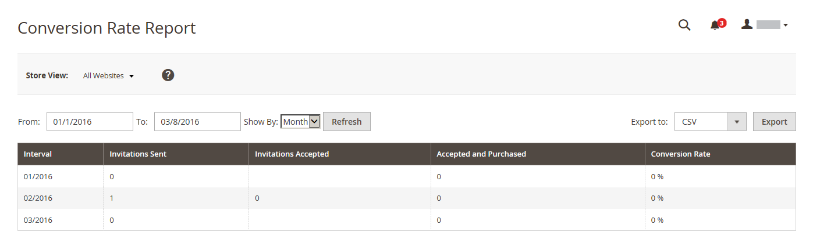

# 专用销售报表

{{ee-feature}}

私有销售报告提供有关[事件和私有销售](../merchandising-promotions/events-private-sales.md)的信息。

## [!UICONTROL Invitations Report]

[!UICONTROL Invitations Report]显示在指定时间段内发送的[邀请](../merchandising-promotions/invitations.md)的数量，以及已接受和已放弃的数量。

在&#x200B;_管理员_&#x200B;侧边栏上，转到&#x200B;**[!UICONTROL Reports]** > _[!UICONTROL Private Sales]_>**[!UICONTROL Invitations]**。

{width="600"}

## [!UICONTROL Invited Customers Report]

[!UICONTROL Invited Customers Report]显示所有已收到私人销售或活动邀请的客户。 其中包括姓名和电子邮件地址、客户群以及发送的邀请数和接受的邀请数。

在&#x200B;_管理员_&#x200B;侧边栏上，转到&#x200B;**[!UICONTROL Reports]** > _[!UICONTROL Private Sales]_>**[!UICONTROL Invited Customers]**。

{width="600"}

## [!UICONTROL Conversion Rate Report]

[!UICONTROL Conversion Rate Report]显示发送和接受的邀请数、导致购买的邀请数以及转化率百分比。

在&#x200B;_管理员_&#x200B;侧边栏上，转到&#x200B;**[!UICONTROL Reports]** > _[!UICONTROL Private Sales]_>**[!UICONTROL Conversions]**。

{width="600"}
