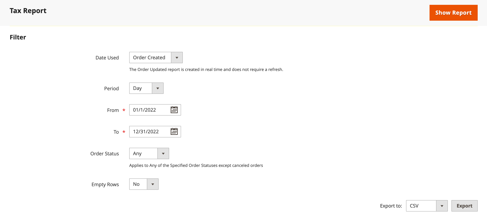
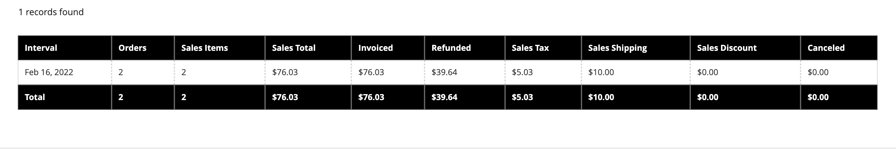
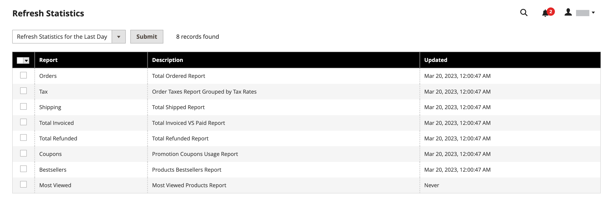

# 销售报表

销售报表的选择包括“订单”、“税”、“已开票”、“发运”、“退款”、“优惠券”和“PayPal结算”。

## 报告过滤器

您可以为整个网站或一家商店生成销售报告。 可以按时间间隔、日期和状态过滤销售报告。

{width="600"}

要筛选销售报表，请设置以下选项：

| 选项 | 描述 |
|--- |--- |
| [!UICONTROL Date Used] | 设置用于报表的数据。 |
| [!UICONTROL Period] | 使用数据的周期：天/月/年。 |
| [!UICONTROL From/To] | 用于按开始日期和结束日期定义搜索数据。 |
| [!UICONTROL Order Status] | 指示订单状态 |
| [!UICONTROL Empty Rows] | 指示是否向报表添加空白行。 |

## [!UICONTROL Orders Report]

[!UICONTROL Orders Report]包括下达和取消的订单数，以及销售额、开票金额、退款、收税、运费收费和折扣的总额。

1. 在&#x200B;_管理员_&#x200B;侧边栏上，转到&#x200B;**[!UICONTROL Reports]** > _[!UICONTROL Sales]_>**[!UICONTROL Orders]**。

1. 在&#x200B;**[!UICONTROL Filter]**&#x200B;部分中，选择用于填充报表的报表时段选项和订单状态。

1. 单击&#x200B;**[!UICONTROL Show Report]**。

{width="600"}

## [!UICONTROL Tax Report]

[!UICONTROL Tax Report]包括应用的税则、税率、订单数和计税金额。

1. 在&#x200B;_管理员_&#x200B;侧边栏上，转到&#x200B;**[!UICONTROL Reports]** > _[!UICONTROL Sales]_>**[!UICONTROL Tax]**。

1. 在&#x200B;**[!UICONTROL Filter]**&#x200B;部分中，选择用于填充报表的报表时段选项和订单状态。

1. 单击&#x200B;**[!UICONTROL Show Report]**。

{width="600"}

## [!UICONTROL Invoice Report]

[!UICONTROL Invoice Report]包括时间段内的订单和发票数，包括已开票、已付和未付金额。

1. 在&#x200B;_管理员_&#x200B;侧边栏上，转到&#x200B;**[!UICONTROL Reports]** > _[!UICONTROL Sales]_>**[!UICONTROL Invoiced]**。

1. 在&#x200B;**[!UICONTROL Filter]**&#x200B;部分中，选择用于填充报表的报表时段选项和订单状态。

1. 单击&#x200B;**[!UICONTROL Show Report]**。

{width="600"}

## [!UICONTROL Shipping Report]

[!UICONTROL Shipping Report]包括所用承运人或装运方法的订单数，包括总销售额和总装运额。

1. 在&#x200B;_管理员_&#x200B;侧边栏上，转到&#x200B;**[!UICONTROL Reports]** > _[!UICONTROL Sales]_>**[!UICONTROL Shipping]**。

1. 在&#x200B;**[!UICONTROL Filter]**&#x200B;部分中，选择用于填充报表的报表时段选项和订单状态。

1. 单击&#x200B;**[!UICONTROL Show Report]**。

{width="600"}

## [!UICONTROL Refunds Report]

[!UICONTROL Refunds Report]包括已退款的订单数以及在线和离线退款的总金额。

1. 在&#x200B;_管理员_&#x200B;侧边栏上，转到&#x200B;**[!UICONTROL Reports]** > _[!UICONTROL Sales]_>**[!UICONTROL Refunds]**。

1. 在&#x200B;**[!UICONTROL Filter]**&#x200B;部分中，选择用于填充报表的报表时段选项和订单状态。

1. 单击&#x200B;**[!UICONTROL Show Report]**。

{width="600"}

## [!UICONTROL Coupons Report]

[!UICONTROL Coupons Report]包括指定时间间隔内使用的每个优惠券代码、相关价格规则和使用次数，以及销售和折扣的总额和小计。

1. 在&#x200B;_管理员_&#x200B;侧边栏上，转到&#x200B;**[!UICONTROL Reports]** > _[!UICONTROL Sales]_>**[!UICONTROL Coupons]**。

1. 在&#x200B;**[!UICONTROL Filter]**&#x200B;部分中，选择用于填充报表的报表时段选项和订单状态。

1. 单击&#x200B;**[!UICONTROL Show Report]**。

有关使用[!UICONTROL Coupons Report]收集促销活动数据的详细信息，请参阅[销售和促销指南](../merchandising-promotions/price-rules-cart-coupon.md#coupons-report)中的&#x200B;_优惠券报告_。

<!---  need coupon data  -->

## [!UICONTROL PayPal Settlement Reports]

[PayPal结算报告]页包括事件类型，如借记卡交易、开始和结束日期、总额和相关费用。 报表可以自动更新为PayPal提供的最新数据。 提供了日期范围、商家帐户、交易ID、发票ID或PayPal参考ID的过滤选项。

在&#x200B;_管理员_&#x200B;侧边栏上，转到&#x200B;**[!UICONTROL Reports]** > _[!UICONTROL Sales]_>**[!UICONTROL PayPal Settlement]**。

{width="600"}

有关使用[!UICONTROL PayPal Settlement Reports]检索影响资金结算的每个PayPal交易信息的更多信息，请参阅[商店和购买体验指南](../stores-purchase/paypal-settlement-reports.md)中的&#x200B;_PayPal结算报告_。

## [!UICONTROL Braintree Settlement Report]

可根据创建日期、金额、状态、交易类型、付款类型、交易ID、订单ID、PayPal付款ID、类型、商家帐户ID或结算批ID筛选[Braintree](../stores-purchase/braintree.md)结算报告。 此报表包含交易ID、订单ID、PayPal付款ID、类型、创建日期、金额、结算代码、状态、结算响应文本、报销ID、商家帐户ID、结算批ID和币种。

在&#x200B;_管理员_&#x200B;侧边栏上，转到&#x200B;**[!UICONTROL Reports]** > _[!UICONTROL Sales]_>**[!UICONTROL Braintree Settlement]**。

<!---  need a Braintree connection to update report screen -->

## 导出报告

1. 要导出报告，请选择文件类型： `Excel XML`或`CSV`

1. 单击&#x200B;**[!UICONTROL Export]**。

## 刷新统计信息

仅[!BADGE PaaS]{type=Informative url="https://experienceleague.adobe.com/zh-hans/docs/commerce/user-guides/product-solutions" tooltip="仅适用于云项目(Adobe管理的PaaS基础架构)和内部部署项目上的Adobe Commerce 。"}

为了减少生成销售报告对性能的影响，[!DNL Commerce]计算并存储每个报告所需的统计信息。 除非您刷新统计信息，否则每次生成报告时不会重新计算统计信息，而是使用存储的统计信息。 要包含最新数据，必须在生成销售报告之前刷新报告统计信息。

{width="700"}

1. 在&#x200B;_管理员_&#x200B;侧边栏上，转到&#x200B;**[!UICONTROL Reports]** > _[!UICONTROL Statistics]_>**[!UICONTROL Refresh Statistics]**。

1. 在列表中，选中每个要刷新报表的复选框。

1. 将&#x200B;**[!UICONTROL Actions]**&#x200B;控件设置为以下项之一：

   - `Refresh Lifetime Statistics`
   - `Refresh Statistics for the Last Day`

1. 单击&#x200B;**[!UICONTROL Submit]**。
