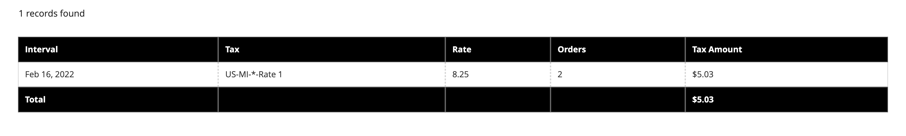

# 销售报表

销售报表的选择包括“订单”、“税”、“已开票”、“发运”、“退款”、“优惠券”和“PayPal结算”。

## 报告过滤器

您可以为整个网站或一家商店生成销售报告。 可以按时间间隔、日期和状态过滤销售报告。

{width="600"}

要筛选销售报表，请设置以下选项：

| 选项 | 描述 |
|--- |--- |
| [!UICONTROL Date Used] | 设置用于报表的数据。 |
| [!UICONTROL Period] | 使用数据的周期：天/月/年。 |
| [!UICONTROL From/To] | 用于按开始日期和结束日期定义搜索数据。 |
| [!UICONTROL Order Status] | 指示订单状态 |
| [!UICONTROL Empty Rows] | 指示是否向报表添加空白行。 |

## [!UICONTROL Orders Report]

此 [!UICONTROL Orders Report] 包括发出和取消的订单数，以及销售额、开票金额、退款、收税、运费收费和折扣的合计。

1. 在 _管理员_ 侧栏，转到 **[!UICONTROL Reports]** > _[!UICONTROL Sales]_>**[!UICONTROL Orders]**.

1. 在 **[!UICONTROL Filter]** 部分，选择用于填充报表的报告期间选项和订单状态。

1. 单击 **[!UICONTROL Show Report]**.

{width="600"}

## [!UICONTROL Tax Report]

此 [!UICONTROL Tax Report] 包括应用的税则、税率、订单数和计税金额。

1. 在 _管理员_ 侧栏，转到 **[!UICONTROL Reports]** > _[!UICONTROL Sales]_>**[!UICONTROL Tax]**.

1. 在 **[!UICONTROL Filter]** 部分，选择用于填充报表的报告期间选项和订单状态。

1. 单击 **[!UICONTROL Show Report]**.

{width="600"}

## [!UICONTROL Invoice Report]

此 [!UICONTROL Invoice Report] 包括时间段内的订单和发票数，以及已开票、已付和未付金额。

1. 在 _管理员_ 侧栏，转到 **[!UICONTROL Reports]** > _[!UICONTROL Sales]_>**[!UICONTROL Invoiced]**.

1. 在 **[!UICONTROL Filter]** 部分，选择用于填充报表的报告期间选项和订单状态。

1. 单击 **[!UICONTROL Show Report]**.

{width="600"}

## [!UICONTROL Shipping Report]

此 [!UICONTROL Shipping Report] 包括所用承运人或发运方法的订单数，包括总销售额和总发运额。

1. 在 _管理员_ 侧栏，转到 **[!UICONTROL Reports]** > _[!UICONTROL Sales]_>**[!UICONTROL Shipping]**.

1. 在 **[!UICONTROL Filter]** 部分，选择用于填充报表的报告期间选项和订单状态。

1. 单击 **[!UICONTROL Show Report]**.

{width="600"}

## [!UICONTROL Refunds Report]

此 [!UICONTROL Refunds Report] 包括退款订单数以及线上和线下退款总额。

1. 在 _管理员_ 侧栏，转到 **[!UICONTROL Reports]** > _[!UICONTROL Sales]_>**[!UICONTROL Refunds]**.

1. 在 **[!UICONTROL Filter]** 部分，选择用于填充报表的报告期间选项和订单状态。

1. 单击 **[!UICONTROL Show Report]**.

{width="600"}

## [!UICONTROL Coupons Report]

此 [!UICONTROL Coupons Report] 包括指定时间间隔内使用的每个优惠券代码、相关价格规则和使用次数，以及销售和折扣的总额和小计。

1. 在 _管理员_ 侧栏，转到 **[!UICONTROL Reports]** > _[!UICONTROL Sales]_>**[!UICONTROL Coupons]**.

1. 在 **[!UICONTROL Filter]** 部分，选择用于填充报表的报告期间选项和订单状态。

1. 单击 **[!UICONTROL Show Report]**.

有关使用 [!UICONTROL Coupons Report] 要收集促销活动的数据，请参阅 [优惠券报告](../merchandising-promotions/price-rules-cart-coupon.md#coupons-report) 在 _Merchandising and Promotions指南_.

<!---  need coupon data  -->

## [!UICONTROL PayPal Settlement Reports]

此 [PayPal结算报告] 页面包括事件类型，如借记卡交易记录、开始和完成日期、总额和相关费用。 报表可以自动更新为PayPal提供的最新数据。 提供了日期范围、商家帐户、交易ID、发票ID或PayPal参考ID的过滤选项。

在 _管理员_ 侧栏，转到 **[!UICONTROL Reports]** > _[!UICONTROL Sales]_>**[!UICONTROL PayPal Settlement]**.

{width="600"}

有关使用 [!UICONTROL PayPal Settlement Reports] 要检索有关影响基金结算的每个PayPal交易的信息，请参阅 [PayPal结算报告](../stores-purchase/paypal-settlement-reports.md) 在 _存储和购买体验指南_.

## [!UICONTROL Braintree Settlement Report]

此 [Braintree](../stores-purchase/braintree.md) 结算报表可以根据创建日期、金额、状态、交易类型、付款类型、交易ID、订单ID、PayPal付款ID、类型、商家帐户ID或结算批ID进行过滤。 此报表包含交易ID、订单ID、PayPal付款ID、类型、创建日期、金额、结算代码、状态、结算响应文本、报销ID、商家帐户ID、结算批ID和币种。

在 _管理员_ 侧栏，转到 **[!UICONTROL Reports]** > _[!UICONTROL Sales]_>**[!UICONTROL Braintree Settlement]**.

<!---  need a Braintree connection to update report screen -->

## 导出报告

1. 要导出报告，请选择文件类型： `Excel XML` 或 `CSV`

1. 单击 **[!UICONTROL Export]**.

## 刷新统计信息

要减少生成销售报告对性能的影响， [!DNL Commerce] 计算并存储每个报表所需的统计信息。 除非您刷新统计信息，否则每次生成报告时不会重新计算统计信息，而是使用存储的统计信息。 要包含最新数据，必须在生成销售报告之前刷新报告统计信息。

{width="700"}

1. 在 _管理员_ 侧栏，转到 **[!UICONTROL Reports]** > _[!UICONTROL Statistics]_>**[!UICONTROL Refresh Statistics]**.

1. 在列表中，选中每个要刷新报表的复选框。

1. 设置 **[!UICONTROL Actions]** 控制以下任一项：

   - `Refresh Lifetime Statistics`
   - `Refresh Statistics for the Last Day`

1. 单击 **[!UICONTROL Submit]**.
