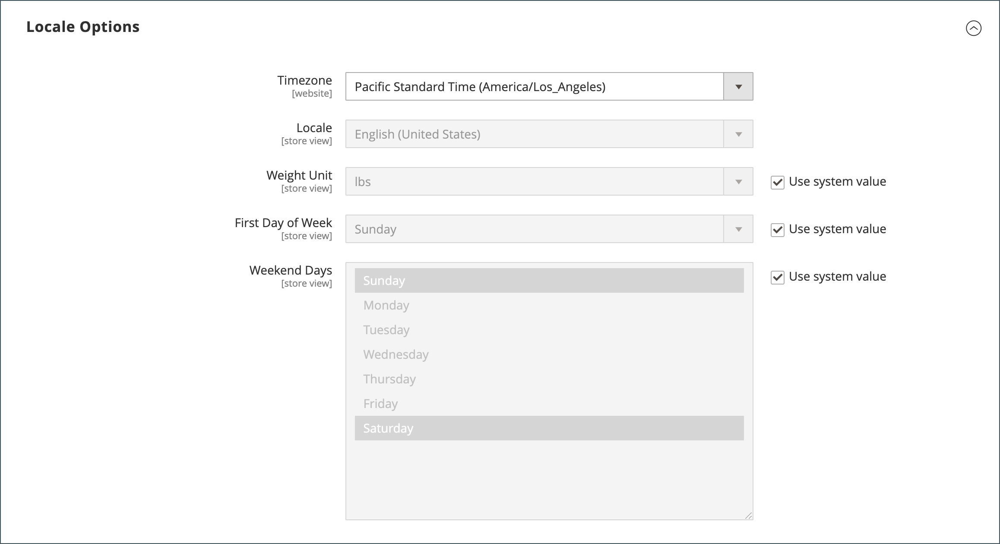

# 商店详细信息

商店的基本信息包括商店名称和地址、电话号码和电子邮件地址，这些显示在发送给客户的电子邮件、发票和其他通信中。

{width="900" zoomable="yes"}

## [!UICONTROL Store Information]

_[!UICONTROL Store Information]_部分提供了出现在销售文档和其他通信中的基本信息。

1. 在&#x200B;_管理员_&#x200B;侧边栏上，转到&#x200B;**[!UICONTROL Stores]** > _[!UICONTROL Settings]_>**[!UICONTROL Configuration]**。

1. 在左侧导航面板中的&#x200B;**[!UICONTROL General]**&#x200B;下，选择&#x200B;**[!UICONTROL General]**。

1. 展开扩展选择器&#x200B;**[!UICONTROL Store Information]**。

   {width="700"}

1. 根据您的商店详细信息设置选项：

   - 输入要在所有通信中使用的&#x200B;**[!UICONTROL Store Name]**。

   - 输入您希望显示的&#x200B;**[!UICONTROL Store Phone Number]**&#x200B;格式。

   - 对于&#x200B;**[!UICONTROL Store Hours of Operation]**，输入您的商店营业的小时数。 例如： `Mon - Fri, 9-5, Sat 9-noon PST`。

   - 选择您的公司所在的&#x200B;**[!UICONTROL Country]**。

   - 选择带有国家/地区的&#x200B;**[!UICONTROL Region/State]**。

   - 输入&#x200B;**[!UICONTROL Store Address]**。 如果地址较长，则继续使用&#x200B;**存储地址行2**&#x200B;上的地址。

   - 如果适用，请输入商店的&#x200B;**[!UICONTROL VAT Number]**。

     要验证该号码，请单击&#x200B;**[!UICONTROL Validate VAT Number]**&#x200B;按钮。 若要了解详细信息，请参阅[VAT ID验证](../stores-purchase/vat.md#vat-id-validation)。

1. 完成后，单击&#x200B;**[!UICONTROL Save Config]**。

有关商店信息配置选项的详细信息，请参阅&#x200B;[_配置参考指南_](../configuration-reference/general/general.md#store-information)。

## [!UICONTROL Locale Options]

区域设置决定了整个存储区使用的许多设置。 其中一些是：

- 语言
- 国家/地区
- 税率
- 货币
- 价格
- 数字格式

区域设置可确定每个商店使用的时区和语言，并标识该区域的工作周日期。

1. 在&#x200B;_管理员_&#x200B;侧边栏上，转到&#x200B;**[!UICONTROL Stores]** > _[!UICONTROL Settings]_>**[!UICONTROL Configuration]**。

1. 在左侧导航面板中的&#x200B;**[!UICONTROL General]**&#x200B;下，选择&#x200B;**[!UICONTROL General]**。

1. 展开扩展选择器&#x200B;**[!UICONTROL Locale Options]**。

   {width="700"}

1. 从列表中选择您的&#x200B;**[!UICONTROL Timezone]**。

1. 将&#x200B;**[!UICONTROL Locale]**&#x200B;设置为商店语言。

1. 将&#x200B;**[!UICONTROL Weight Unit]**&#x200B;设置为通常用于来自区域设置的装运的度量单位。

1. 将&#x200B;**[!UICONTROL First Day of the Week]**&#x200B;设置为您所在地区被视为一周中第一天的日期。

1. 在&#x200B;**[!UICONTROL Weekend Days]**&#x200B;列表中，选择您所在地区的周末日期。

   要选择多天，请按住Ctrl键(PC)或Command键(Mac)并单击每个项目。

1. 完成后，单击&#x200B;**[!UICONTROL Save Config]**。

有关区域设置配置选项的更多信息，请参阅[配置参考指南](../configuration-reference/general/general.md#locale-options)。

## [!UICONTROL State Options]

在许多国家/地区，省/市/自治区是邮政地址的必需部分。 该信息用于装运和帐单信息、计算税率等。 对于不需要填写省/自治区/直辖市的国家/地区，可以从地址中完全忽略该字段，或将其作为可选字段包含在内。

由于标准地址格式因国家/地区而异，因此您还可以编辑用于格式化发票、装箱单和装运标签地址的模板。

1. 在&#x200B;_管理员_&#x200B;侧边栏上，转到&#x200B;**[!UICONTROL Stores]** > _[!UICONTROL Settings]_>**[!UICONTROL Configuration]**。

1. 在左侧导航面板中的&#x200B;**[!UICONTROL General]**&#x200B;下，选择&#x200B;**[!UICONTROL General]**。

1. 展开扩展选择器&#x200B;**[!UICONTROL State Options]**。

   {width="700"}

1. 使用&#x200B;**[!UICONTROL State is required for]**&#x200B;列表选择区域/州是必需条目的每个国家/地区。

1. 将&#x200B;**[!UICONTROL Allow to Choose State if it is Optional for Country]**&#x200B;设置为以下项之一：

   `Yes` — 在不需要状态字段的国家/地区，包括状态字段作为可选条目。

   `No` — 在不需要省/市/自治区字段的国家/地区，省略省/市/自治区字段。

1. 完成后，单击&#x200B;**[!UICONTROL Save Config]**。

有关状态配置选项的详细信息，请参阅[配置参考指南](../configuration-reference/general/general.md#state-options)。

## [!UICONTROL Country Options]

国家/地区选项标识您的企业所在的国家/地区以及接受付款的国家/地区。

### 为商店设置国家/地区选项

1. 在&#x200B;_管理员_&#x200B;侧边栏上，转到&#x200B;**[!UICONTROL Stores]** > _[!UICONTROL Settings]_>**[!UICONTROL Configuration]**。

1. 在左侧导航面板中的&#x200B;**[!UICONTROL General]**&#x200B;下，选择&#x200B;**[!UICONTROL General]**。

1. 展开扩展选择器&#x200B;**[!UICONTROL Country Options]**。

   >[!NOTE]
   >
   >如果需要，请清除要更改的每个设置的&#x200B;**[!UICONTROL Use system value]**&#x200B;复选框。

   {width="700"}

1. 选择您的公司所在的&#x200B;**[!UICONTROL Default Country]**。

1. 在&#x200B;**[!UICONTROL Allow Countries]**&#x200B;列表中，选择您接受订单的每个国家/地区。

   默认情况下，选择列表中的所有国家/地区。 要选择多个国家/地区，请按住Ctrl键(PC)或Command键(Mac)并单击每个项目。

1. 使用&#x200B;**[!UICONTROL Zip/Postal Code is Optional for]**&#x200B;列表选择您开展业务的每个国家/地区，不需要将邮政编码作为街道地址的一部分包括在内。

1. 在&#x200B;**[!UICONTROL European Union Countries]**&#x200B;列表中，选择欧盟中您开展业务的每个国家/地区。

   默认情况下，将选择所有欧盟国家/地区。 要选择所需的国家/地区，请按住Ctrl键(PC)或Command键(Mac)并单击每个项目。

1. 在&#x200B;**[!UICONTROL Top Destinations]**&#x200B;列表中，选择您为销售目标的主要国家/地区。

1. 完成后，单击&#x200B;**[!UICONTROL Save Config]**。

### 为特定投放方法设置国家/地区选项

您还可以为每个可用的[交货方法](../stores-purchase/delivery.md)（UPS、FedEx等）配置到特定国家/地区的发货。

1. 在&#x200B;_管理员_&#x200B;侧边栏上，转到&#x200B;**[!UICONTROL Stores]** > _[!UICONTROL Settings]_>**[!UICONTROL Configuration]**。

1. 在左侧导航面板中，展开&#x200B;**[!UICONTROL Sales]**&#x200B;并选择&#x200B;**[!UICONTROL Delivery Methods]**。

1. 选择要应用特定国家/地区的装运承运人。

1. 对于&#x200B;**[!UICONTROL Ship to Applicable Countries]**，取消选中&#x200B;**[!UICONTROL Use system value]**&#x200B;复选框，然后选择&#x200B;**[!UICONTROL Specific Countries]**&#x200B;选项。

1. 在&#x200B;**[!UICONTROL Top Destinations]**&#x200B;列表中，选择您为配送所定向的主要国家/地区。

   {width="700"}

1. 完成后，单击&#x200B;**[!UICONTROL Save Config]**。

### 资源疑难解答

要获得有关排查国家/地区配置问题的帮助，请参阅以下[!DNL Commerce]支持知识库文章：

- [如何添加国家/地区](https://experienceleague.adobe.com/docs/commerce-knowledge-base/kb/how-to/how-to-add-a-new-country-to-magento-2.html)

## [!UICONTROL Merchant Location]

仅[!BADGE PaaS]{type=Informative url="https://experienceleague.adobe.com/en/docs/commerce/user-guides/product-solutions" tooltip="仅适用于云项目(Adobe管理的PaaS基础架构)和内部部署项目上的Adobe Commerce 。"}

“商家位置”设置用于配置[付款方法](../stores-purchase/payments.md)。 如果此设置没有值，则使用[默认国家/地区](#uicontrol-country-options)设置。

1. 在&#x200B;_管理员_&#x200B;侧边栏上，转到&#x200B;**[!UICONTROL Stores]** > _[!UICONTROL Settings]_>**[!UICONTROL Configuration]**。

1. 在左侧导航面板中，展开&#x200B;**[!UICONTROL Sales]**&#x200B;并选择&#x200B;**[!UICONTROL Payment Methods]**。

1. 展开 **商家位置**&#x200B;部分并选择您的&#x200B;**[!UICONTROL Merchant Country]**。

   {width="600"}

1. 完成后，单击&#x200B;**[!UICONTROL Save Config]**。

有关付款方式配置选项的详细信息，请参阅[配置参考指南](../configuration-reference/sales/payment-methods.md)。

## 货币

货币设置 — 定义基本[货币](../stores-purchase/currency-configuration.md)和任何接受为付款的其他货币。 同时建立用于自动更新货币汇率的导入连接和计划。

货币符号 — 定义出现在产品价格和销售文档（如订单和发票）中的[货币符号](../stores-purchase/currency-configuration.md#step-5-customize-currency-symbols-optional)。 [!DNL Commerce]支持来自全球200多个国家的货币。

更新汇率 — 可根据需要，或根据预定义的计划，手动更新[汇率](../stores-purchase/currency-update.md)或导入到您的存储中。

货币选择器 — 如果有多种货币可用，则[货币选择器](../stores-purchase/currency.md)在商店的标题中可用。

## [!UICONTROL Store Email Addresses]

您最多可以有5个不同的电子邮件地址，代表每个商店或视图的不同职能或部门。 除了以下预定义的电子邮件标识外，您还可以根据需要设置一些自定义标识。

- 常规联系人
- 销售代表
- 客户支持

每个身份及其关联的电子邮件地址可以与特定的自动电子邮件关联，并显示为从您的商店发送的电子邮件的发件人。

### 步骤1：设置域的电子邮件地址

在为存储配置电子邮件地址之前，必须将每个电子邮件地址设置为域的有效电子邮件地址。 要创建所需的每个电子邮件地址，请按照服务器管理员或电子邮件托管提供商提供的说明进行操作。

### 第2步：为生成的链接设置基本URL

仅[!BADGE SaaS]{type=Positive url="https://experienceleague.adobe.com/en/docs/commerce/user-guides/product-solutions" tooltip="仅适用于Adobe Commerce as a Cloud Service项目(Adobe管理的SaaS基础架构)。"}

某些面向客户的电子邮件包含指向商店的链接，例如帮助客户重置密码的链接。 要确保指向店面的链接正常工作，您必须定义指向店面的基本URL。

1. 在&#x200B;_管理员_&#x200B;侧边栏上，转到&#x200B;**[!UICONTROL Stores]** > _[!UICONTROL Settings]_>**[!UICONTROL Configuration]**。

1. 在左侧导航面板中的&#x200B;**[!UICONTROL General]**&#x200B;下，选择&#x200B;**[!UICONTROL Store Email Addresses]**。

1. 在&#x200B;**[!UICONTROL Storefront Base URL]**&#x200B;字段&#x200B;**[!UICONTROL General]**&#x200B;部分中，输入商店的根URL，如`https://www.example.com/`。 URL必须以正斜杠结尾。

   {width="600"}

### 步骤3：配置存储区的电子邮件地址

仅[!BADGE SaaS]{type=Positive url="https://experienceleague.adobe.com/en/docs/commerce/user-guides/product-solutions" tooltip="仅适用于Adobe Commerce as a Cloud Service和Adobe Commerce Optimizer项目(Adobe管理的SaaS基础架构)。"}配置实例时配置发件人电子邮件地址。 如果需要更改这些地址，请创建支持服务单。

1. 在&#x200B;_管理员_&#x200B;侧边栏上，转到&#x200B;**[!UICONTROL Stores]** > _[!UICONTROL Settings]_>**[!UICONTROL Configuration]**。

1. 在左侧导航面板中的&#x200B;**[!UICONTROL General]**&#x200B;下，选择&#x200B;**[!UICONTROL Store Email Addresses]**。

1. 展开扩展选择器&#x200B;**[!UICONTROL General Contact]**&#x200B;并执行以下操作：

   {width="600"}

   - 对于&#x200B;**[!UICONTROL Sender Name]**，输入与常规联系人身份关联的人员的姓名，以显示任何电子邮件的发件人。

   - 对于&#x200B;**[!UICONTROL Sender Email]**，输入关联的电子邮件地址。

1. 为您计划使用的每个商店电子邮件地址重复此过程。

1. 完成后，单击&#x200B;**[!UICONTROL Save Config]**。

### 步骤4：更新销售电子邮件配置

如果您使用自定义电子邮件地址，请确保更新任何相关电子邮件的配置，以便以发件人身份显示正确的身份。

1. 在左侧导航面板中，展开&#x200B;**[!UICONTROL Sales]**&#x200B;并选择&#x200B;**[!UICONTROL Sales Emails]**。

   对于以下各项，该页面均具有一个单独的部分：

   - 订单和订单注释
   - 发票和发票注释
   - 装运和装运注释
   - 贷项通知单和贷项通知单备注
   - RMA、RMA授权、RMA管理注释和RMA客户注释(仅限Adobe Commerce)

1. 从&#x200B;**[!UICONTROL Order]**&#x200B;开始，展开每封邮件的部分，并确保选择了正确的发件人。

   {width="600"}

1. 完成后，单击&#x200B;**[!UICONTROL Save Config]**。

有关销售电子邮件配置选项的详细信息，请参阅&#x200B;[_配置参考指南_](../configuration-reference/sales/sales-emails.md)。

## 联系我们表单

商店页脚中的&#x200B;_联系我们_&#x200B;链接是客户与您保持联系的简便方法。 客户可以填写表单以向您的商店发送消息。 标准[!DNL Commerce]安装显示默认的&#x200B;_联系我们_&#x200B;表单。 提交表单后，会显示感谢消息

请务必了解，默认的“联系我们”表单是直接从代码而不是CMS页面渲染的。

{width="700"}

商店页脚包括指向联系我们页面的链接，该链接在整个商店中均可用。

{width="700"}

Luma示例数据包括“联系我们”页面上的其他信息，用于演示如何自定义商店的页面。

{width="700"}

### 配置联系人表单

1. 在&#x200B;_管理员_&#x200B;侧边栏上，转到&#x200B;**[!UICONTROL Stores]** > _[!UICONTROL Settings]_>**[!UICONTROL Configuration]**。

1. 在左侧导航面板中的&#x200B;**[!UICONTROL General]**&#x200B;下，选择&#x200B;**[!UICONTROL Contacts]**。

1. 展开扩展选择器&#x200B;**[!UICONTROL Contact Us]**&#x200B;并将&#x200B;**[!UICONTROL Enable Contact Us]**&#x200B;设置为`Yes`。

   {width="600"}

1. 展开 **[!UICONTROL Email Options]**&#x200B;部分并设置电子邮件联系人选项：

   {width="600"}

   - 对于&#x200B;**[!UICONTROL Send Emails to]**，输入发送来自与我们联系表单的邮件的电子邮件地址。

   - 将&#x200B;**[!UICONTROL Email Sender]**&#x200B;设置为存储标识，该标识显示为“联系我们”表单中邮件的发件人。 例如：自定义电子邮件2。

   - 将&#x200B;**[!UICONTROL Email Template]**&#x200B;设置为用于从“与我们联系”表单发送邮件的模板。

1. 完成时，单击&#x200B;**[!UICONTROL Save Config]**。

### 自定义内容

您可以自定义&#x200B;_联系我们_&#x200B;表单中的内容，以满足您的商店和客户服务政策的需求。

### 方法1：使用样本数据

Luma示例数据包含可为您的商店自定义的&#x200B;_联系我们信息_&#x200B;块。 可以轻松修改`contact-us-info` [块](../content-design/blocks.md)以将您自己的内容添加到“联系我们”页面。

1. 在&#x200B;_管理员_&#x200B;侧边栏上，转到&#x200B;**[!UICONTROL Content]** > _[!UICONTROL Elements]_>**[!UICONTROL Blocks]**。

1. 在列表中找到&#x200B;**[!UICONTROL Contact Us Info]**&#x200B;块并在&#x200B;**[!UICONTROL Edit]**&#x200B;模式下打开。

   {width="700"}

1. 在块页面底部，单击&#x200B;**[!UICONTROL Edit with Page Builder]**。

   {width="700"}

   >[!NOTE]
   >
   >如果您[[!DNL Page Builder] 已禁用](../page-builder/setup.md#disable-dnl-page-builder)，则可以使用编辑器[工具栏](../content-design/editor.md)设置文本格式，并添加[图像](../content-design/editor-insert-image.md)和[链接](../content-design/editor-insert-link.md)。

1. 将鼠标悬停在HTML容器上以显示工具箱，然后选择&#x200B;_设置_ （  ）图标。

1. 编辑HTML代码，以提供您商店的联系信息，然后单击&#x200B;**[!UICONTROL Save]**。

   {width="700"}

1. 退出[!DNL Page Builder]阶段并单击&#x200B;**[!UICONTROL Save Block]**。

### 方法2：没有示例数据

>[!IMPORTANT]
>
>从2.4.0版本开始，联系人表单不能再在CMS块或CMS页面中调用。 应使用布局xml或自定义主题模板完成联系人表单的所有自定义。

默认情况下，购物者使用店面页面页脚中的&#x200B;_联系人链接_&#x200B;访问联系人表单。 有关自定义联系人页面的更多信息，请参阅[前端开发人员指南](https://developer.adobe.com/commerce/frontend-core/guide/themes/)。
