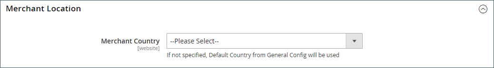

# 商店详细信息

商店的基本信息包括商店名称和地址、电话号码和电子邮件地址，这些显示在发送给客户的电子邮件、发票和其他通信中。

{width="900" zoomable="yes"}

## [!UICONTROL Store Information]

此 _[!UICONTROL Store Information]_部分提供了出现在销售文档和其他通信中的基本信息。

1. 在 _管理员_ 侧栏，转到 **[!UICONTROL Stores]** > _[!UICONTROL Settings]_>**[!UICONTROL Configuration]**.

1. 下 **[!UICONTROL General]** 在左侧导航面板中，选择 **[!UICONTROL General]**.

1. 展开  该 **[!UICONTROL Store Information]** 部分。

   {width="700"}

1. 根据您的商店详细信息设置选项：

   - 输入 **[!UICONTROL Store Name]** 您希望在所有通信中使用的ID。

   - 输入 **[!UICONTROL Store Phone Number]**，根据您希望的显示格式进行设置。

   - 对象 **[!UICONTROL Store Hours of Operation]**，输入您的商店对业务开放的小时数。 例如： `Mon - Fri, 9-5, Sat 9-noon PST`.

   - 选择 **[!UICONTROL Country]** 公司所在的位置。

   - 选择 **[!UICONTROL Region/State]** 和国家。

   - 输入 **[!UICONTROL Store Address]**. 如果地址很长，则继续该地址 **商店地址行2**.

   - 如果适用，请输入 **[!UICONTROL VAT Number]** 你店里的。

     要验证该号码，请单击 **[!UICONTROL Validate VAT Number]** 按钮。 要了解更多信息，请参阅 [VAT ID验证](../stores-purchase/vat.md#vat-id-validation).

1. 完成后，单击 **[!UICONTROL Save Config]**.

有关商店信息配置选项的详细信息，请参见 [_配置参考指南_](../configuration-reference/general/general.md#store-information).

## [!UICONTROL Locale Options]

区域设置决定了整个存储区使用的许多设置。 其中一些是：

- 语言
- 国家/地区
- 税率
- 货币
- 价格
- 数字格式

区域设置可确定每个商店使用的时区和语言，并标识该区域的工作周日期。

1. 在 _管理员_ 侧栏，转到 **[!UICONTROL Stores]** > _[!UICONTROL Settings]_>**[!UICONTROL Configuration]**.

1. 在左侧导航面板中的 **[!UICONTROL General]**，选择 **[!UICONTROL General]**.

1. 展开  该 **[!UICONTROL Locale Options]** 部分。

   {width="700"}

1. 选择您的 **[!UICONTROL Timezone]** 从名单上。

1. 设置 **[!UICONTROL Locale]** 到商店语言。

1. 设置 **[!UICONTROL Weight Unit]** 到通常用于来自您区域设置的装运的度量单位。

1. 设置 **[!UICONTROL First Day of the Week]** 到您所在地区被视为一周第一天的那天。

1. 在 **[!UICONTROL Weekend Days]** 列表，选择您所在地区的周末日期。

   要选择多天，请按住Ctrl键(PC)或Command键(Mac)并单击每个项目。

1. 完成后，单击 **[!UICONTROL Save Config]**.

有关区域设置配置选项的更多信息，请参见 [配置参考指南](../configuration-reference/general/general.md#locale-options).

## [!UICONTROL State Options]

在许多国家/地区，省/市/自治区是邮政地址的必需部分。 该信息用于装运和帐单信息、计算税率等。 对于不需要填写省/自治区/直辖市的国家/地区，可以从地址中完全忽略该字段，或将其作为可选字段包含在内。

由于标准地址格式因国家/地区而异，因此您还可以编辑用于格式化发票、装箱单和装运标签地址的模板。

1. 在 _管理员_ 侧栏，转到 **[!UICONTROL Stores]** > _[!UICONTROL Settings]_>**[!UICONTROL Configuration]**.

1. 下 **[!UICONTROL General]** 在左侧导航面板中，选择 **[!UICONTROL General]**.

1. 展开  该 **[!UICONTROL State Options]** 部分。

   {width="700"}

1. 使用 **[!UICONTROL State is required for]** 列表以选择要求输入地区/州的每个国家/地区。

1. 设置 **[!UICONTROL Allow to Choose State if it is Optional for Country]** 更改为以下任一项：

   `Yes`  — 在非必填国家/地区，包括“州”字段作为可选条目。

   `No`  — 在不需要省/市/自治区字段的国家/地区，将省略省/市/自治区字段。

1. 完成后，单击 **[!UICONTROL Save Config]**.

有关状态配置选项的更多信息，请参见 [配置参考指南](../configuration-reference/general/general.md#state-options).

## [!UICONTROL Country Options]

国家/地区选项标识您的企业所在的国家/地区以及接受付款的国家/地区。

### 为商店设置国家/地区选项

1. 在 _管理员_ 侧栏，转到 **[!UICONTROL Stores]** > _[!UICONTROL Settings]_>**[!UICONTROL Configuration]**.

1. 在左侧导航面板中的 **[!UICONTROL General]**，选择 **[!UICONTROL General]**.

1. 展开  该 **[!UICONTROL Country Options]** 部分。

   >[!NOTE]
   >
   >如有需要，清除 **[!UICONTROL Use system value]** 用于要更改的每个设置的复选框。

   {width="700"}

1. 选择 **[!UICONTROL Default Country]** 公司所在的位置。

1. 在 **[!UICONTROL Allow Countries]** ，选择您接受订单的每个国家/地区。

   默认情况下，选择列表中的所有国家/地区。 要选择多个国家/地区，请按住Ctrl键(PC)或Command键(Mac)并单击每个项目。

1. 使用 **[!UICONTROL Zip/Postal Code is Optional for]** 列表以选择您开展业务的每个国家/地区，并且街道地址中不包含邮政编码。

1. 在 **[!UICONTROL European Union Countries]** 列表中，选择您开展业务的欧盟国家/地区。

   默认情况下，将选择所有欧盟国家/地区。 要选择所需的国家/地区，请按住Ctrl键(PC)或Command键(Mac)并单击每个项目。

1. 在 **[!UICONTROL Top Destinations]** 列表上，选择您针对销售所定位的主要国家/地区。

1. 完成后，单击 **[!UICONTROL Save Config]**.

### 为特定投放方法设置国家/地区选项

您还可以为每个可用设备配置向特定国家/地区的送货服务 [投放方法](../stores-purchase/delivery.md) （UPS、联邦快递等）。

1. 在 _管理员_ 侧栏，转到 **[!UICONTROL Stores]** > _[!UICONTROL Settings]_>**[!UICONTROL Configuration]**.

1. 在左侧导航面板中，展开 **[!UICONTROL Sales]** 并选择 **[!UICONTROL Delivery Methods]**.

1. 选择要应用特定国家/地区的装运承运人。

1. 对象 **[!UICONTROL Ship to Applicable Countries]**，取消选择 **[!UICONTROL Use system value]** 复选框，然后选择 **[!UICONTROL Specific Countries]** 选项。

1. 在 **[!UICONTROL Top Destinations]** 列表上，选择您为配送所定向的主要国家/地区。

   {width="700"}

1. 完成后，单击 **[!UICONTROL Save Config]**.

### 资源疑难解答

要获得解决国家/地区配置问题的帮助，请参阅以下内容 [!DNL Commerce] 支持知识库文章：

- [如何添加国家/地区](https://experienceleague.adobe.com/docs/commerce-knowledge-base/kb/how-to/how-to-add-a-new-country-to-magento-2.html)
- [提供的国家/地区ID不存在](https://experienceleague.adobe.com/docs/commerce-knowledge-base/kb/support-tools/patches/v1-0-15/mdva-33393-magento-patch-provided-countryid-does-not-exist.html)

## [!UICONTROL Merchant Location]

“商家位置”设置用于配置 [支付方式](../stores-purchase/payments.md). 如果此设置没有值，则 [默认国家/地区](#uicontrol-country-options) 设置。

1. 在 _管理员_ 侧栏，转到 **[!UICONTROL Stores]** > _[!UICONTROL Settings]_>**[!UICONTROL Configuration]**.

1. 在左侧导航面板中，展开 **[!UICONTROL Sales]** 并选择 **[!UICONTROL Payment Methods]**.

1. 展开  该 **商家位置** 部分，然后选择您的 **[!UICONTROL Merchant Country]**.

   {width="600"}

1. 完成后，单击 **[!UICONTROL Save Config]**.

有关支付方式配置选项的详情，请参阅 [配置参考指南](../configuration-reference/sales/payment-methods.md).

## 货币

货币设置 — 定义基础 [货币](../stores-purchase/currency-configuration.md) 以及任何接受作为付款的其他货币。 同时建立用于自动更新货币汇率的导入连接和计划。

货币符号 — 定义 [货币符号](../stores-purchase/currency-configuration.md#step-5-customize-currency-symbols-optional) 出现在产品价格和销售文档（如订单和发票）中。 [!DNL Commerce] 支持全球200多个国家的货币。

更新币种汇率 — 币种汇率可以是 [已更新](../stores-purchase/currency-update.md) 根据需要或根据预定义的时间表，手动或导入您的商店。

货币选择器 — 如果有多种货币可用，则 [货币选择器](../stores-purchase/currency.md) 在商店的标题中可用。

## [!UICONTROL Store Email Addresses]

您最多可以有5个不同的电子邮件地址，代表每个商店或视图的不同职能或部门。 除了以下预定义的电子邮件标识外，您还可以根据需要设置一些自定义标识。

- 常规联系人
- 销售代表
- 客户支持

每个身份及其关联的电子邮件地址可以与特定的自动电子邮件关联，并显示为从您的商店发送的电子邮件的发件人。

### 步骤1：设置域的电子邮件地址

在为存储配置电子邮件地址之前，必须将每个电子邮件地址设置为域的有效电子邮件地址。 要创建所需的每个电子邮件地址，请按照服务器管理员或电子邮件托管提供商提供的说明进行操作。

### 步骤2：配置存储区的电子邮件地址

1. 在 _管理员_ 侧栏，转到 **[!UICONTROL Stores]** > _[!UICONTROL Settings]_>**[!UICONTROL Configuration]**.

1. 下 **[!UICONTROL General]** 在左侧导航面板中，选择 **[!UICONTROL Store Email Addresses]**.

1. 展开  该 **[!UICONTROL General Contact]** 部分并执行以下操作：

   {width="600"}

   - 对象 **[!UICONTROL Sender Name]**，输入与常规联系人身份关联的人员姓名，该人员将显示为任何电子邮件的发件人。

   - 对象 **[!UICONTROL Sender Email]**，输入关联的电子邮件地址。

1. 为您计划使用的每个商店电子邮件地址重复此过程。

1. 完成后，单击 **[!UICONTROL Save Config]**.

### 步骤3：更新销售电子邮件配置

如果您使用自定义电子邮件地址，请确保更新任何相关电子邮件的配置，以便以发件人身份显示正确的身份。

1. 在左侧导航面板中，展开 **[!UICONTROL Sales]** 并选择 **[!UICONTROL Sales Emails]**.

   对于以下各项，该页面均具有一个单独的部分：

   - 订单和订单注释
   - 发票和发票注释
   - 装运和装运注释
   - 贷项通知单和贷项通知单备注
   - RMA、RMA授权、RMA管理注释和RMA客户注释  (仅限Adobe Commerce)

1. 开始使用 **[!UICONTROL Order]**，展开每封邮件的部分，并确保选择了正确的发件人。

   {width="600"}

1. 完成后，单击 **[!UICONTROL Save Config]**.

有关销售电子邮件配置选项的更多信息，请参见 [_配置参考指南_](../configuration-reference/sales/sales-emails.md).

## 联系我们表单

此 _联系我们_ 商店页脚中的链接是客户与您保持联系的轻松方式。 客户可以填写表单以向您的商店发送消息。 标准 [!DNL Commerce] 安装显示默认设置 _联系我们_ 表单。 提交表单后，会显示感谢消息

请务必了解，默认的“联系我们”表单是直接从代码而不是CMS页面呈现的。

{width="700"}

商店页脚包括指向联系我们页面的链接，该链接在整个商店中均可用。

{width="700"}

Luma示例数据包括“联系我们”页面上的其他信息，用于演示如何自定义商店的页面。

{width="700"}

### 配置联系人表单

1. 在 _管理员_ 侧栏，转到 **[!UICONTROL Stores]** > _[!UICONTROL Settings]_>**[!UICONTROL Configuration]**.

1. 在左侧导航面板中的 **[!UICONTROL General]**，选择 **[!UICONTROL Contacts]**.

1. 展开  该 **[!UICONTROL Contact Us]** 分区和设置 **[!UICONTROL Enable Contact Us]** 到 `Yes`.

   {width="600"}

1. 展开  该 **[!UICONTROL Email Options]** 并设置电子邮件联系人选项：

   {width="600"}

   - 对象 **[!UICONTROL Send Emails to]**，输入发送来自“与我们联系”表单的消息的电子邮件地址。

   - 设置 **[!UICONTROL Email Sender]** 从“联系我们”表单中显示为邮件发件人的商店标识。 例如：自定义电子邮件2。

   - 设置 **[!UICONTROL Email Template]** 添加到用于从“联系我们”表单发送消息的模板。

1. 完成时，单击 **[!UICONTROL Save Config]**.

### 自定义内容

您可以在中自定义内容 _联系我们_ 表单以满足您的商店和客户服务政策的需求。

### 方法1：使用样本数据

Luma示例数据包括 _联系我们信息_ 可针对您的商店自定义的块。 此 `contact-us-info` [块](../content-design/blocks.md) 可以轻松修改以将您自己的内容添加到“联系我们”页面。

1. 在 _管理员_ 侧栏，转到 **[!UICONTROL Content]** > _[!UICONTROL Elements]_>**[!UICONTROL Blocks]**.

1. 查找 **[!UICONTROL Contact Us Info]** 阻止列表并在中打开 **[!UICONTROL Edit]** 模式。

   {width="700"}

1. 在块页面底部，单击 **[!UICONTROL Edit with Page Builder]**.

   {width="700"}

   >[!NOTE]
   >
   >如果您拥有 [[!DNL Page Builder] 已禁用](../page-builder/setup.md#disable-dnl-page-builder)，您可以使用编辑器 [工具栏](../content-design/editor.md) 设置文本格式，并添加 [图像](../content-design/editor-insert-image.md) 和 [链接](../content-design/editor-insert-link.md).

1. 将鼠标悬停在HTML容器上以显示工具箱，然后选择 _设置_ (  )图标。

1. 根据提供商店的联系信息编辑HTML代码，然后单击 **[!UICONTROL Save]**.

   {width="700"}

1. 退出 [!DNL Page Builder] 暂存并单击 **[!UICONTROL Save Block]**.

### 方法2：没有示例数据

>[!IMPORTANT]
>
>从2.4.0版本开始，联系人表单不能再在CMS块或CMS页面中调用。 应使用布局xml或自定义主题模板完成联系人表单的所有自定义。

默认情况下，购物者使用 _联系人链接_ 在店面页的页脚上。 有关自定义联系人页面的详细信息，请参阅 [前端开发人员指南][theme-guide].

[theme-guide]: https://developer.adobe.com/commerce/frontend-core/guide/themes/
