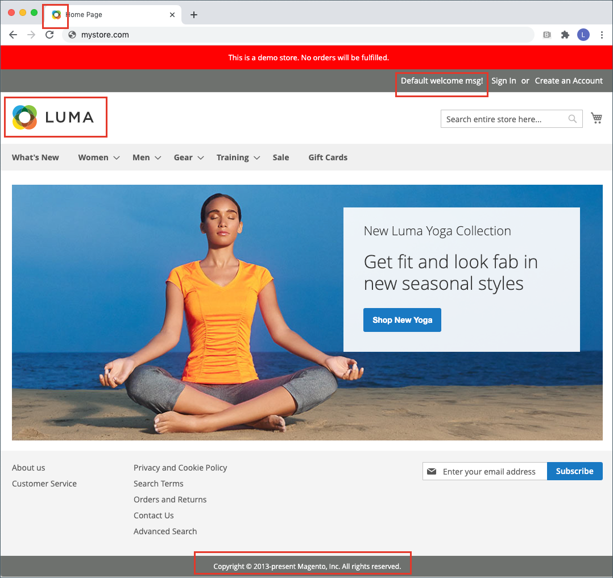
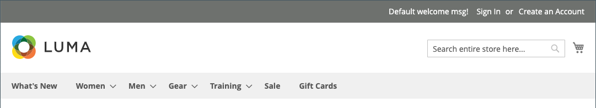
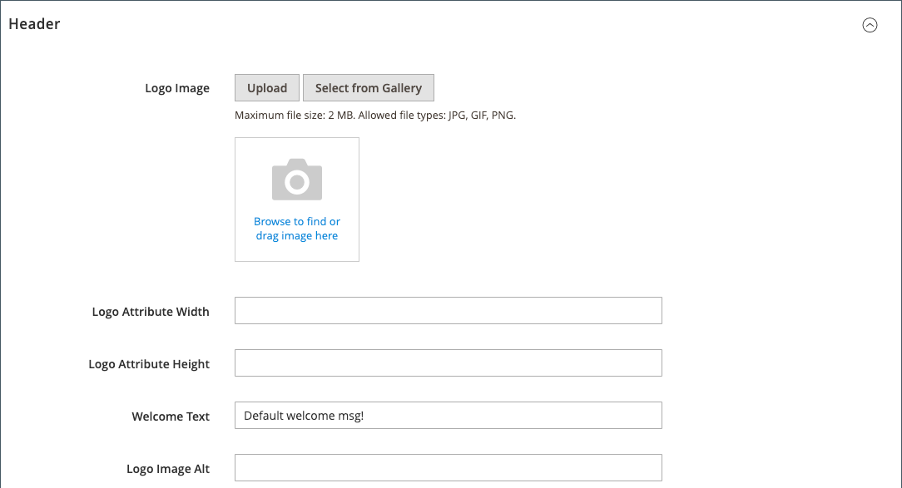
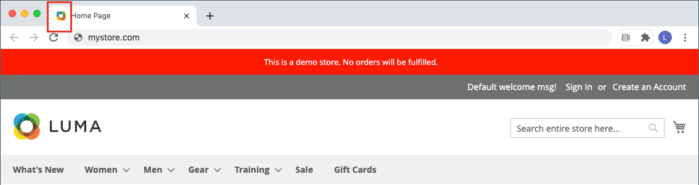
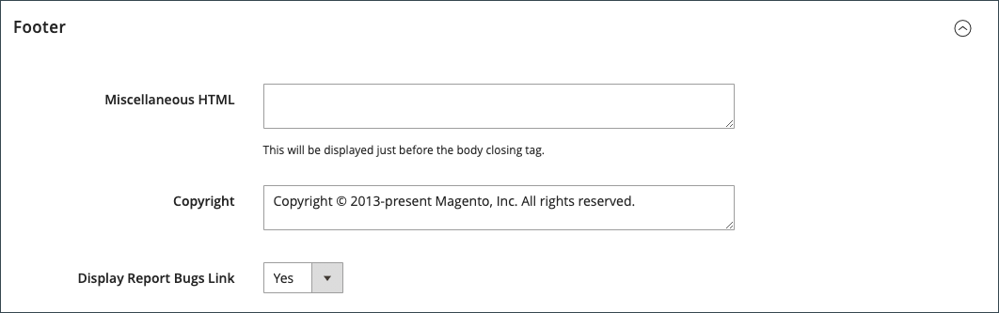

# 店面品牌

您首先要做的事情之一是[更改标题中的徽标](#upload-your-logo)并[为浏览器](#add-a-favicon)上传favicon。 接下来，您应[添加您的欢迎邮件](#change-the-welcome-message)并[更新页脚中的版权声明](#change-the-copyright-notice)。 这些任务就是一些您可以立即处理的简单设计元素。 当您的商店处于开发状态时，您可以[打开商店演示通知](#set-the-store-demo-notice)，然后在准备好启动时将其删除。

{width="600" zoomable="yes"}

## 上传您的徽标

标题中徽标的大小和位置由商店主题决定。 您的徽标可以保存为GIF、PNG或JPG(JPEG)文件类型，并可从您的商店管理员处上传。

标题中的{width="600"}

徽标图像位于服务器上的以下位置。 任何名为`logo.svg`的图像文件都用作默认主题徽标。

完整路径 — `app/design/frontend/[vendor]/[theme]/web/images/logo.svg`

相对路径 — `images/logo.svg`

如果您不知道主题中使用的徽标或其他图像的大小，请在浏览器中打开该页面，右键单击图像，然后检查该元素。

>[!NOTE]
>
>除了标题中的徽标外，您的徽标还会出现在[电子邮件模板](../systems/email-templates.md#prepare-your-email-logo)和[PDF发票](../stores-purchase/sales-documents.md)及其他销售单据中。 用于电子邮件模板和发票的徽标具有不同的大小要求，必须单独上传。

支持的徽标文件格式：

| 文件格式 | 描述 |
|--- |--- |
| PNG | （可移植网络图形）此较新的GIF格式替代方案最多支持1600万色（24位）。 无损压缩格式会生成具有清晰文本的高质量位图图像，但文件大小比某些格式大。 PNG格式支持透明层，并设计用于在线查看和流式传输。 |
| GIF | （图形交换格式）广泛支持且较旧的位图格式，限制为256色（8位）。 GIF格式支持简单动画和透明图层。 |
| JPG(JPEG) | （联合照相专家组）大多数数码相机使用的压缩位图格式。 有损压缩会导致一些数据丢失，有时由于文本中的模糊点而变得非常明显。 |

{style="table-layout:auto"}

1. 在&#x200B;_管理员_&#x200B;侧边栏上，转到&#x200B;**[!UICONTROL Content]** > _[!UICONTROL Design]_>**[!UICONTROL Configuration]**。

   {width="700"}

1. 查找要配置的商店视图，然后单击&#x200B;_[!UICONTROL Action]_列中的&#x200B;**[!UICONTROL Edit]**。

1. 展开&#x200B;**[!UICONTROL Header]**&#x200B;部分的。

   {width="600"}

1. 要上传新的徽标，请单击&#x200B;**[!UICONTROL Upload]**&#x200B;并从您的系统中选择文件。

1. 输入&#x200B;**[!UICONTROL Logo Image Width]**&#x200B;和&#x200B;**[!UICONTROL Logo Image Height]**&#x200B;像素。

1. 对于&#x200B;**[!UICONTROL Logo Image Alt]**，输入当有人将鼠标悬停在该图像上时要显示的文本。

1. 完成后，单击&#x200B;**[!UICONTROL Save Configuration]**。

## 添加收藏夹

_Favicon_&#x200B;是&#x200B;_收藏图标_&#x200B;的缩写，它是指每个浏览器页面选项卡上的小图标。 根据浏览器的不同，Favicon也会显示在地址栏中，位于URL的前面。

Favicon通常为16 x 16像素或32 x 32像素。 [!DNL Commerce]接受ICO、PNG、APNG、GIF和JPG(JPEG)文件类型，但并非所有浏览器都支持这些格式。 Favicon最受支持的文件格式是ICO。 您可以使用其他图像文件类型，但并非所有浏览器都支持该格式。 有许多可用的在线工具，可用于生成ICO图像或将图像转换为该格式。

浏览器选项卡中的{width="600"}

[!DNL Commerce]支持以下文件格式作为Favicon：

| 文件格式 | 描述 |
|--- |--- |
| 图标 | 此图像文件格式专为小型计算机图标图像而设计。 ICO格式主要用于Microsoft® Windows操作系统，它最多可包含256 x 256像素和1600万色（24位）的图像，具有8位透明度。 |
| PNG | （可移植网络图形）此较新的GIF格式替代方案最多支持1600万色（24位）。 无损压缩格式会生成具有清晰文本的高质量位图图像，但文件大小比某些格式大。 PNG格式支持透明层，并设计用于在线查看和流式传输。 |
| APNG | （可移植网络图形动画）一种与PNG相似的文件格式，它支持简单动画。 |
| GIF | （图形交换格式）广泛支持且较旧的位图格式，限制为256色（8位）。 GIF格式支持简单动画和透明图层。 |
| JPG(JPEG) | （联合照相专家组）大多数数码相机使用的压缩位图格式。 有损压缩会导致一些数据丢失，有时由于文本中的模糊点而变得非常明显。 |

{style="table-layout:auto"}

### 步骤1：创建Favicon

1. 使用您选择的图像编辑器创建徽标的16 x 16或32 x 32图形图像。

1. （可选）使用一种可用的联机工具将文件转换为.ico格式并将文件保存到计算机。

### 步骤2：将favicon上传到您的商店

1. 在&#x200B;_管理员_&#x200B;侧边栏上，转到&#x200B;**[!UICONTROL Content]** > _[!UICONTROL Design]_>**[!UICONTROL Configuration]**。

1. 在网格中，找到要配置的商店视图，然后单击&#x200B;_[!UICONTROL Action]_列中的&#x200B;**[!UICONTROL Edit]**。

1. 在&#x200B;_[!UICONTROL Other Settings]_下，展开&#x200B;**[!UICONTROL HTML Head]**部分的。

   {width="600"}

1. 如果要删除当前的favicon，请单击图像左下角的&#x200B;_删除_ （）图标。

1. 单击&#x200B;**[!UICONTROL Upload]**&#x200B;并打开您准备的favicon文件。

   {width="400"}

1. 完成后，单击&#x200B;**[!UICONTROL Save Configuration]**。

### 步骤3：刷新缓存

1. 提示刷新缓存时，单击工作区顶部消息中的&#x200B;**[!UICONTROL Cache Management]**&#x200B;链接。

1. 在列表中，选中标记为`Invalidated`的&#x200B;**[!UICONTROL Page Cache]**&#x200B;复选框。

1. 将&#x200B;**[!UICONTROL Actions]**&#x200B;设置为`Refresh`并单击&#x200B;**[!UICONTROL Submit]**。

1. 要查看新的收藏夹，请返回店面并刷新浏览器。

## 更改欢迎消息

标头中的欢迎消息将展开以包含已登录的客户名称。 在启动商店之前，请务必更改每个商店视图的默认&#x200B;_欢迎_&#x200B;文本。

{width="600"}

1. 在&#x200B;_管理员_&#x200B;侧边栏上，转到&#x200B;**[!UICONTROL Content]** > _[!UICONTROL Design]_>**[!UICONTROL Configuration]**。

1. 在网格中，找到要配置的商店视图，然后单击&#x200B;_[!UICONTROL Action]_列中的&#x200B;**[!UICONTROL Edit]**。

1. 在&#x200B;_[!UICONTROL Other Settings]_下，展开&#x200B;**[!UICONTROL Header]**部分的。

1. 对于&#x200B;**[!UICONTROL Welcome Text]**，输入要显示在商店标题中的欢迎消息文本。

   {width="600"}

1. 完成后，单击&#x200B;**[!UICONTROL Save Configuration]**。

1. 提示更新页面缓存时，单击工作区顶部的&#x200B;**[!UICONTROL Cache Management]**&#x200B;链接，然后按照说明刷新缓存。

## 更改版权声明

您的商店在每页的页脚中显示版权声明。 作为最佳实践，版权声明应包含当前年份，并将您的公司标识为网站上内容的合法所有者。

{width="600"}

`&copy;`字符代码用于插入版权符号，如以下示例所示：

- 长格式示例

  `Copyright &copy; 2013-present Luma, Inc. All rights reserved.`

- 短格式示例

  `&copy; 2021 Luma, Inc. All rights reserved.`

**_更新版权声明：_**

1. 在&#x200B;_管理员_&#x200B;侧边栏上，转到&#x200B;**[!UICONTROL Content]** > _[!UICONTROL Design]_>**[!UICONTROL Configuration]**。

1. 在网格中，找到要配置的商店视图，然后单击&#x200B;_[!UICONTROL Action]_列中的&#x200B;**[!UICONTROL Edit]**。

1. 在&#x200B;_其他设置_&#x200B;下，展开**[!UICONTROL Footer]**&#x200B;部分。

   {width="600"}

1. 对于&#x200B;**[!UICONTROL Copyright]**，请输入要显示在每页页脚中的版权声明。

   使用`&copy;`字符代码插入版权符号。

1. 完成后，单击&#x200B;**[!UICONTROL Save Configuration]**。

## 设置商店演示通知

如果您的商店在线上，但仍处于建设阶段，则可以在页面顶部显示商店演示通知，以告知用户该商店尚未开业。 当您准备好&#x200B;_上线_&#x200B;时，只需移除该消息即可。 它类似于将窗内悬挂的标志从&#x200B;_Closed_&#x200B;翻转到&#x200B;_Open_。 演示通知的格式由商店的主题决定。

{width="600"}

1. 在&#x200B;_管理员_&#x200B;侧边栏上，转到&#x200B;**[!UICONTROL Content]** > _[!UICONTROL Design]_>**[!UICONTROL Configuration]**。

1. 在网格中，找到要配置的商店视图，然后单击&#x200B;_[!UICONTROL Action]_列中的&#x200B;**[!UICONTROL Edit]**。

1. 在&#x200B;_[!UICONTROL Other Settings]_下，展开&#x200B;**[!UICONTROL HTML Head]**部分的。

   {width="600"}

1. 向下滚动到底部并将&#x200B;**[!UICONTROL Display Demo Store Notice]**&#x200B;设置为您的首选项。

1. 完成后，单击&#x200B;**[!UICONTROL Save Configuration]**。

1. 如果系统提示您更新缓存，请在系统消息中单击&#x200B;**[!UICONTROL Cache Management]**，然后按照说明刷新缓存。
