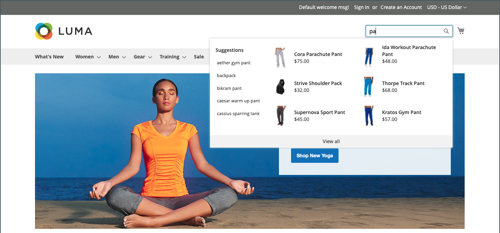
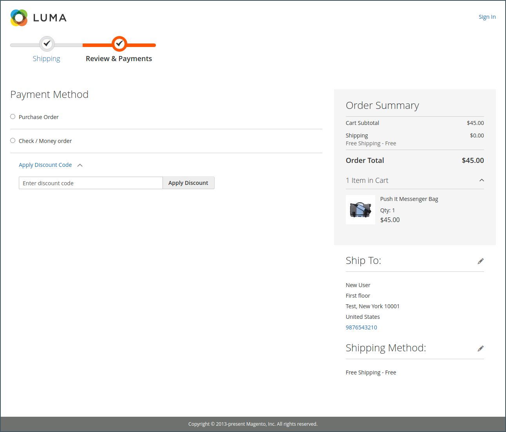

# 店面是什么？

在您的Adobe Commerce或Magento Open Source实施中，店面是商店中面向公众的外部部分。 它提供客户用于购物和购买的内容和功能组件。

客户进行销售的路径有时称为&#x200B;_购买路径_，您的店面包括供客户完成此路径的组件。 以下部分概述了提供战略价值的基本页面类型，即客户在商店购物时通常会访问的位置。 在回顾这些功能时，请考虑可在客户历程的每个阶段使用的不同商店功能。

## 主页

您知道吗，大多数人在决定留下来或前往其他位置之前，只会在页面上停留几秒钟？ 给人留下印象用不了多久。 研究表明，人们也喜欢照片，尤其是其他人的照片。 无论您选择哪种设计，主页上的所有内容都应当让访客沿着销售过程的下一步前进。 他们的想法是从一个兴趣点到另一个兴趣点引导他们的注意力。

{width="700"}

## 目录页面

目录页面列表通常具有小型产品图像和简要说明，并且可以通过列表或网格进行格式化。 您可以添加块、视频和富含关键词的描述，还可以为促销或季节创建特殊设计。 您可以创建一个特殊类别，以展示由不同类别的产品组成的精选系列中的某个生活方式或品牌。

最初的产品描述通常为购物者提供了足够的信息，值得更仔细地观察。 知道自己需要什么的人可以将产品添加到购物车中并离开。 在登录到帐户期间购物的客户可享受个性化的购物体验。

店面上的{width="700"}

## 搜索结果

您知道吗？使用搜索功能的人购买产品的可能性几乎是仅依赖导航功能的人的两倍。 您可能会认为这些购物者是&#x200B;_预获资格_。

### [!DNL Live Search]

使用Adobe Commerce的[[!DNL Live Search]](https://experienceleague.adobe.com/docs/commerce-merchant-services/live-search/overview.html)，您的商店可提供快速、超级相关且直观的搜索体验，可供Adobe Commerce免费使用。

{width="700"}

### 标准目录搜索

使用[标准目录搜索](../catalog/search.md)，您的商店在右上角包括一个搜索框，并在页脚中包含一个指向高级搜索的链接。 购物者提交的所有搜索词都会被保存，这样您就可以准确地看到他们要查找的内容。 您可以提供建议，并输入同义词和常见拼写错误。 然后，在输入搜索词时显示特定页面。

{width="700"}

## 产品页面

产品页面有很多工作要做！ 在产品页面上吸引您眼球的第一件事情是带有高分辨率缩放和缩略图库的主图像。 除了价格和可用性之外，还有一个选项卡部分，其中包含更多信息和相关产品的列表。

{width="700"}

## 购物车

在购物车中，您可以确定订单总额、折扣券以及预计的运费和税金，还可以在购物车中显示您的信托徽章和印章。 这也是提供最后一个项目的理想机会。 作为交叉销售，您可以选择特定商品在购物车中出现时作为冲动购买提供。

{width="700"}

## 签出页面

结账流程包括两个步骤：

1. 配送信息

   结账流程的第一步是让客户填写送货地址信息，并选择送货方式。 如果客户有帐户，则系统会自动输入送货地址，但如有需要，可以更改送货地址。
如果访客客户输入的电子邮件地址被识别为先前已注册，则当存储配置中的[!UICONTROL Enable Guest Checkout Login]字段设置为`Yes`时，将显示登录提示（请参阅&#x200B;_配置参考指南_&#x200B;中的[[!UICONTROL Checkout Options]](../configuration-reference/sales/checkout.md#checkout-options)）。 但是，此设置可能会向未经身份验证的用户公开客户信息。

   {width="700"}

1. 复查和付款信息

   结帐流程的第二个步骤是，客户选择付款方法并选择应用折扣代码。

   >[!NOTE]
   >
   >虽然[!DNL Commerce]允许配置多个优惠券代码，但客户只能向购物车应用一个优惠券代码。 （有关详细信息，请参阅[优惠券代码](../merchandising-promotions/price-rules-cart-coupon.md#coupon-codes)。）

   {width="700"}

页面顶部的进度栏跟踪结帐流程的每个步骤，_订单摘要_&#x200B;显示截至此阶段输入的信息。

>[!NOTE]
>
>两步结账的例外情况适用于虚拟和/或可下载的产品。 如果购物车中只有这些类型的产品，则结帐会自动转换为单步流程，因为不需要提供送货信息。
