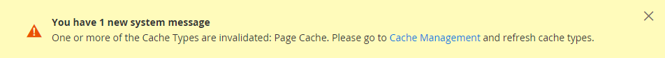

# 站点、存储和查看范围

每个Adobe Commerce和Magento Open Source安装都有一个 [层级](../stores-purchase/stores.md) 网站、商店和商店视图。 术语 _范围_ 确定数据库实体（如产品、属性或类别）内容元素或配置设置在层次结构中的应用位置。 网站、商店和商店视图具有一对多的父/子关系。 单个安装可以具有多个网站，每个网站可以具有多个商店和商店视图。

>[!NOTE]
>
>要了解更多信息，请参阅 [多个网站或商店](https://experienceleague.adobe.com/docs/commerce-operations/configuration-guide/multi-sites/ms-overview.html) 在 [!DNL Commerce] 开发人员文档。

## 网站

安装从单个开始 [网站](../stores-purchase/stores.md#add-websites)，其名称为 _主网站_ 默认情况下。 您还可以为单个安装设置多个网站，每个网站都有自己的IP地址和域。

## 商店

一个网站可以有多个网站 [存储](../stores-purchase/stores.md#add-stores)，每个页面都具有自己的主菜单。 商店共享产品目录，但可以有不同的产品和设计选择。 同一网站下的所有商店共享管理员和结账。

## 商店视图

顾客可使用的每家店铺均根据特定店铺类别呈列， _[视图](../stores-purchase/store-views.md)_. 最初，商店有一个默认视图。 可添加其他商店视图以支持不同语言或用于其他目的。 客户可以使用标头中的语言选择器来更改商店视图。

在使用网站、商店和商店视图时，请牢记以下几点：

- 商业实例具有级联模型：全局→网站→商店→商店视图。
- 每个网站至少有一个默认商店和商店视图。
- 每个商店视图可以具有不同的基本URL。
- 网站的主要功能是进行顶级功能配置。
- 存储的主要功能是根类别配置。
- 商店视图的主要功能是翻译信息和货币符号配置。

## 范围设置

如果您的Adobe Commerce或Magento Open Source安装具有网站、商店或视图的层次结构，则可以设置上下文，或者 _范围_ 配置设置的。 还可以为许多数据库实体的上下文分配特定范围，以确定如何在存储层次结构中使用它。 要了解更多信息，请参阅 [产品范围](../catalog/introduction.md#product-scope) 和 [价格范围](../catalog/catalog-price-scope.md).

某些配置设置（如邮政编码）具有全局范围，因为在整个系统中使用相同的值。 此 [网站](../stores-purchase/stores.md#add-websites) 范围适用于层次结构中该级别下的任何存储，包括所有存储及其视图。 范围为的任何项目 [商店视图](../stores-purchase/store-views.md) 可以针对每个商店视图进行不同的设置，通常用于支持多种语言。 要覆盖配置设置的默认值，请参阅 [设置范围](../configuration-reference/scope-change.md#set-the-scope).

除非商店在中运行 [单存储模式](#single-store-mode)，则每个配置设置的范围都会显示在字段标签下方的小文本中。 如果您的安装包含多个网站、商店或视图，请选择 [商店视图](../stores-purchase/store-views.md) 其中，这些设置将在进行任何更改之前应用。

{width="550"}

| 范围 | 描述 |
|--- |--- |
| [!UICONTROL Global] | 在整个安装过程中可用的系统范围设置和资源。 |
| [!UICONTROL Website] | 仅限于当前网站的设置和资源。 每个网站都有一个默认商店。 |
| [!UICONTROL Store] | 仅限于当前商店的设置和资源。 每个存储都有一个默认的根类别（主菜单）和默认的存储视图。 |
| [!UICONTROL Store View] | 设置为和限制为当前存储视图的资源。 |

{style="table-layout:auto"}

## 单存储模式

如果Commerce安装只有单个商店和商店视图，您可以通过关闭所有商店视图选项和范围指示器来简化显示。 如果符合以下条件，则将覆盖单商店模式 [添加更多商店视图](../stores-purchase/store-views.md) 稍后。

{width="550"}

1. 在 _管理员_ 侧栏，转到 **[!UICONTROL Stores]** > _[!UICONTROL Settings]_>**[!UICONTROL Configuration]**.

1. 下 **[!UICONTROL General]**，向下滚动到页面底部并展开 **[!UICONTROL Single-Store Mode]** 部分。

1. 设置 **[!UICONTROL Enable Single-Store Mode]** 到 `Yes`.

   {width="400"}

1. 单击 **[!UICONTROL Save Config]**.

1. 当提示刷新缓存时，执行以下操作：

   - 单击 **[!UICONTROL Cache Management]** 页面顶部系统消息中的链接。

     {width="600" zoomable="yes"}

   - 选择 **[!UICONTROL Page Cache]** 复选框。

   - 替换为 **[!UICONTROL Actions]** 设置为 `Refresh`，单击 **[!UICONTROL Submit]**
