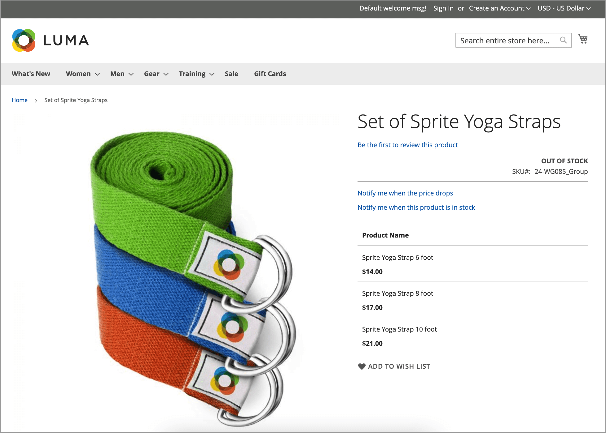

# 产品警报

客户可以通过电子邮件订阅两种类型的警报：价格更改警报和库存警报。 对于每种类型的警报，您可以确定客户是否能够订阅，选择使用的电子邮件模板，并识别电子邮件的发件人。

{width="600" zoomable="yes"}

## 价格更改警报

启用价格更改警报后，每个产品页面上都会显示&#x200B;_价格下降时通知我_&#x200B;链接。 客户可以单击该链接以订阅与产品相关的警报。 系统会提示访客在您的商店中开立帐户。 每当价格发生变化或产品推出特殊产品时，订阅该警报的每个人都会收到电子邮件警报。

## 库存警报

库存通知会创建一个链接，名为&#x200B;_当此产品已库存时，通知我_，用于每个缺货的产品。 客户可以单击链接以订阅警报。 当产品重新上架时，客户会收到一封电子邮件通知，告知该产品可供使用。 带有警报的产品在“产品信息”面板中有一个&#x200B;_产品警报_&#x200B;选项卡，该选项卡列出了订阅了警报的客户。

{width="600" zoomable="yes"}

## 设置产品警报

1. 在&#x200B;_管理员_&#x200B;侧边栏上，转到&#x200B;**[!UICONTROL Stores]** > _[!UICONTROL Settings]_>**[!UICONTROL Configuration]**。

1. 在左侧面板中，展开&#x200B;**[!UICONTROL Catalog]**&#x200B;并在下面选择&#x200B;**[!UICONTROL Catalog]**。

1. 单击以展开&#x200B;_[!UICONTROL Product Alerts]_&#x200B;部分并执行以下操作：

   {width="600" zoomable="yes"}

   - 若要向客户提供价格更改警报，请将&#x200B;**[!UICONTROL Allow Alert When Product Price Changes]**&#x200B;设置为`Yes`。

   - 将&#x200B;**[!UICONTROL Price Alert Email Template]**&#x200B;设置为要用于价格警报通知的模板。

   - 要在缺货产品再次可用时提供警报，请将&#x200B;**[!UICONTROL Allow Alert When Product Comes Back in Stock]**&#x200B;设置为`Yes`。

     >[!NOTE]
     >
     >仅当&#x200B;**[!UICONTROL Display Out of Stock Products]**&#x200B;设置为`Yes`（在[!UICONTROL Catalog] > [!UICONTROL Inventory]的配置中）时，_在此产品有库存时通知我_&#x200B;消息才会显示。

   - 将&#x200B;**[!UICONTROL Stock Alert Email Template]**&#x200B;设置为要用于产品库存警报的模板。

   - 将&#x200B;**[!UICONTROL Alert Email Sender]**&#x200B;设置为您希望显示为电子邮件警报发件人的[商店联系人](../getting-started/store-details.md#store-email-addresses){target="_blank"}。 在核心用户指南中了解有关[存储电子邮件地址](../configuration-reference/general/store-email-addresses.md){target="_blank"}的更多信息。

1. 完成后，单击&#x200B;**[!UICONTROL Save Config]**。

## 配置产品警报电子邮件模板

接下来，配置、添加或修改价格警报的电子邮件模板。 创建其他模板后，您可能需要编辑价格警报配置。

有关使用电子邮件的详细信息，请参阅&#x200B;_管理系统指南_&#x200B;中的[消息模板](../systems/email-template-custom.md#message-templates)。

1. 在&#x200B;_管理员_&#x200B;侧边栏上，转到&#x200B;**[!UICONTROL Marketing]** > _[!UICONTROL Communications]_>**[!UICONTROL Email Templates]**。

1. 单击&#x200B;**[!UICONTROL Add New Template]**。

1. 在&#x200B;_加载默认模板_&#x200B;下，选择要自定义的&#x200B;**[!UICONTROL Template]**。

   您可以选择主题中包含的警报模板。 或者，您也可以选择&#x200B;_[!UICONTROL Magento_PriceAlert]_&#x200B;下的`Price Alert`或`Stock Alert`模板。

1. 单击&#x200B;**[!UICONTROL Load Template]**。

1. 输入&#x200B;**[!UICONTROL Template Name]**。

   您可以在&#x200B;_价格警报_&#x200B;配置中选择此名称。

1. 通读现有内容，并根据需要进行更改，以实现以下目标：

   | 字段 | 描述 |
   | ----- | ----- |
   | [!UICONTROL Template Subject] | 此文本显示在电子邮件的主题行中。 |
   | [!UICONTROL Template Content] | 此文本显示在已发送电子邮件的完整内容中。 |

1. 若要从[!DNL Commerce]数据添加生成的信息，请使用&#x200B;**[!UICONTROL Insert Variable]**&#x200B;选项以使用可用变量列表。

1. 单击&#x200B;**[!UICONTROL Save Template]**。

## 产品警报运行设置

这些设置允许您选择[!DNL Commerce]检查需要发送警报的更改的频率。 您还可以为发送警报失败时发送的电子邮件选择收件人、发件人和模板。

{width="600" zoomable="yes"}

1. 在&#x200B;_管理员_&#x200B;侧边栏上，转到&#x200B;**[!UICONTROL Stores]** > _[!UICONTROL Settings]_>**[!UICONTROL Configuration]**。

1. 在左侧面板中，展开&#x200B;**[!UICONTROL Catalog]**&#x200B;并在下面选择&#x200B;**[!UICONTROL Catalog]**。

1. 展开&#x200B;**[!UICONTROL Product Alerts Run Settings]**&#x200B;部分的。

1. 要确定发送产品警报的频率，请将&#x200B;**[!UICONTROL Frequency]**&#x200B;设置为以下项之一：

   - `Daily`
   - `Weekly`
   - `Monthly`

1. 要确定一天中发送产品警报的时间，请将&#x200B;**[!UICONTROL Start Time]**&#x200B;设置为小时、分钟和秒。

   >[!NOTE]
   >
   >产品警报由“product_alert”使用者发送。

1. 对于&#x200B;**[!UICONTROL Error Email Recipient]**，输入发生错误时要联系的人员的电子邮件。

1. 对于&#x200B;**[!UICONTROL Error Email Sender]**，选择显示为错误通知发送者的存储标识。

1. 将&#x200B;**[!UICONTROL Error Email Template]**&#x200B;设置为要用于错误通知的事务性电子邮件模板。

1. 完成后，单击&#x200B;**[!UICONTROL Save Config]**。
