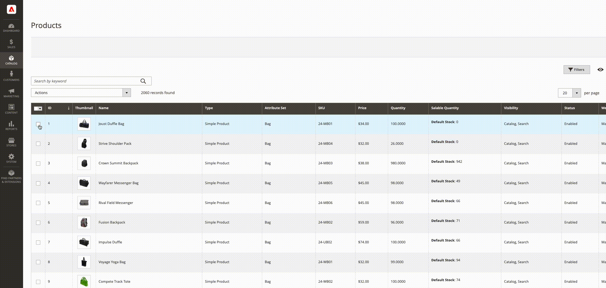
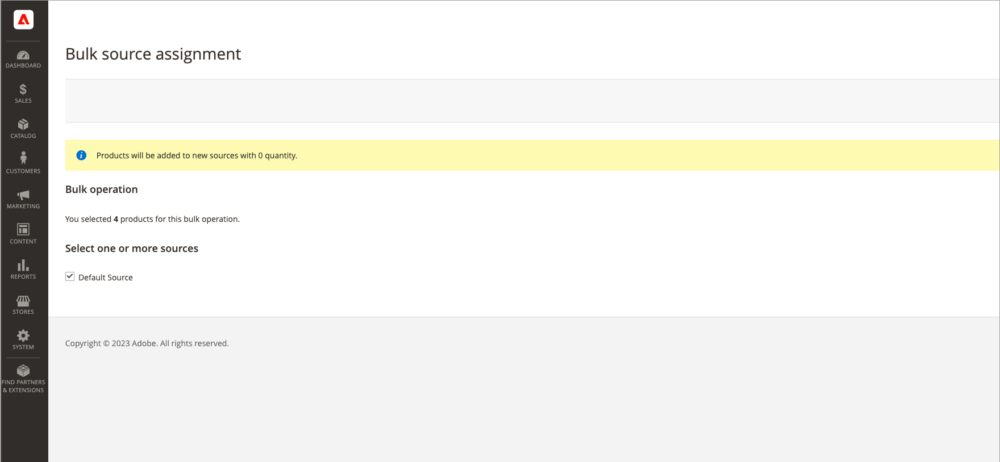
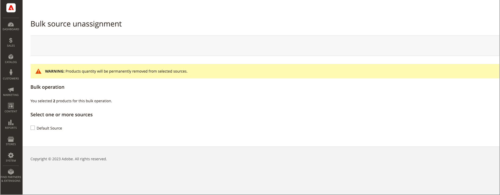

# 批量源分配和取消分配

使用 _分配源_ 工具，用于将一个或多个源添加到您的产品。 在创建和将自定义来源分配给默认库存或自定义库存以及准备新位置和库存时，该工具很有帮助。

添加新的自定义源后，您可以添加 [每个产品的库存数量](quantities-assign-per-product.md) 或者通过管理员访问多个产品，或者使用 [导入功能](inventory-import-export.md).

## 分配来源和数量

1. 在 _管理员_ 侧栏，转到 **[!UICONTROL Catalog]** > **[!UICONTROL Products]**.

1. 选择要修改其源的产品。

   浏览或搜索以查找产品并选中这些复选框。

1. 单击 **[!UICONTROL Actions]** 菜单，然后选择 **[!UICONTROL Assign Inventory Source]**.

1. 单击 **[!UICONTROL OK]** 在确认对话框中。

1. 对于要添加到产品的所有源，请选中复选框。

1. 单击 **[!UICONTROL Assign Sources]**.

   {width="600" zoomable="yes"}

将源添加到库存数量为0的产品。 您可以添加 [库存数量](quantities-assign-per-product.md) 每个源。

## 取消分配来源和数量

从产品中取消分配源时，表示该产品不再存储在该位置。 此过程将完全清除当前分配给产品的来源的所有库存数据。 如果要将现有库存移动到新位置，请考虑使用 _转移库存_ 选项。

{{$include /help/_includes/unassign-source.md}}

强烈建议在删除来源之前完成这些产品的所有订单和装运。

1. 在 _管理员_ 侧栏，转到 **[!UICONTROL Catalog]** > **[!UICONTROL Products]**.

1. 选择要修改其源的产品。

   浏览或搜索以查找产品并选中这些复选框。

1. 单击 **[!UICONTROL Actions]** 菜单，然后选择 **[!UICONTROL Unassign Inventory Source]**.

1. 单击 **[!UICONTROL OK]** 在确认对话框中。

1. 选择要从产品中删除的源。

   页面会显示一个警报，指出取消分配会从产品中删除所有特定的源和数量数据。

1. 单击 **[!UICONTROL Unassign Sources]**.

   {width="600" zoomable="yes"}
