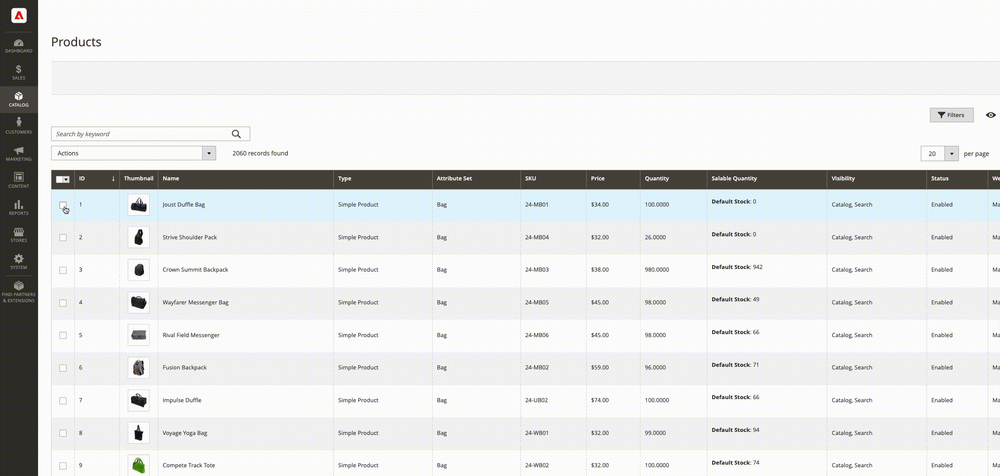

# 批量源分配和取消分配

使用&#x200B;_分配源_&#x200B;工具向产品添加一个或多个源。 在创建和将自定义来源分配给默认库存或自定义库存以及准备新位置和库存时，该工具很有帮助。

添加新的自定义源后，您可以通过管理员或使用[导入功能](inventory-import-export.md)为每个产品](quantities-assign-per-product.md)或多个产品添加[库存数量。

## 分配来源和数量

1. 在&#x200B;_管理员_&#x200B;侧边栏上，转到&#x200B;**[!UICONTROL Catalog]** > **[!UICONTROL Products]**。

1. 选择要修改其源的产品。

   浏览或搜索以查找产品并选中这些复选框。

1. 单击顶部的&#x200B;**[!UICONTROL Actions]**&#x200B;菜单，然后选择&#x200B;**[!UICONTROL Assign Inventory Source]**。

1. 在确认对话框中，单击&#x200B;**[!UICONTROL OK]**。

1. 对于要添加到产品的所有源，请选中复选框。

1. 单击&#x200B;**[!UICONTROL Assign Sources]**。

   {width="600" zoomable="yes"}

将源添加到库存数量为0的产品。 您可以为每个源添加[库存数量](quantities-assign-per-product.md)。

## 取消分配来源和数量

从产品中取消分配源时，表示该产品不再存储在该位置。 此过程将完全清除当前分配给产品的来源的所有库存数据。 如果要将现有库存移动到新位置，请考虑使用&#x200B;_转移库存_&#x200B;选项。

{{$include /help/_includes/unassign-source.md}}

强烈建议在删除来源之前完成这些产品的所有订单和装运。

1. 在&#x200B;_管理员_&#x200B;侧边栏上，转到&#x200B;**[!UICONTROL Catalog]** > **[!UICONTROL Products]**。

1. 选择要修改其源的产品。

   浏览或搜索以查找产品并选中这些复选框。

1. 单击顶部的&#x200B;**[!UICONTROL Actions]**&#x200B;菜单，然后选择&#x200B;**[!UICONTROL Unassign Inventory Source]**。

1. 在确认对话框中，单击&#x200B;**[!UICONTROL OK]**。

1. 选择要从产品中删除的源。

   页面会显示一个警报，指出取消分配会从产品中删除所有特定的源和数量数据。

1. 单击&#x200B;**[!UICONTROL Unassign Sources]**。

   {width="600" zoomable="yes"}

<!-- Last updated from includes: 2022-08-30 15:36:09 -->
