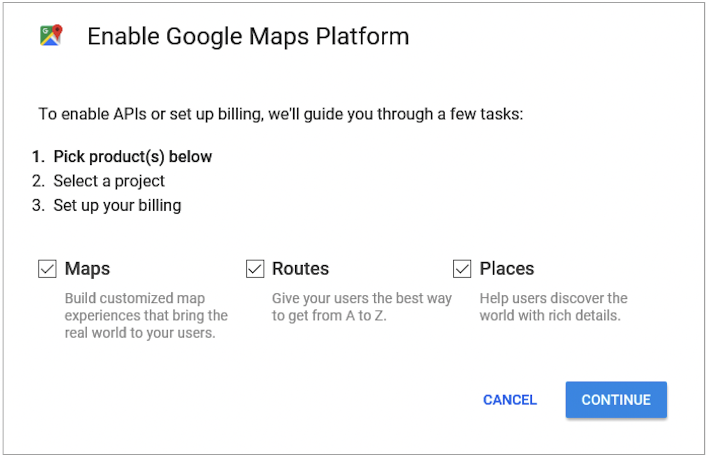
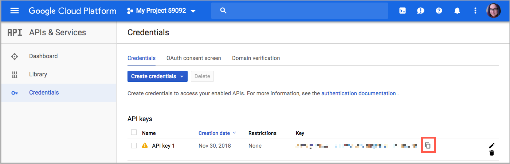

# 配置距离优先级算法

距离优先级算法将发运目标地址的位置与来源位置进行比较，以确定完成发运的最近来源。 该距离可以通过物理距离或使用数据库数据或驾驶、步行或骑车方向从一个位置到另一个位置所花费的时间来确定。 使用此[Source选择算法](selection-reservations.md)来推荐与配送目的地地址最接近的来源。

>[!NOTE]
>
>如果您使用距离优先级算法，建议输入[源](sources-add.md)的完整街道地址和GPS坐标。

您可以使用两个选项来计算距离和时间，以查找发运履行的最近来源：

- **Google MAP** — 使用[Google Map Platform][1]服务计算送货目标地址与源位置之间的距离和时间。 此选项使用源的纬度和经度（GPS坐标），并且可以根据计算模式使用街道地址。 已启用[地理编码API][2]和[距离矩阵API][3]的Google API密钥是必需的，您可能会通过Google产生费用。

- **离线计算** — 使用下载和导入的地理码数据（使用邮编/邮政编码和GPS坐标）计算距离，以确定距离送货目的地地址最近的来源。 要配置此选项，您可能需要开发人员帮助才能使用命令行说明最初下载和导入地理代码。

>[!NOTE]
>
>对于具有多个国家/地区的多商店网站，请为每个国家/地区配置[默认税务目标](../stores-purchase/tax-class.md#default-tax-destination){target="_blank"}。

## 使用Google地图

您不需要Google帐户即可开始。 如果需要，该过程包括Google帐户和项目创建。 此选项要求将计费帐户和支付方法添加到您的Google帐户，以完成配置并使用算法。
但是，建议使用基于Google MAP距离的算法，因为该算法比离线计算更先进、更精确。

### 步骤1：创建Google API密钥

密钥来自[Google映射平台][1]，应该启用[地理编码API][2]和[距离矩阵API][3]。 有关详细信息，请参阅[配置距离优先级算法](distance-priority-algorithm.md)。

1. 访问[Google地图平台][1]并单击&#x200B;**[!UICONTROL Get Started]**。

1. 要启用该平台，请选择&#x200B;**[!UICONTROL Maps, Routes, and Places]**&#x200B;并单击&#x200B;**[!UICONTROL Continue]**。

   为您的密钥{width="350" zoomable="yes"}

1. 使用Google帐户登录或创建帐户。

1. 设置项目：

   - 选择一个项目或输入一个新的项目名称。

   - 要接受条款，请选择`Yes`。

   - 单击&#x200B;**[!UICONTROL Next]**。

1. 输入帐单帐户或创建帐户。 您可以稍后跳过并添加计费帐户。

   需要付费帐户才能使用此服务。

1. 要打开并配置您的Google Cloud Platform选项，请单击&#x200B;**[!UICONTROL Console]**。

   - 打开您的项目。

   - 展开菜单并单击&#x200B;**[!UICONTROL APIs & Services]** > **[!UICONTROL Library]**。

     {width="350" zoomable="yes"}

   - 搜索[地理编码API][2]和[距离矩阵API][3]。 选择并启用每个服务。

1. 展开菜单，单击&#x200B;**[!UICONTROL APIs & Services]** > **[!UICONTROL Credentials]**，然后复制Google API密钥。

   {width="350" zoomable="yes"}

### 步骤2：配置Google MAP提供程序

1. 在&#x200B;_管理员_&#x200B;侧边栏上，转到&#x200B;**[!UICONTROL Stores]** > _[!UICONTROL Settings]_>**[!UICONTROL Configuration]**。

1. 在左侧面板中，展开&#x200B;**[!UICONTROL Catalog]**&#x200B;并选择&#x200B;**[!UICONTROL Inventory]**。

1. 展开&#x200B;_[!UICONTROL Distance Provider for Distance Based SSA]_部分的并将&#x200B;**[!UICONTROL Provider]**设置为`Google MAP`。

   基于距离的SSA的{width="350" zoomable="yes"}

1. 展开 _[!UICONTROL Google Distance Provider]_部分并配置设置：

   - 对于&#x200B;**[!UICONTROL Google API Key]**，输入从您的Google帐户复制的密钥。

   - 对于&#x200B;**[!UICONTROL Computation mode]**，请选择配置。

     >[!NOTE]
     >
     >在使用此算法处理发运时，如果对于发运的选定计算模式（驾驶、骑车或行走），工艺路线和数据未返回，则SSA将默认使用“Source优先级”。 建议为每Stock](stocks-prioritize-sources.md)的源设置[优先级。

     | 选项 | 描述 |
     | ----- | ----- |
     | `Driving` | （默认）使用道路网络请求标准行车方向。 |
     | `Walking` | 客人可以使用人行道和人行道（如果可用）来要求步行路线。 |
     | `Bicycling` | 客人可以使用自行车道和首选街道（如果有的话）要求自行车骑行路线。 [Distance Matrix Service][4]仅在美国和一些加拿大城市提供。 |

   - 对于&#x200B;**[!UICONTROL Value]**，请选择值类型：

     | 选项 | 描述 |
     | ----- | ----- |
     | `Distance` | （默认）返回以公制（公里和米）或英制（英里和英尺）表示的点之间的距离。 |
     | `Time to Destination` | 以小时和分钟为单位，返回从源位置到送货地址所需经过的时间。 |

   {width="350" zoomable="yes"}

1. 完成后，单击&#x200B;**[!UICONTROL Save Config]**。

## 使用离线计算

离线计算使用国家/地区代码来确定发运目的地和来源地址之间的距离。 可能需要开发人员帮助才能配置此选项。 使用[!DNL Inventory Management] CLI命令从[geonames.org][5]下载和导入数据。

>[!NOTE]
>
>从[geonames.org][5]导入的地理代码对某些国家/地区具有限制，例如加拿大和爱尔兰。 有关详细信息，请参阅[地名邮政编码文件][6]。

### 步骤1：下载和导入地理代码

完成命令行配置，下载并导入地理编码国家/地区以收货并在中拥有源位置。 此步骤可能需要开发人员帮助来获取命令行任务的帮助。 请参阅[导入地理代码](cli.md#import-geocodes)。

可根据需要随时完成这些命令，以添加更多地理代码。

### 第2步：设置计算

1. 在&#x200B;_管理员_&#x200B;侧边栏上，转到&#x200B;**[!UICONTROL Stores]** > _[!UICONTROL Settings]_>**[!UICONTROL Configuration]**。

1. 在左侧面板中，展开&#x200B;**[!UICONTROL Catalog]**&#x200B;并选择&#x200B;**[!UICONTROL Inventory]**。

1. 展开&#x200B;_[!UICONTROL Distance Provider for Distance Based SSA]_部分的。

1. 取消选中&#x200B;**[!UICONTROL Use system value]**&#x200B;复选框并将&#x200B;**[!UICONTROL Provider]**&#x200B;设置为`Offline Calculation`。

   基于距离的SSA的{width="350" zoomable="yes"}

1. 完成后，单击&#x200B;**[!UICONTROL Save Config]**。

[1]: https://cloud.google.com/maps-platform/
[2]: https://developers.google.com/maps/documentation/geocoding/start
[3]: https://developers.google.com/maps/documentation/distance-matrix/start
[4]: https://developers.google.com/maps/documentation/javascript/distancematrix#travel_modes
[5]: https://www.geonames.org/
[6]: https://download.geonames.org/export/zip/readme.txt
