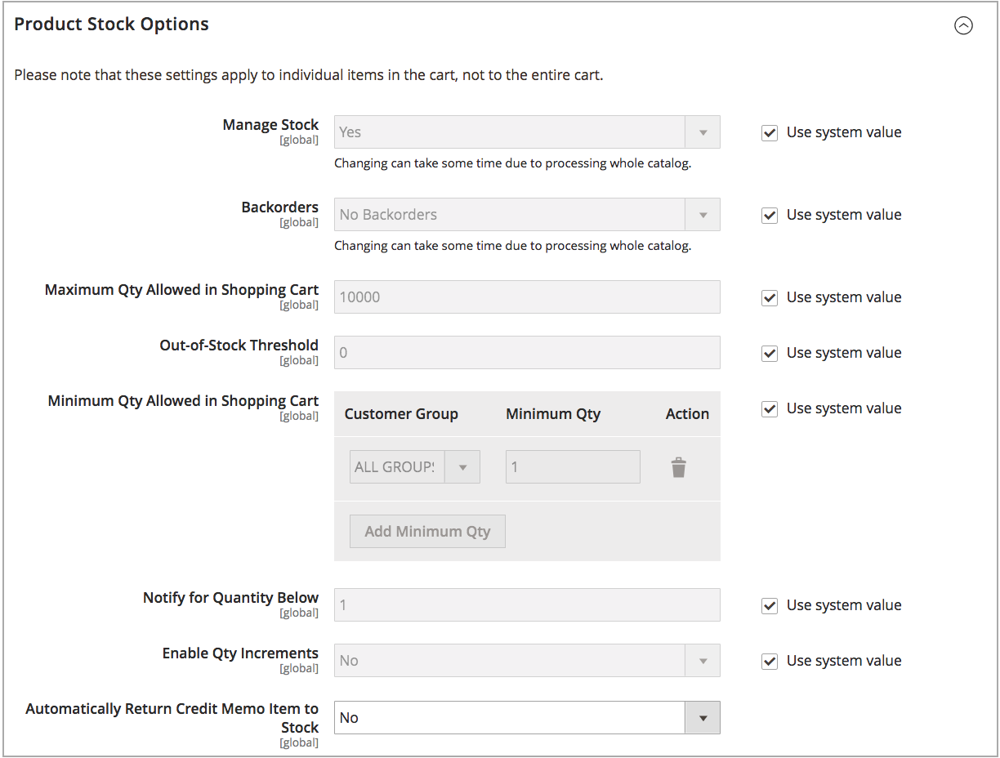

# 配置[!DNL Inventory Management]全局选项

为网站的产品和库存配置默认配置选项。 可以通过[配置产品选项](product-options.md)为每个产品覆盖其中的某些设置。 要配置距离优先级设置，请参阅[配置距离优先级算法](distance-priority-algorithm.md)。

## 全局配置产品和股票选项

1. 在&#x200B;_管理员_&#x200B;侧边栏上，转到&#x200B;**[!UICONTROL Stores]** > _[!UICONTROL Settings]_>**[!UICONTROL Configuration]**。

1. 在左侧面板中，展开&#x200B;**[!UICONTROL Catalog]**&#x200B;并选择&#x200B;**[!UICONTROL Inventory]**。

1. 展开 **[!UICONTROL Stock Options]**&#x200B;部分并设置选项：

   {width="600" zoomable="yes"}

   - 要在下订单时调整现有量，请将&#x200B;**[!UICONTROL Decrease Stock When Order is Placed]**&#x200B;设置为`Yes`。

   - 若要在订单取消时将项目退回Stock，请&#x200B;**[!UICONTROL Set Items' Status to be in Stock When Order in Cancelled]**&#x200B;至`Yes`。

   - 要继续显示目录中不再有库存的产品，请将&#x200B;**[!UICONTROL Display Out of Stock Products]**&#x200B;设置为`Yes`。

   - 如果启用了[价格警报](alert-setup.md)，则客户可以注册以在产品重新上架时收到通知。

   - 要设置产品页上显示最后剩余库存金额的开始时间，请输入&#x200B;**[!UICONTROL Only X left Threshold]**&#x200B;的金额。

     当库存量达到阈值时，将开始显示消息。 例如，如果设置为`3`，则当库存数量达到三时，将显示消息`Only 3 left`。 消息会调整以反映库存中的数量，直到数量达到零。

   - 要在产品页面上显示“有货”或“无货”消息，请将&#x200B;**[!UICONTROL Display Products Availability In Stock on Storefront]**&#x200B;设置为`Yes`。

   - 要在购物车中加载产品时检查库存，请将&#x200B;**[!UICONTROL Enable Inventory Check On Cart Load]**&#x200B;设置为`Yes`。 禁用此选项后，将跳过清单检查。 禁用此选项可加快结帐速度，尤其是当购物车中有许多商品时。 但是，如果您跳过预验证，客户稍后在结账过程中可能会看到“缺货”错误。

   - 要保持清单和目录之间的一致性，请将&#x200B;**[!UICONTROL Synchronize with Catalog]**&#x200B;设置为`Yes`。 启用此选项后，库存数据将根据目录变化（例如删除了产品、更改了产品SKU以及更改了产品类型）进行调整。

1. 展开 **[!UICONTROL Product Stock Options]**&#x200B;部分并设置选项：

   - 要为目录激活[库存控制](enable.md)，请将&#x200B;**[!UICONTROL Manage Stock]**&#x200B;设置为`Yes`。

     {width="600" zoomable="yes"}

   - 将&#x200B;**[!UICONTROL Backorders]**&#x200B;设置为以下项之一：

     | 选项 | 描述 |
     | ----- | ----- |
     | `No Backorders` | 产品缺货时，不接受[延期交货](backorders.md)。 |
     | `Allow Qty Below 0` | 当数量降至零以下时，将接受延交订单。 |
     | `Allow Qty Below 0 and Notify Customer` | 当数量低于零时，系统会接受延交订单，并通知客户仍然可以下达订单。 |

   - 输入&#x200B;**[!UICONTROL Maximum Qty Allowed in Shopping Cart]**。

   - 输入&#x200B;**[!UICONTROL Out-of-Stock Threshold]**&#x200B;的金额：

     | 值 | 描述 |
     | ----- |-----|
     | 正数 | 禁用“延交订单”后，请输入正金额。 |
     | 零 | 启用延交订单后，输入`0`将允许无限延交订单。 |
     | 负金额 | 启用延交订单后，建议输入负金额。 该金额将添加到可销售数量。 例如，输入`-50`以允许订单数量不超过此金额。 |

   - 为所选组和金额输入&#x200B;**[!UICONTROL Minimum Qty Allowed in Shopping Cart]**。

   - 对于&#x200B;**[!UICONTROL Notify for Quantity Below]**，输入触发物料缺货通知的库存级别。

   - 要激活产品的数量增量，请将&#x200B;**[!UICONTROL Enable Qty Increments]**&#x200B;设置为`Yes`。 然后，对于&#x200B;**[!UICONTROL Qty Increments]**，输入为了满足要求必须购买的项目数。

     例如，可以购买数量为`6`、`12`、`18`等以六为增量销售的项目。

   - 对于[!DNL Inventory Management]，**[!UICONTROL Automatically Return Credit Memo Item to Stock]**&#x200B;设置为`No`。 在提交贷项通知单时，您可以输入并选择将库存退回给来源。

1. 展开 **[!UICONTROL Admin bulk operations]**&#x200B;部分并设置选项：

   {width="600" zoomable="yes"}

   - 设置&#x200B;**[!UICONTROL Run asynchronously]**&#x200B;以异步运行批量产品操作的操作

     这些操作包括批量[分配和取消分配源](bulk-assignment.md)和[将库存转移到源](inventory-transfer.md)。 它会收集批量操作（最大为异步批次大小），然后运行这些操作。 此选项默认处于禁用状态。 建议在启用之前检查批量操作的性能。

     >[!NOTE]
     >
     >要配置和支持&#x200B;_异步队列管理器_，必须使用命令行发出命令。 此步骤可能需要开发人员帮助。 请参阅&#x200B;_配置指南_&#x200B;中的[启动消息队列使用者](https://experienceleague.adobe.com/docs/commerce-operations/configuration-guide/cli/start-message-queues.html?lang=zh-Hans)。

   - 如果启用，请设置&#x200B;**[!UICONTROL Asynchronous batch size]**。 默认批次大小为100。 当批量进程达到此数量时，系统会触发该数量。

1. 完成后，单击&#x200B;**[!UICONTROL Save Config]**。
