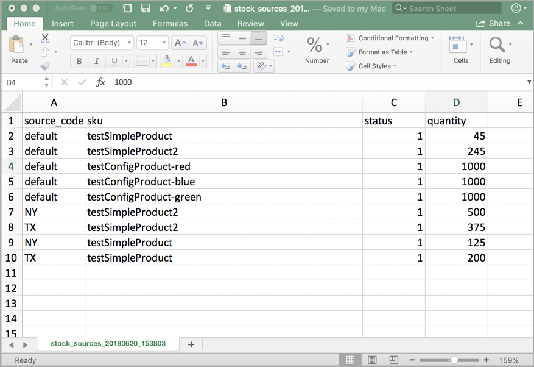

# 导入和导出库存

对于包含许多产品的目录，请使用具有扩展[!DNL Inventory Management]选项的本机导入和导出功能来按SKU更新来源和数量。 使用这些选项，您可以为所有来源或特定来源添加新来源并更新库存数量。 例如，您可以为位于德国的来源导出产品，而不会影响位于法国、英国或美国的来源的产品信息。

- 在升级[!DNL Commerce]或导入新产品时，[!DNL Commerce]会自动将默认Source分配给您的产品。 如果导入指定了自定义来源的产品，则仍会添加数量为0的默认Source。 要更新来源和数量，请使用这些导入说明。

- 单一来源商家使用导入功能仅更新产品数量。 所有现有和添加的产品都会分配到默认的Source。

- 多来源商家使用导入功能为每个SKU添加多个来源和每行数量。

要导入更新，请先导出特定或所有源的CSV文件。 编辑CSV文件，并为每个源和数量每个SKU添加一行。 添加源和添加库存数量时需要源代码。 不能使用导入 — 导出特征添加或更新库存。

## CSV文件内容

导出 — 导入文件根据源包括以下信息：

- `source_code` - [!DNL Commerce]中的源代码。 每个源和SKU都有一行。
- `sku` - [!DNL Commerce]中产品的SKU。 SKU必须与您商店中的产品匹配才能正确更新[!DNL Inventory Management]数据。
- `status` - 0表示缺货。 1表示有库存。 此值必须为1才能从该来源购买库存。
- `quantity` — 此SKU和源的可用库存总金额。

使用CSV文件快速更新多个产品和分配的源，以更新和更正库存记录中的任何不准确之处，而不是通过应用程序界面一次更新一个。 对于基本文件，请先导出并根据需要进行更新。

{width="600" zoomable="yes"}

## 导出所有来源的产品数据

1. 在&#x200B;_管理员_&#x200B;侧边栏上，转到&#x200B;**[!UICONTROL System]** > _[!UICONTROL Data Transfer]_>**[!UICONTROL Export]**。

1. 对于&#x200B;**[!UICONTROL Entity Type]**，请选择`Stock Sources`。

   导出仅提取带有SKU的产品数据。

1. 单击&#x200B;**[!UICONTROL Continue]**。

   文件会生成并下载以打开和编辑。

更新库存数量和产品数据后，将文件导入回[!DNL Commerce]。

{width="350" zoomable="yes"}

## 导出特定来源的产品数据

1. 在&#x200B;_管理员_&#x200B;侧边栏上，转到&#x200B;**[!UICONTROL System]** > _[!UICONTROL Data Transfer]_>**[!UICONTROL Export]**。

1. 对于&#x200B;**[!UICONTROL Entity Type]**，请选择`Stock Sources`。

   导出仅提取带有SKU的产品数据。

1. 使用&#x200B;**[!UICONTROL Entity Attributes]**&#x200B;筛选特定源的导出产品。

   对于`source_code`，在筛选器字段中输入源代码。

1. 单击&#x200B;**[!UICONTROL Continue]**。

   文件会生成并下载以打开和编辑。

更新库存数量和产品数据后，将文件导入回[!DNL Commerce]。

## 导入产品数据

1. 在&#x200B;_管理员_&#x200B;侧边栏上，转到&#x200B;**[!UICONTROL System]** > _[!UICONTROL Data Transfer]_>**[!UICONTROL Import]**。

1. 对于&#x200B;**[!UICONTROL Entity Type]**，请选择`Stock Sources`。

   导出仅提取带有SKU的产品数据。

1. 选择&#x200B;**[!UICONTROL Import Behavior]**&#x200B;的配置。

1. 选择要导入的.csv文件。

1. 单击&#x200B;**[!UICONTROL Check Data]**&#x200B;并完成导入。

{width="600" zoomable="yes"}
