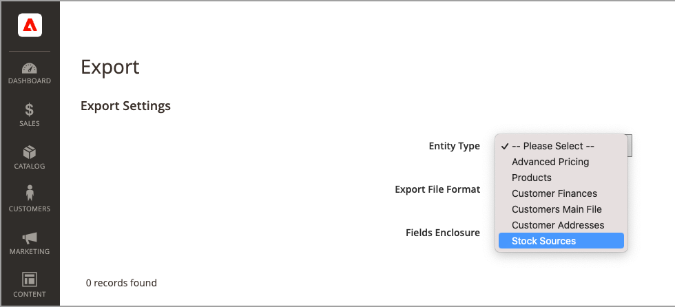

# 导入和导出库存

对于包含许多产品的目录，请使用扩展的本机导入和导出功能 [!DNL Inventory Management] 按SKU更新来源和数量的选项。 使用这些选项，您可以为所有来源或特定来源添加新来源并更新库存数量。 例如，您可以为位于德国的来源导出产品，而不会影响位于法国、英国或美国的来源的产品信息。

- [!DNL Commerce] 升级时将自动将默认源分配给产品 [!DNL Commerce] 或进口新产品。 如果导入指定了自定义来源的产品，则仍会添加“默认来源”的数量0。 要更新来源和数量，请使用这些导入说明。

- 单一来源商家使用导入功能仅更新产品数量。 所有现有和添加的产品都会被分配到“默认来源”。

- 多来源商家使用导入功能为每个SKU添加多个来源和每行数量。

要导入更新，请先导出特定或所有源的CSV文件。 编辑CSV文件，并为每个源和数量每个SKU添加一行。 添加源和添加库存数量时需要源代码。 不能使用导入 — 导出特征添加或更新库存。

## CSV文件内容

导出 — 导入文件根据源包括以下信息：

- `source_code`  — 中的源代码 [!DNL Commerce]. 每个源和SKU都有一行。
- `sku`  — 中产品的SKU [!DNL Commerce]. SKU必须与您商店中的产品匹配才能正确更新 [!DNL Inventory Management] 数据。
- `status` - 0表示缺货。 1表示有库存。 此值必须为1才能从该来源购买库存。
- `quantity`  — 此SKU和源的可用库存总额。

使用CSV文件快速更新多个产品和分配的源，以更新和更正库存记录中的任何不准确之处，而不是通过应用程序界面一次更新一个。 对于基本文件，请先导出并根据需要进行更新。

{width="600" zoomable="yes"}

## 导出所有来源的产品数据

1. 在 _管理员_ 侧栏，转到 **[!UICONTROL System]** > _[!UICONTROL Data Transfer]_>**[!UICONTROL Export]**.

1. 对象 **[!UICONTROL Entity Type]**，选择 `Stock Sources`.

   导出仅提取带有SKU的产品数据。

1. 单击 **[!UICONTROL Continue]**.

   文件会生成并下载以打开和编辑。

更新库存数量和产品数据后，将文件导入回 [!DNL Commerce].

{width="350" zoomable="yes"}

## 导出特定来源的产品数据

1. 在 _管理员_ 侧栏，转到 **[!UICONTROL System]** > _[!UICONTROL Data Transfer]_>**[!UICONTROL Export]**.

1. 对象 **[!UICONTROL Entity Type]**，选择 `Stock Sources`.

   导出仅提取带有SKU的产品数据。

1. 使用 **[!UICONTROL Entity Attributes]** 用于筛选特定源的导出产品。

   对象 `source_code`，在筛选器字段中输入源代码。

1. 单击 **[!UICONTROL Continue]**.

   文件会生成并下载以打开和编辑。

更新库存数量和产品数据后，将文件导入回 [!DNL Commerce].

## 导入产品数据

1. 在 _管理员_ 侧栏，转到 **[!UICONTROL System]** > _[!UICONTROL Data Transfer]_>**[!UICONTROL Import]**.

1. 对象 **[!UICONTROL Entity Type]**，选择 `Stock Sources`.

   导出仅提取带有SKU的产品数据。

1. 选择配置 **[!UICONTROL Import Behavior]**.

1. 选择要导入的.csv文件。

1. 单击 **[!UICONTROL Check Data]** 并完成导入。

{width="600" zoomable="yes"}
