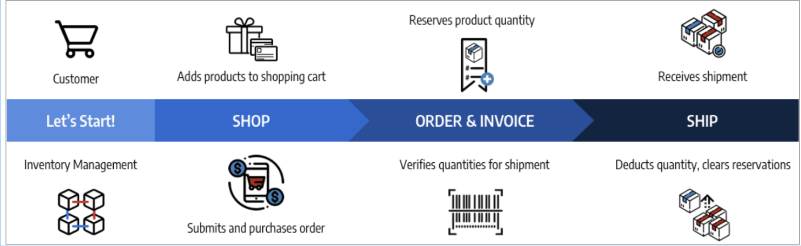
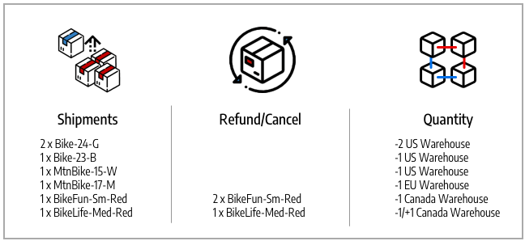

# 订单状态和预订

[!DNL Inventory Management]支持每个订单的部分和全部开票、付款、配送和取消。 当您通过处理、开票、发运和可能退款来管理订单时，[!DNL Commerce]会自动输入或更改保留，以更新库存（或销售渠道）的可销售数量和每个来源的现有库存量。 您不必主动访问或输入预留。 完成要完成、取消或退款订单的操作会为您完成此操作。

这些保留始终会调整您的可销售数量（正或负金额），以增加或减少数量。 其结果是更新现有库存量和可销售数量，以获得最新的产品可用性。

有关订单和装运的详细信息，请参阅[管理订单和装运](shipments.md)。

## 订单管理选项

根据库存状态和客户请求，您可以更新具有部分付款和取消的订单、来自多个来源的部分发运或延期交货的订单，或者退回退回退回产品的贷项通知单。

### 装运

对订单开票后，发送部分或全部发运，直到您完成整个订单为止。 每次发运都会转换预留，并从每个来源的产品数量中扣减金额。 输入保留补偿以更新库存的可销售数量。 如果您发送了部分发运，则每次发运都会从产品数量和保留中扣减该金额。 任何未发运的产品保留将保留在原位，直到它们也发运为止，这样，您的可销售金额是最新的，使您可以控制产品库存，并支持多个来源发运和延交订单。

### 取消的订单

如果客户在发运前（部分或全部）取消订单，则系统将输入新保留以将库存金额退回到可销售数量。 这些预留实际上相互抵消，不会从任何来源中扣除数量。 其他客户可透过相关库存及销售渠道积极采购该等产品数量。

### 已退款的订单

如果客户请求退款，请签发部分或全部产品金额的贷项通知单。 在接收退回的产品时，请输入贷项通知单以提供资金并更新产品金额。 在选择“退回至库存”选项时，[!DNL Commerce]会将数量添加回发运订单和预留补偿的产品和来源，以更新关联库存的可销售数量。

## 订单类型

简单的订单从购物车开始，继续付款，最后交付满意。 在这些订单中，[!DNL Inventory Management]可以轻松处理购物车和结帐中的可用性（或可销售数量）的预留，并在发运时从现有库存量中扣除。

{width="600" zoomable="yes"}

更复杂的订单可能包括部分取消、部分发运和退款。 在这些情况下，保留会影响可用库存，以增加取消和退款的数量，并减少订购和发运的数量。

{width="600" zoomable="yes"}

根据订单状态进行可用性预留和库存更改。

## 状态和预订

下表详细列出了订单和贷项通知单状态，其中保留更改由[!DNL Commerce]输入，用于管理库存。

| 订单状态 | 描述 | 可销售数量的预留 |
|--|--|--|
| [!UICONTROL Open] | 新的和最近提交的，无处理 | 在提交库存订单时保存预订。 |
| [!UICONTROL Canceled] | 付款前已部分或全部取消 | 输入预留补偿以将部分或全部数量返回至库存可销售数量。 |
| [!UICONTROL On Hold] | 未处理付款和装运或未开票 | 预订就位。 |
| [!UICONTROL Suspected Fraud] | 由于欺诈未处理 | 如果获得批准或正在审查，保留将保留。 如果被拒绝，预订将保持不变，直到商家决定批准或取消。 如果取消，则输入预留补偿，以将全部数量返回至库存可销售数量。 |
| [!UICONTROL Pending] | 正在等待付款 | 预订就位。 |
| [!UICONTROL Processing] | 付款处理，未收到 | 预订就位。 |
| [!UICONTROL Pending Payment] | 未收到付款 | 预订就位。 |
| [!UICONTROL Payment Review] | 正在审核付款以进行处理和完成 | 预订就位。 |
| [!UICONTROL Complete] | 已付和已全部发货 | 在部分或全部开票时，从所选来源的产品数量中扣除预留金额。 输入预留补偿以更新总可销售数量。 |
| [!UICONTROL Closed] | 已退款或已存档 | 如果存档，则数量不会发生更改。 如果部分或全部退款，则会输入预留补偿，并转换预留补偿，以添加每个来源的产品数量和每个库存的可销售数量。 |

| 贷项通知单状态 | 描述 | 可销售数量的预留 |
|--|--|--|
| [!UICONTROL Open] | 退款已到期，尚未完成 | 预订没有变化。 |
| [!UICONTROL Refunded] | 已完成，退回资金 | 如果部分或全部退款，则会输入预留补偿，并转换预留补偿，以添加每个来源的产品数量和每个库存的可销售数量。 |

## 复杂订单示例

布莱克·桑德斯为家人度假和娱乐订了自行车和衣服。 他们在您的自行车冒险商店中看到了一些出色的销售情况，其库存和来源遍布美国、加拿大和欧洲。

他们给自己的小孩买了两辆很棒的公园自行车，给十几岁的孩子买了一辆BMX自行车，给自己买了一辆不错的山地自行车，给配偶买了一辆现代的德国越野自行车。 商店里卖了一件可爱的衬衫，所以他们买了一件给全家比的。 请参阅下面的假期采购列表、匹配的SKU以及根据库存可销售数量输入的预留。

{width="600" zoomable="yes"}

他们向家人展示他们找到的东西，但也会做出一些改变。 在付款完成之前，他们取消了33款BikeFun SKU中的两款（孩子们不喜欢它们）。 由于付款待定，这是部分取消，因此不需要贷项通知单。 要更新，[!DNL Commerce]将添加回加拿大的可销售数量库存。 订单已付清，所有产品均发货，及时送达，准备放假。 [!DNL Commerce]更新装运产品的装运仓库的可销售数量和来源数量。

但这件衬衫并不适合他们的配偶。 Blake要求退款并寄回他的衬衫。 创建贷项通知单后，加拿大库存和货运仓库中又添加了一件54-BikeLife衬衫。

- **已发运产品** — 如果已经购买和发运产品，[!DNL Commerce]将更新库存。 保留补偿将转换为从发运来源扣减的现有库存量。 库存的可用可销售数量会更新。

- **已取消产品** — 通过取消库存，[!DNL Commerce]将删除该产品的预订。 在库存层输入预留补偿，以添加部分取消两件T恤的可销售数量。 这不会影响来源层的库存数量。

- **贷项通知单/退款产品** — 通过退回库存，必须将其添加回数量。 在发放贷项通知单时，您可以选择返回至库存。 [!DNL Commerce]将退回库存数量添加到产品的装运来源。 输入保留补偿以清除任何剩余的保留。 可销售数量会根据更新数量重新计算。

{width="600" zoomable="yes"}
