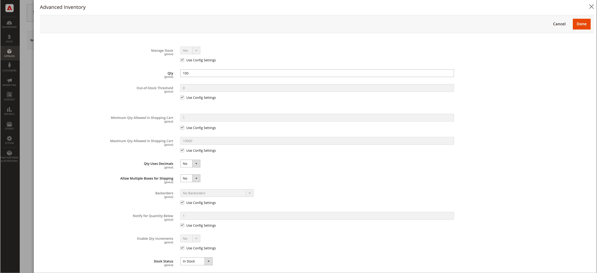

# 配置[!DNL Inventory Management]产品选项

这些配置仅适用于已编辑的产品，并覆盖全局网站级别的所有配置。 在编辑产品时，通过&#x200B;_[!UICONTROL Sources]_&#x200B;部分和&#x200B;_[!UICONTROL Advanced Inventory]_&#x200B;页面修改这些设置。

- 按源配置产品选项
- 配置高级清单的产品选项

## 按源显示的产品选项

为产品配置每个[添加的源](sources-add.md)的数量和其他设置。

1. 在&#x200B;_管理员_&#x200B;侧边栏上，转到&#x200B;**[!UICONTROL Catalog]** > **[!UICONTROL Products]**。

1. 在编辑模式下打开产品。

1. 展开&#x200B;**[!UICONTROL Sources]**&#x200B;部分的并配置每个源的产品设置：

   - 输入&#x200B;**[!UICONTROL Qty]**（数量）金额。

   - 将&#x200B;**[!UICONTROL Source Item Status]**&#x200B;设置为`In Stock`或`Out of Stock`。

   - 要修改“通知每个源数量低于”，请清除或选中&#x200B;**[!UICONTROL Notify Quantity Use Default]**&#x200B;复选框。

     如果清除，请输入触发物料缺货通知的库存水平金额。 输入的金额将从库存层的项目可销售数量中扣除。

     `Select to use Default` - [!DNL Commerce]检查产品高级清单选项中的配置设置。
     `Clear to Modify` — 输入通知数量的值，覆盖高级清单和商店配置设置。

   产品的{width="350" zoomable="yes"}

1. 完成后，单击&#x200B;**[!UICONTROL Done]**，然后单击&#x200B;**[!UICONTROL Save]**。

### 字段描述

| 字段 | 范围 | 描述 |
|--|--|--|
| [!UICONTROL Source Code] | 全局 | [源](sources-manage.md)的唯一代码。 |
| [!UICONTROL Name] | 全局 | 源的唯一名称。 |
| [!UICONTROL Status] | 全局 | 在目录中启用或禁用产品。 |
| [!UICONTROL Source Item Status] | 全局 | 确定产品的当前可用性。 选项：  `In Stock` — 使产品可供购买。 `Out of Stock` — 除非激活延交订单，否则将阻止产品可供购买，并从目录中删除列表。 |
| [!UICONTROL Qty] | 全局 | 每个来源或地点的现有库存量。 |
| [!UICONTROL Notify Quantity] | 全局 | 如果未选择&#x200B;_[!UICONTROL Notify Quantity Use Default]_，则此特定源的&#x200B;_[!UICONTROL Notify for Quantity Below]_&#x200B;金额。 |
| [!UICONTROL Notify Quantity Use Default] | 全局 | 指示使用产品&#x200B;_[!UICONTROL Advanced Inventory]_&#x200B;中_[!UICONTROL Notify for Quantity Below]_&#x200B;的默认设置或存储配置中的全局设置。 |

## 高级产品选项

1. 在&#x200B;_管理员_&#x200B;侧边栏上，转到&#x200B;**[!UICONTROL Catalog]** > **[!UICONTROL Products]**。

1. 在编辑模式下打开产品。

1. 展开 **[!UICONTROL Sources]**&#x200B;部分并单击&#x200B;**[!UICONTROL Advanced Inventory]**。

1. 要为您的目录启用[库存控制](enable.md)，请将&#x200B;**[!UICONTROL Manage Stock]**&#x200B;设置为`Yes`。

   >[!NOTE]
   >
   >子产品中的[!UICONTROL Manage Stock]设置将覆盖可配置的产品。

   产品的{width="600" zoomable="yes"}

1. 输入&#x200B;**[!UICONTROL Out-of-Stock Threshold]**&#x200B;的金额：

   | 值 | 描述 |
   | ----- | ----- |
   | 正数 | 禁用&#x200B;_[!UICONTROL Backorders]_&#x200B;后，请输入正值。 |
   | 零 | 启用&#x200B;_[!UICONTROL Backorders]_&#x200B;后，输入`0`将允许无限延交订单。 |
   | 负金额 | 启用&#x200B;_[!UICONTROL Backorders]_&#x200B;后，建议输入负值。 该金额将添加到可销售数量。 例如，输入`-50`以允许订单数量不超过此金额。 |

1. 输入&#x200B;**[!UICONTROL Minimum Qty Allowed in Shopping Cart]**。

1. 输入&#x200B;**[!UICONTROL Maximum Qty Allowed in Shopping Cart]**。

1. 如果客户在输入订购数量时可以使用小数值而不是整数，请将&#x200B;**[!UICONTROL Qty uses Decimals]**&#x200B;设置为`Yes`。

1. 如果产品可以分盒单独销售，请将&#x200B;**[!UICONTROL Allow Multiple Boxes for Shipping]**&#x200B;设置为`Yes`。 仅当&#x200B;**[!UICONTROL Qty Uses Decimals]**&#x200B;设置为`Yes`时，此选项才可见。

1. 将&#x200B;**[!UICONTROL Backorders]**&#x200B;设置为以下项之一：

   | 选项 | 描述 |
   | ----- | ----- |
   | `No Backorders` | 产品缺货时不接受延交订单。 |
   | `Allow Qty Below 0` | 要在数量低于零时接受延交订单，请执行以下操作： |
   | `Allow Qty Below 0 and Notify Customer` | 在数量低于零时接受延交订单，并通知客户仍然可以下订单。 |

   有关详细信息，请参阅[配置延期交货](backorders.md)。

1. 要激活产品的数量增量，请将&#x200B;**[!UICONTROL Enable Qty Increments]**&#x200B;设置为`Yes`，并在&#x200B;**[!UICONTROL Qty Increments]**&#x200B;字段中输入必须购买才能满足要求的项目数。

   例如，以6为增量销售的项目可以以6、12、18等数量购买。

   **[!UICONTROL Qty Increments]**&#x200B;字段设置作为单个产品以及可配置、分组和捆绑产品的子产品必须购买的产品项目数。

1. 完成后，单击&#x200B;**[!UICONTROL Done]**，然后单击&#x200B;**[!UICONTROL Save]**。

### 字段描述

| 字段 | 范围 | 描述 |
|--|--|--|
| [!UICONTROL Manage Stock] | 全局 | 确定是否使用库存控制管理目录中的此产品。 设置为启用或禁用所有[!DNL Inventory Management]功能。 当您完成退货或贷项通知单时，产品数量会自动返回至受影响的来源数量。 如果使用第三方ERP系统，则可能需要禁用。 |
| [!UICONTROL Out-of-Stock Threshold] | 全局 | 确定将产品视为缺货的库存水平。 选项： 正值 — 禁用延交订单后，请输入正金额。 零(0) — 启用延交订单后，输入零将允许无限延交订单。 负值 — 启用延交订单后，建议输入负金额。 该金额将添加到可销售数量。 例如，输入`-50`以允许订单数量不超过此金额。 |
| [!UICONTROL Minimum Qty Allowed in Shopping Cart] | 全局 | 确定单个订单可购买产品的最小数量。 |
| [!UICONTROL Maximum Qty Allowed in Shopping Cart] | 全局 | 确定单笔订单可购买产品的最大数量。 |
| [!UICONTROL Qty Uses Decimals] | 全局 | 确定在输入订购数量时，客户是否可以使用小数值而不是整数。 选项： `Yes` — 允许以小数形式输入值，而不是整数。 小数点适合按重量、体积或长度销售的产品。 `No` — 要求以整数输入数量值。 |
| [!UICONTROL Allow Multiple Boxes for Shipping] | 全局 | 确定产品部件是否可以单独发运。 当&#x200B;**[!UICONTROL Qty Uses Decimals]** = `Yes`时，此选项可见。 |
| [!UICONTROL Backorders] | 全局 | 确定如何管理延交订单。 延交订单不会更改订单的处理状态。 无论产品是否有库存，在下单后仍会立即授权或获取资金。 产品在可用时即发运。 启用后，建议您为缺货阈值输入负值。 选项： `No Backorders` — 产品缺货时不接受延期交货。 `Allow Qty Below 0` — 在数量低于零时接受延交订单。 `Allow Qty Below 0 and Notify Customer` — 在数量低于零时接受延交订单，但通知客户仍然可以下订单。 |
| [!UICONTROL Enable Qty Increments] | 全局 | 确定产品是否可以按数量递增销售。 增量设置作为单个产品以及可配置、分组和捆绑产品的子产品必须购买的产品项目数。 |

>[!NOTE]
>
>简单产品配置会覆盖特定产品的可配置产品配置。
