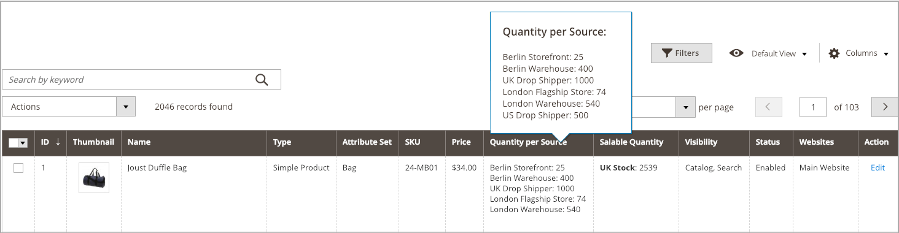

# 按产品分配数量

添加[源](sources-assign-per-product.md)后，更新产品的库存数量。 这些值跟踪现有可用库存量。

若要在不移除源的情况下隐藏源库存的装运，请将&#x200B;_[!UICONTROL Source Item Status]_设置为`Out of Stock`。 SSA和装运选项仅访问列为`In Stock`且具有可用库存数量的来源。

所有更新的数量和来源都会显示在产品网格中。

## 更新数量

1. 在&#x200B;_管理员_&#x200B;侧边栏上，转到&#x200B;**[!UICONTROL Catalog]** > **[!UICONTROL Products]**。

1. 在编辑模式下查找并打开产品。

1. 展开&#x200B;**[!UICONTROL Sources]**&#x200B;部分的。

1. 将&#x200B;**[!UICONTROL Source Item Status]**&#x200B;设置为`In Stock`。

1. 要更新现有库存量，请输入&#x200B;**[!UICONTROL Qty]**&#x200B;的金额。

1. 要设置库存数量通知，请执行以下操作之一：

   - 自定义通知数量 — 取消选中&#x200B;**[!UICONTROL Use Default]**&#x200B;复选框，并在&#x200B;**[!UICONTROL Notify Qty]**&#x200B;中输入数量。
   - 默认通知数量 — 选中&#x200B;**[!UICONTROL Use Default]**&#x200B;复选框。 [!DNL Commerce]检查并使用&#x200B;_[!UICONTROL Advanced Inventory]_或全局存储配置中的设置。

   {width="350" zoomable="yes"}

1. 执行以下操作之一进行保存：

   - 单击&#x200B;**[!UICONTROL Save]**。

   - 在&#x200B;**[!UICONTROL Save]** （）菜单中，选择&#x200B;**[!UICONTROL Save & Close]**。

“产品网格”将更新为所有来源和相关数量的列表。 对于分配了五个以上源的产品，将鼠标悬停在&#x200B;_[!UICONTROL Quantity per Source]_列上可查看完整列表。

每个源的{width="600" zoomable="yes"}
