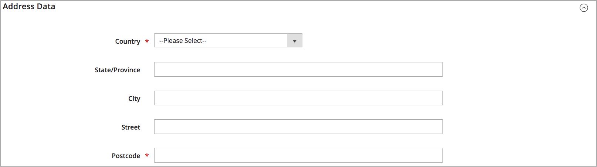

# 添加源

使用自定义来源从多个位置管理库存和订单履行。 为每个位置（如仓库、实体店、配送中心和卸货托运人）创建来源。 按产品分配来源和更新数量

如果编辑默认Source，则可以编辑除名称和代码之外的所有配置。 建议单个来源商家添加与其位置匹配的信息。

## 添加库存来源

1. 在&#x200B;_管理员_&#x200B;侧边栏上，转到&#x200B;**[!UICONTROL Stores]** > _[!UICONTROL Inventory]_>**[!UICONTROL Sources]**。

1. 单击&#x200B;**[!UICONTROL Add New Source]**。

   

1. 展开&#x200B;**[!UICONTROL General]**&#x200B;部分中的并执行以下操作：

   - 要标识库存来源，请输入唯一的&#x200B;**[!UICONTROL Name]**。

   - 输入唯一的&#x200B;**[!UICONTROL Code]**。

     该代码支持大小写字母、数字、破折号和下划线。 该代码是在分配给股票和导出 — 导入数据时使用的唯一ID。

   - 如果此清单源已准备就绪，请将&#x200B;**[!UICONTROL Is Enabled]**&#x200B;设置为`Yes`。

   - 输入此位置的简短&#x200B;**[!UICONTROL Description]**&#x200B;以快速参考或附加详细信息。

   - 对于&#x200B;**[!UICONTROL Latitude]**&#x200B;和&#x200B;**[!UICONTROL Longitude]**，请输入协作室位置的全球定位系统(GPS)坐标。

     若要查找包含[Google地图][1]的GPS坐标，请在搜索框中输入地址。 右键单击地图上的标记并选择&#x200B;**[!UICONTROL What's here?]**。 GPS坐标显示在街道地址下方的详细信息框中。

     

   - 如果此库存来源是提货地点，请将&#x200B;**[!UICONTROL Use as Pickup Location]**&#x200B;设置为`Yes`。

     默认Source不能用作店内装货订单的装货地点。

1. 展开&#x200B;**[!UICONTROL Contact Info]**&#x200B;部分中的并执行以下操作：

   - 对于&#x200B;**[!UICONTROL Contact Name]**，输入所在位置的主要联系人的全名。

   - 输入用于联系位置的&#x200B;**[!UICONTROL Email]**&#x200B;地址。

   - 对于&#x200B;**[!UICONTROL Phone]**，输入区号和电话号码。

   - 对于&#x200B;**[!UICONTROL Fax]**，输入传真的区号和电话号码（如果可用）。

     

1. 展开&#x200B;**[!UICONTROL Address Data]**&#x200B;部分中的并执行以下操作：

   - 选择&#x200B;**[!UICONTROL Country]**。

   - 对于&#x200B;**[!UICONTROL State/Province]**，输入省/市/自治区标准缩写。

   - 输入&#x200B;**[!UICONTROL City]**。

   - 输入物理&#x200B;**[!UICONTROL Street]**&#x200B;地址。

   - 对于&#x200B;**[!UICONTROL Postcode]**，输入邮政编码。

     

1. 如果在前一步骤中将源设置为接收位置，请展开&#x200B;**[!UICONTROL Pickup Location]**&#x200B;部分的，并提供有关该位置的描述性信息：

   - 输入取车地点的&#x200B;**[!UICONTROL Frontend Name]**。

   - 输入取车地点的&#x200B;**[!UICONTROL Frontend Description]**。 使用此文本框显示店内时间、相对于其他地标的位置，或其他有助于客户选择正确取车地点的有用信息。

     

   有关在使用源作为接收位置时如何配置电子邮件通知的更多信息，请参阅&#x200B;_配置参考指南_&#x200B;中的[销售电子邮件](../configuration-reference/sales/sales-emails.md)。

1. 要保存您所做的工作，请执行以下操作之一：

   - 要保存您的工作并继续编辑，请单击&#x200B;**[!UICONTROL Save & Continue]**。

   - 若要保存您的工作并返回到“管理源”页面，请单击向下箭头（），然后选择&#x200B;**[!UICONTROL Save & Close]**。

   - 若要保存您对当前源记录所做的工作并输入新的源，请选择&#x200B;**[!UICONTROL Save & New]**。

## 按钮栏

| 按钮 | 描述 |
|--|--|
| [!UICONTROL Back] | 返回到“管理源”页。 |
| [!UICONTROL Reset] | 将表单中的所有字段恢复为上次保存时的值。 |
| [!UICONTROL Save & Continue] | 保存所有更改并保持表单处于打开状态以供进一步编辑。 单击向下箭头可获取其他选项：  **[!UICONTROL Save & Close]**— 保存对当前记录所做的更改，关闭表单，并返回到“管理源”页。 **[!UICONTROL Save & New]** — 保存更改，关闭当前记录，并打开一个新的空白表单。 |

## 字段描述

| 字段 | 描述 |
|--|--|
| **[!UICONTROL General]** | |
| [!UICONTROL Name] | （必需）为管理员用户标识库存来源的唯一名称。 |
| [!UICONTROL Code] | （必需）系统用于标识库存来源的唯一字母数字代码。 以大写或小写字符和/或数字（不含空格）输入代码。 如有必要，可以使用连字符或下划线代替空格。 创建源后无法编辑代码。 它是您向库存分配来源以及导出和/或导入产品数据时使用的唯一ID。 |
| [!UICONTROL Is Enabled] | 确定库存来源是否可用。 选项：是/否 |
| [!UICONTROL Description] | 库存来源地点的简要说明。 包含对管理员用户有用的详细信息。 |
| [!UICONTROL Latitude] | 指定GPS库存源的纬度坐标。 输入数字形式的值，并根据需要加号或减号加号。 不允许使用度符号和字母。 例如：Latitude 32.7555 |
| [!UICONTROL Longitude] | 指定GPS库存源的经度坐标。 输入数字形式的值，并根据需要加号或减号加号。 不允许使用度符号和字母。 例如： `-97.3308` |
| **[!UICONTROL Contact Info]** | |
| [!UICONTROL Contact Name] | 库存来源地点的主要联系人的姓名。 |
| [!UICONTROL Email] | 主要联系人的电子邮件。 |
| [!UICONTROL Phone] | 主要联系人的区号和电话号码，使用您喜欢的格式。 例如： `(123) 456-7890`或`123-456-7890` |
| [!UICONTROL Fax] | 主要联系人的区号和传真号。 |
| **[!UICONTROL Address Data]** | |
| [!UICONTROL Country] | （必需）库存来源所在的国家/地区。 |
| [!UICONTROL State/Province] | 库存来源所在的省/市/自治区。 |
| [!UICONTROL City] | 库存来源所在的城市。 |
| [!UICONTROL Street] | 库存来源的街道地址。 |
| [!UICONTROL Postcode] | （必需）库存来源的邮政编码。 |
| **[!UICONTROL Pickup Location]** | |
| [!UICONTROL Frontend Name] | 显示在店面中的源的接收位置名称。 |
| [!UICONTROL Frontend Description] | 店面中显示的来源提货地点的说明。 它可以包含附加的图像。 |

[1]: https://www.google.com/maps
