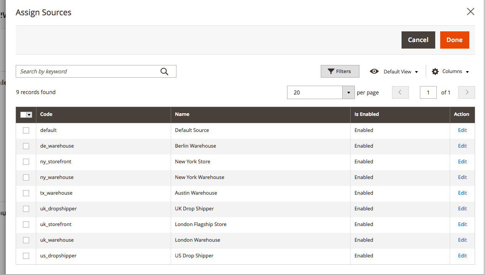

# 按产品分配源

在修改数量和设置之前，必须指定 [源](sources-manage.md) 到产品。

{{$include /help/_includes/unassign-source.md}}

## 将源分配给产品

1. 在 _管理员_ 侧栏，转到 **[!UICONTROL Catalog]** > **[!UICONTROL Products]**.

1. 在中打开产品 _编辑_ 模式。

1. 展开  该 **[!UICONTROL Sources]** 部分。

   此部分允许您修改来源、更新库存数量等。

   >[!NOTE]
   >
   >目前，只有简单、可配置、虚拟、可下载和分组的产品支持多个源。 只能使用“默认来源”和“库存”来创建和管理捆绑销售产品。

   {width="600" zoomable="yes"}

1. 要添加源，请单击 **[!UICONTROL Assign Sources]**.

1. 在 _[!UICONTROL Assign Sources]_页面上，选中要为产品分配的每个源旁边的复选框。

   {width="600" zoomable="yes"}

1. 单击 **[!UICONTROL Done]** 以添加源。

1. 执行以下操作之一进行保存：

   - 单击 **[!UICONTROL Save]**.
   - 在 _[!UICONTROL Save]_ ()菜单，选择&#x200B;**[!UICONTROL Save & Close]**.

分配源后，更新 [库存数量](quantities-assign-per-product.md) 每个产品源。
