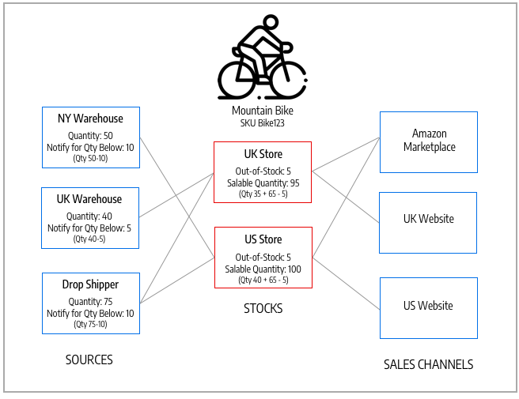

# 库存和来源

管理库存，而不管仓库位置、产品或服务类型或销售渠道如何。 完成来自多个仓库、实体店、分发中心和直接发运的订单并发运产品，以完成订单，并重点关注均衡的库存、运输成本等。

这些描述包括一家自行车公司的产品、来源和库存，该公司在美国和欧洲拥有多个发货地点和网站。

## 源

[源](sources-manage.md) 是管理和发运产品库存以用于订单履行或提供服务的实际地点。 这些地点可包括仓库、实体店、配送中心和卸货托运人。 [!DNL Commerce] 使用每个库存的数量和可销售数量，并自动管理被管理产品和订单的库存金额。 如果您有一个源，则您将被视为 _单源_ 模式。 如果您有多个源，则视为 _多源_ 模式。

来源可以优先处理一个仓库中的库存，但不一定在所有仓库中，因为来源可以重复用于不同的库存。 库存和来源的数量增加了确定履行订单的最佳仓库或存储的复杂性。 例如，您的实体仓库中可用的产品数量有限，而关键地点的服务库存量又有限。

在本例中，商家有一辆山地自行车，可以从商店、仓库和托运人中装运。

{width="600" zoomable="yes"}

## 库存

[库存](stocks-manage.md) 代表可供销售至您的销售渠道（网站）的虚拟汇总产品清单。 每个库存都用可用库存和可销售数量的来源映射销售渠道。 根据您的站点配置，库存可能会分配给一个或多个销售渠道和来源。

Sales Channel表示销售您的库存的实体，包括网站、商店视图、B2B客户组等。 销售渠道只能关联到一个Stock。 每个销售渠道只能分配一个库存，单个库存可以分配给多个网站。 通过库存，您可以修改在发运订单时和由供应商使用的来源优先顺序。 [源选择算法](selection-reservations.md).

您首先会为默认来源和您的网站分配一个默认库存，最好由单一来源商家使用。 只能将“默认来源”分配给此库存。 多来源商家根据需要为自定义来源和网站创建自定义库存。

{width="600" zoomable="yes"}

## 产品数量

数量是活动库存中可供购买的产品数量。 当您完成发运或调整库存时，产品的数量会增加或减少。 将产品添加到购物车不会影响此金额。 可销售数量跟踪销售渠道中产品的可用性，并使用此值来确定可供购买的库存。 根据您的来源数量，您可以查看和管理以下产品之一的产品数量：

- **数量**  — 对单一来源商户而言， _[!UICONTROL Quantity]_列和值跟踪可用现有库存量。
- **每个源的数量**  — 对于多来源商家， _[!UICONTROL Quantity per Source]_列和值按地点跟踪现有库存量。 如果添加多个来源，此值将替换“数量”，并列出每个来源和分配的数量。

预订跟踪整个购物过程的库存请求 — 将产品添加到购物车、完成结帐和管理退款。 对于可用库存和库存，预留通过结账流程保留每张订单的库存金额，从可销售数量中扣除。 开票和发运产品时，保留将转换为数量扣减。

“可销售数量”使用配置的阈值、保留或销售金额以及每个来源的数量来计算产品（或可用性）的虚拟库存。 对于每只股票， [!DNL Commerce] 访问所有分配的来源并汇总相关的产品数量。 然后，使用此基值减去所有保留金额和 _[!UICONTROL Notify for Quantity Below]_阈值。

{width="600" zoomable="yes"}

## 清单配置

每个产品、来源和库存都包括在全局、来源、库存和产品级别为商店配置的多个选项。 有关这些选项的完整列表，请参阅 [配置Inventory management](configuration.md).

以下是要了解的重要选项 [!DNL Inventory Management]：

- **[!UICONTROL Out-of-Stock Threshold]**  — 设置从可销售数量中减去的金额。 如果启用延交订单，则不会从可销售数量中扣除此值。
- **[!UICONTROL Backorders]**  — 确定产品是否可以在零库存之外销售，保存订单直到重新上架。 启用延交订单后，配置 [!UICONTROL Out-of-Stock Threshold] 推荐。

>[!NOTE]
>
>缺货阈值支持负值和正值。 如果启用延交订单，则将此值设置为负数，表示在产品确实被视为缺货之前可以延交的最大产品数。

## Inventory management演示

观看此视频，了解Inventory management资源和库存：

>[!VIDEO](https://video.tv.adobe.com/v/343748?quality=12)
