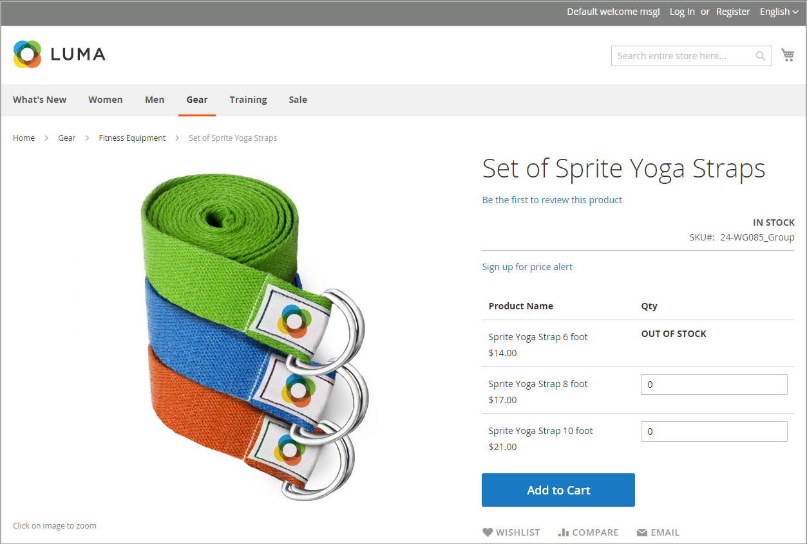

# 股票消息方案

您可以使用配置设置的组合来控制产品页面上的库存可用性消息和目录页面上的产品列表。

{width="600" zoomable="yes"}

## 产品页面库存消息

根据“管理库存”和“库存可用性”设置的组合，产品页面提供了几种不同的消息传送方式。

### 示例1：显示可用性消息

#### 场景1

此设置组合会根据每个产品的库存可用性，在产品页面上显示可用性消息。

| 股票期权 | 设置 | 消息 |
|--|--|--|
| [!UICONTROL Display product availability in stock in the frontend] | `Yes` | |
| [!UICONTROL Manage Stock] | `Yes` | |
| [!UICONTROL Stock Availability] | `In Stock` | _[!UICONTROL Availability: In Stock]_ |
| | `Out of Stock` | _[!UICONTROL Availability: Out of Stock]_ |

#### 场景2

当未管理产品的库存时，此设置组合可用于在产品页面上显示可用性消息。

| 股票期权 | 设置 | 消息 |
|--|--|--|
| [!UICONTROL Display product availability in stock in the frontend] | `Yes` |  |
| [!UICONTROL Manage Stock] | `No` | _[!UICONTROL Availability: In Stock]_ |

### 示例2：隐藏可用性消息

#### 场景1

配置和产品设置的这种组合可防止在产品页面上显示可用性消息。

| 股票期权 | 设置 | 消息 |
|--|--|--|
| [!UICONTROL Display product availability in stock in the frontend] | `No` |  |
| [!UICONTROL Manage Stock] | `Yes` |  |
| [!UICONTROL Stock Availability] | `In Stock` | 无 |
|  | `Out of Stock` | 无 |

#### 场景2

当未管理产品的库存时，这种配置和产品设置的组合会阻止在产品页面上显示可用性消息。

| 股票期权 | 设置 | 消息 |
|--|--|--|
| [!UICONTROL Display product availability in stock in the frontend] | `No` |  |
| [!UICONTROL Manage Stock] | `No` | 无 |

## 目录页面库存消息

以下显示选项可用于类别和搜索结果列表，具体取决于产品可用性和配置设置。

{width="600" zoomable="yes"}

### 示例1：显示带有“缺货”消息的产品

此配置设置组合包括类别和搜索结果列表中的缺货产品，并显示“缺货”消息。

| 股票期权 | 设置 | 消息 |
|--|--|--|
| [!UICONTROL Display Out of Stock Products] | `Yes` |  |
| [!UICONTROL Display product availability in stock in the frontend] | `Yes` | _[!UICONTROL Out of stock]_ |
| [!UICONTROL Display Out of Stock Products] | `Yes` |  |
| [!UICONTROL Display product availability in stock in the frontend] | `No` | 无 |

### 示例2：显示没有“缺货”消息的产品

此配置设置组合包括类别和搜索结果列表中的缺货产品，但不显示消息。

| 股票期权 | 设置 | 消息 |
|--|--|--|
| [!UICONTROL Display Out of Stock Products] | `Yes` | 无 |
| [!UICONTROL Display product availability in stock in the frontend] | `No` |  |

### 示例3：隐藏产品直到重新上架

此配置设置从类别和搜索结果列表中完全省略缺货产品，直到它们重新上架为止。

| 股票期权 | 设置 | 消息 |
|--|--|--|
| [!UICONTROL Display Out of Stock Products] | `No` | 无 |
