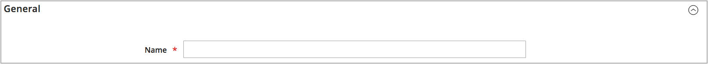
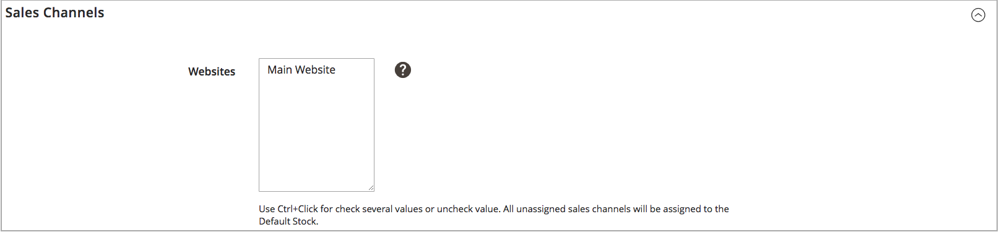
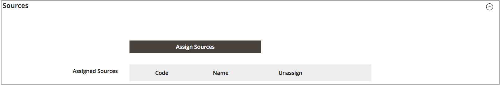

# 添加库存

库存可将您的来源映射到销售渠道（或网站），提供可销售数量和产品库存的直接链接。

创建自定义库存时，您可以分配网站和来源。 源可以包括已启用和禁用的源。 例如，您可以向库存中添加仓库，准备打开库位以管理库存并完成发运。

添加源后，必须按从上（第一个）到下（最后一个）的顺序排列源优先级。 此订单会影响订单发运期间的推荐。

{width="600" zoomable="yes"}

## 添加库存库存

1. 在 _管理员_ 侧栏，转到 **[!UICONTROL Stores]** > _[!UICONTROL Inventory]_>**[!UICONTROL Stock]**.

1. 单击 **[!UICONTROL Add New Stock]**.

1. 展开  该 **[!UICONTROL General]** 部分，并输入唯一 **[!UICONTROL Name]** 以标识新库存。

   {width="350" zoomable="yes"}

1. 展开  该 **[!UICONTROL Sales Channels]** 部分，然后选择 **[!UICONTROL Websites]** 在此股票可用的位置。

   对于多站点安装，按住Ctrl键(PC)或Command键(Mac)，然后单击每个网站。

   >[!NOTE]
   >
   >如果选择分配给其他股票的网站或销售渠道，则会从该股票中取消分配该网站或销售渠道。 任何未分配给自定义库存的Sales Channel都会分配给默认库存。

   {width="350" zoomable="yes"}

1. 展开  该 **[!UICONTROL Sources]** 部分，并对默认以外的任何股票执行以下操作：

   - 单击 **[!UICONTROL Assign Sources]**.

   {width="350" zoomable="yes"}

   - 选中要分配给资源的所有源的复选框。

   >[!IMPORTANT]
   >
   >如果将同一来源分配给多个库存，则可能会导致分配给该来源的产品销售过量。

   - 单击 **[!UICONTROL Done]**.

     添加的源将显示在“分配的源”中。

     {width="600" zoomable="yes"}

1. 使用  将源拖放到从上（第一个）到下（最后一个）的优先级中。

   在发运订单时，来源订单很重要。

   {width="600" zoomable="yes"}

1. 在 _[!UICONTROL Save]_()菜单，选择&#x200B;**[!UICONTROL Save & Close]**.

## 字段描述

| 字段 | 描述 |
|--|--|
| **[!UICONTROL General]** | |
| [!UICONTROL Name] | 股票的名称。 例如： `UK Stock`， `US Stock` |
| **[!UICONTROL Sales Channels]** | |
| [!UICONTROL Websites] | 定义 [范围](../getting-started/websites-stores-views.md#scope-settings) ，方法是将该股票指定给特定网站： _销售渠道_. 为每只股票选择一个或多个网站。 每个网站只能分配给一种库存。 |
| **[!UICONTROL Sources]** | |
| [!UICONTROL Assign Sources] | 将库存来源分配给此库存。 无法将自定义源分配给默认库存。 |
| [!UICONTROL Assigned Sources] | 已分配源的列表。 使用拖放源  将订单排入优先级订单中，以便进行订单履行和装运。  **[!UICONTROL Code]**— 源的唯一代码ID。 **[!UICONTROL Name]**  — 源的名称描述。 **[!UICONTROL Unassign]**— 使用从资源库中移除分配的源 . |
