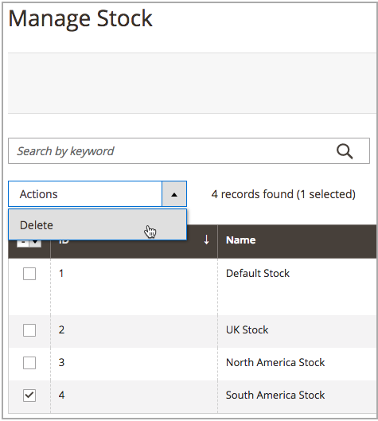

# 删除库存

当您删除库存时，所有已分配的网站都将被分配到默认库存。 建议先将网站重新分配给其他库存，然后再删除。

>[!IMPORTANT]
>
>删除[stock](stocks-manage.md)可能会影响销售渠道的可销售数量和未处理的订单。 如果继续使用销售渠道，请将该销售渠道添加到其他现有库存或新库存。

1. 在&#x200B;_管理员_&#x200B;侧边栏上，转到&#x200B;**[!UICONTROL Stores]** > _[!UICONTROL Inventory]_>**[!UICONTROL Stocks]**。

1. 选择一个或多个要删除的库存。

   浏览或搜索并选中要删除的股票复选框。

1. 从&#x200B;**[!UICONTROL Actions]**&#x200B;菜单中选择&#x200B;**[!UICONTROL Delete]**。

   {width="350" zoomable="yes"}

1. 在确认对话框中，单击&#x200B;**[!UICONTROL OK]**。

   库存将会被删除，并且任何分配的销售渠道都会取消映射。

   {width="350" zoomable="yes"}
