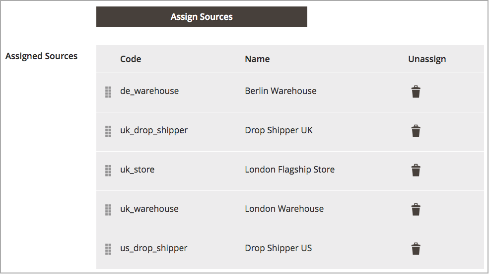

# 排定库存来源的优先级

将[源](sources-manage.md)添加到[stock](stocks-manage.md)后，按优先级从上到下排列这些源以满足订单。 Source选择算法(SSA)在确定发运和库存扣减额时提供了使用此订单的算法“优先级”。

编辑产品库存时，库存的来源优先级不会影响分配的来源。

在此示例中，英国库存的货源被无序分配到伦敦的一家商店和两个仓库，以及柏林的一个仓库。

{width="350" zoomable="yes"}

商户更喜欢优先从更大的柏林仓库、伦敦仓库、伦敦货位仓库以及伦敦的店面出货。 要更改顺序，将条目拖放到所需顺序中。

1. 在&#x200B;_管理员_&#x200B;侧边栏上，转到&#x200B;**[!UICONTROL Stores]** > _[!UICONTROL Inventory]_>**[!UICONTROL Stocks]**。

1. 以&#x200B;_编辑_&#x200B;模式打开库存。

1. 根据需要展开&#x200B;_[!UICONTROL Sources]_&#x200B;选项卡。

1. 使用将源拖放到从上（第一个）到下（最后一个）的优先级中。

   此订单在配送订单时很重要。 SSA建议根据来源顺序进行装运

1. 单击&#x200B;**[!UICONTROL Save & Continue]**&#x200B;保存更改。

在优先级设置后{width="350" zoomable="yes"}
