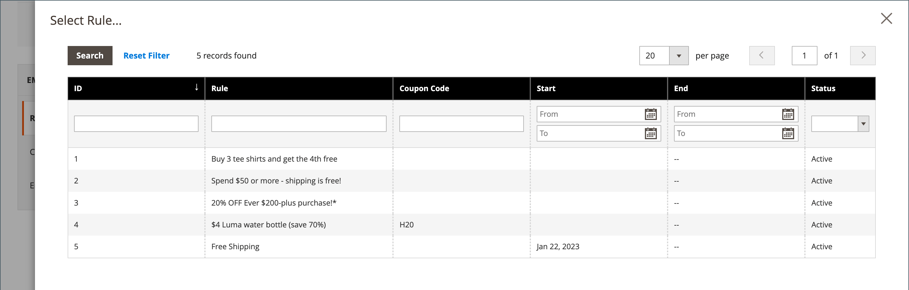

# 创建电子邮件提醒

在设置电子邮件提醒规则之前，您必须先[设置购物车价格规则](price-rules-cart-create.md)以定义提供的促销活动。 触发电子邮件提醒的规则条件可以基于购物车属性、愿望清单属性或同时基于两者。

>[!NOTE]
>
>电子邮件提醒可能会促销包含或不包含优惠券的购物车价格规则。 定义自动生成优惠券的购物车价格规则为每个客户生成随机优惠券代码。

1. 在&#x200B;_管理员_&#x200B;侧边栏上，转到&#x200B;**[!UICONTROL Marketing]** > _[!UICONTROL Communications]_>**[!UICONTROL Email Reminder Rules]**。

1. 单击右上角的&#x200B;**[!UICONTROL Add New Rule]**。

1. 按如下方式完成&#x200B;_[!UICONTROL Rule Information]_：

   {width="700" zoomable="yes"}

   - 输入&#x200B;**[!UICONTROL Rule Name]**&#x200B;以在内部识别规则。

   - 输入规则的简短&#x200B;**[!UICONTROL Description]**。

   - 若要选择此提醒要通告的&#x200B;**[!UICONTROL Cart Price Rule]**&#x200B;促销活动，请单击&#x200B;**[!UICONTROL Select Rule…]**，然后选择规则。

     {width="600" zoomable="yes"}

   - 如果希望规则立即生效，请将&#x200B;**[!UICONTROL Status]**&#x200B;设置为`Active`。

   - 要设置规则生效的日期范围，请输入&#x200B;**[!UICONTROL From]**&#x200B;和&#x200B;**[!UICONTROL To]**&#x200B;日期。

     您还可以从日历（  ）中选择日期。

   - 若要多次发送提醒，请在&#x200B;**[!UICONTROL Repeat Schedule]**&#x200B;字段中输入下次发送电子邮件前的天数。

1. 在左侧的面板中，选择&#x200B;**[!UICONTROL Conditions]**。

   必须为规则定义至少一个条件。 该过程类似于生成[目录价格规则。](price-rules-catalog.md)

   {width="600" zoomable="yes"}

   单击&#x200B;_添加_ （）以显示选项列表，然后选择以下条件之一：

   - 愿望清单
   - 购物车

   >[!NOTE]
   >
   >如果客户有多个匹配的放弃购物车、愿望清单或两者的组合，则仅为该客户触发一次电子邮件提醒。 要再次触发相同的电子邮件提醒，请使用&#x200B;_[!UICONTROL Repeat Schedule]_&#x200B;字段设置电子邮件之间的间隔天数。 
   >
   >对于&#x200B;**_新_**&#x200B;放弃的购物车和&#x200B;_&#x200B;**之后**&#x200B;_&#x200B;的愿望清单&#x200B;_[!UICONTROL Repeat Schedule]_&#x200B;期限结束的同一客户，同一电子邮件提醒是&#x200B;**_未重新触发_**。

   完成条件以描述触发电子邮件提醒的情况。

   {width="600" zoomable="yes"}

1. 在左侧的面板中，选择&#x200B;**[!UICONTROL Emails and Labels]**。

   {width="600" zoomable="yes"}

1. 在&#x200B;**[!UICONTROL Email Templates]**&#x200B;部分中，选择要用于您[商店层次结构](../getting-started/websites-stores-views.md)中每个网站和商店视图的电子邮件模板。

   如果您不想向商店视图的客户发送提醒电子邮件，请保留值`Not Selected`。

1. 在&#x200B;_默认标题和描述_&#x200B;部分中，执行以下操作：

   - 输入&#x200B;**[!UICONTROL Rule Title for All Store Views]**。

     >[!NOTE]
     >
     >通过使用`promotion_name`变量，此值可合并到电子邮件模板中。

   - 输入&#x200B;**[!UICONTROL Rule Description for All Store Views]**。

     {width="500" zoomable="yes"}

   - 在&#x200B;_[!UICONTROL Titles and Descriptions Per Store View]_&#x200B;部分中，输入_&#x200B;默认存储视图&#x200B;_的&#x200B;**[!UICONTROL Rule Title]**&#x200B;和&#x200B;**[!UICONTROL Description]**。 对于多个商店视图，请为每个商店视图输入相应的标题和描述。

     >[!NOTE]
     >
     >通过使用promotion_description变量，可以将描述并入电子邮件模板中。

     {width="500" zoomable="yes"}

1. 完成后，单击&#x200B;**[!UICONTROL Save]**。

## 触发条件

| Source | 触发器 |
|--- |--- |
| [!UICONTROL Wish List] | [!UICONTROL Conditions Combination] [!UICONTROL Sharing] [!UICONTROL Number of Items] [!UICONTROL Items Sub selection] |
| [!UICONTROL Shopping Cart] | [!UICONTROL Conditions Combination] [!UICONTROL Coupon Code] [!UICONTROL Cart Line Items] [!UICONTROL Items Quantity] [!UICONTROL Virtual Only] [!UICONTROL Total Amount] [!UICONTROL Items Subselection] |

{style="table-layout:auto"}

## 字段描述

| 字段 | 描述 |
|--- |--- |
| [!UICONTROL Rule Name] | 自动提醒规则的名称在内部标识该规则。 |
| [!UICONTROL Description] | 供内部参考的规则的描述。 |
| [!UICONTROL Shopping Cart Price Rule] | 与此电子邮件提醒关联的购物车规则。 提醒电子邮件可以促销带有或不带有优惠券的购物车价格规则。 如果购物车价格规则包括自动生成的优惠券，则提醒规则为每个客户生成随机、唯一的优惠券代码。 |
| [!UICONTROL Assigned to Website] | 基于此规则接收自动提醒电子邮件的网站。 |
| [!UICONTROL Status] | 激活规则。 如果状态为非活动，则忽略所有其他设置，并且不触发规则。 选项： `Active` / `Inactive` |
| [!UICONTROL From Date] | 此自动提醒规则的开始日期。 如果未指定日期，则规则将立即处于活动状态。 |
| [!UICONTROL To Date] | 此自动提醒规则的结束日期。 如果未指定日期，则规则将无限期地处于活动状态。 |
| [!UICONTROL Repeat Schedule] | 触发规则前的天数，以及在满足条件的情况下再次发送提醒电子邮件。 要多次触发规则，请输入下次发送电子邮件前的天数（以逗号分隔）。 例如，输入`7`使规则在七天后再次触发；输入`7,14`使规则在七天后再次触发，并在14天后再次触发。 |
| [!UICONTROL Email Templates] | 确定用于每个商店视图的电子邮件模板。 |
| [!UICONTROL Rule Title for All Store Views] | 确定每个商店视图的规则标题。 |
| [!UICONTROL Rule Description for All Store Views] | 确定每个存储视图的规则描述。 |

{style="table-layout:auto"}
