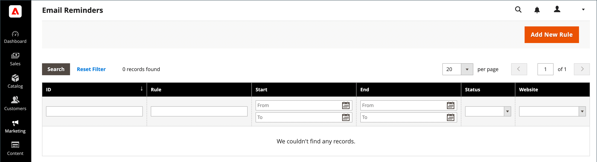

# 电子邮件提醒

{{ee-feature}}

电子邮件提醒的目的是鼓励访问过您的商店的人利用促销活动并购物。 当满足一组特定条件时，可以自动向客户发送电子邮件提醒。 例如，您可以向购物车或愿望清单中添加了一些东西，但尚未购买的客户发送提醒。 您可以使用电子邮件提醒来鼓励客户返回您的商店，并包含[优惠券代码](price-rules-cart-coupon.md)作为奖励。 系统可以为每批电子邮件提醒自动生成优惠券代码，以便您控制与每批电子邮件提醒关联的优惠。

在放弃购物车后过了特定天数后，或者对于您要定义的任何其他条件，可以触发电子邮件提醒。 常见条件包括购物车总值、数量、购物车中的商品等。

>[!NOTE]
>
>如果客户有多个匹配的放弃购物车、愿望清单或两者的组合，则仅为该客户触发一次电子邮件提醒。 要再次触发相同的电子邮件提醒，请使用&#x200B;_[!UICONTROL Repeat Schedule]_&#x200B;字段设置电子邮件之间的间隔天数。

{width="700" zoomable="yes"}

## 配置电子邮件提醒

电子邮件提醒规则可以按分钟、小时或天定期发送。 该配置确定批量发送的电子邮件数量，以及显示为消息发送者的存储身份。

1. 在&#x200B;_管理员_&#x200B;侧边栏上，转到&#x200B;**[!UICONTROL Stores]** > _[!UICONTROL Settings]_>**[!UICONTROL Configuration]**。

1. 在左侧面板中，展开&#x200B;**[!UICONTROL Customers]**&#x200B;并选择&#x200B;**[!UICONTROL Promotions]**。

1. 展开&#x200B;**[!UICONTROL Automated Email Reminder Rules]**&#x200B;部分中的并执行以下操作：

   {width="600" zoomable="yes"}

   - 将&#x200B;**[!UICONTROL Enable Reminder Emails]**&#x200B;设置为`Yes`。

   - 要设置对符合自动电子邮件提醒条件的新客户运行检查的频率，请将&#x200B;**[!UICONTROL Frequency]**&#x200B;设置为以下项之一：

      - `Minute Intervals`
      - `Hourly`
      - `Daily`

   - 根据&#x200B;_[!UICONTROL Frequency]_&#x200B;设置设置相应的&#x200B;**[!UICONTROL Interval]**。

   - 将&#x200B;**[!UICONTROL Start Time]**&#x200B;设置为基于24小时制发送电子邮件的小时、分钟和秒。

   - 要限制批次中可以发送的电子邮件数量，请在&#x200B;**[!UICONTROL Maximum Emails per One Run]**&#x200B;字段中输入该数量。

   - 为避免重复尝试发送失败的电子邮件，请在&#x200B;**[!UICONTROL Email Send Failure Threshold]**&#x200B;字段中输入最大尝试次数。

   - 将&#x200B;**[!UICONTROL Reminder Email Sender]**&#x200B;设置为显示为提醒电子邮件发件人的[商店联系人](../getting-started/store-details.md#store-email-addresses)。

   有关这些选项的详细列表，请参阅&#x200B;_配置引用_&#x200B;中的[自动电子邮件提醒规则](../configuration-reference/customers/promotions.md#automated-email-reminder-rules)。

1. 完成后，单击&#x200B;**[!UICONTROL Save Config]**。

## 电子邮件提醒模板

可以自定义默认电子邮件提醒模板，并为不同促销活动创建其他模板。 电子邮件提醒包含一系列可纳入消息中的特定变量。 这些变量中的信息由您设置的电子邮件提醒规则以及与优惠券关联的购物车价格规则决定。 “插入变量”按钮可用于将带有变量的标记标记插入到模板中。 若要了解详细信息，请参阅[电子邮件](../systems/email-templates.md)。

{width="600" zoomable="yes"}

### 自定义电子邮件提醒模板

1. 在&#x200B;_管理员_&#x200B;侧边栏上，转到&#x200B;**[!UICONTROL Marketing]** > _[!UICONTROL Communications]_>**[!UICONTROL Email Templates]**。

1. 单击&#x200B;**[!UICONTROL Add New Template]**。

1. 在`Magento_Reminder`下的&#x200B;**[!UICONTROL Template]**&#x200B;列表中，选择&#x200B;**[!UICONTROL Promotion Notification/Reminder]**&#x200B;模板。

1. 单击&#x200B;**[!UICONTROL Load Template]**。

按照标准[说明](../systems/email-template-custom.md)自定义模板。

### 电子邮件提醒变量

#### 优惠券代码

```
{{var coupon.getCode()|escape}}
```

#### 优惠券使用限制

```
{{var coupon.usage_limit|escape}}
```

#### 每位客户的优惠券使用情况

```
{{var coupon.usage_per_customer|escape}}
```

#### 客户帐户URL

```
{{var this.getUrl($store,'customer/account/',[_nosid:1])}}
```

#### 客户名称

```
{{var customer_data.name|escape}}
```

#### 电子邮件页脚模板

```
{{template config_path="design/email/footer_template"}}
```

#### 电子邮件标头模板

```
{{template config_path="design/email/header_template"}}
```

#### 电子邮件徽标图像替代

```
{{var logo_alt}}
```

#### 电子邮件徽标图像URL

```
{{var logo_url}}
```

#### 提升描述

```
{{var promotion_description|escape|nl2br}}
```

#### 促销名称

```
{{var promotion_name|escape}}
```

#### 存储名称

```
{{var store.frontend_name}}
```

#### 商店URL

```
{{store url=""}}
```
